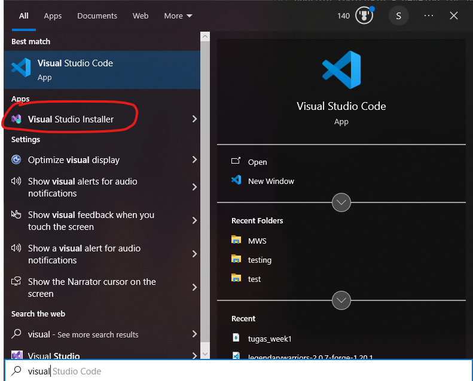

# Week 1 (Minggu Pertama)

**Tanggal**: 19 September 2024

**Nama**: Sultan Akmal Ghiffari
**NPM**: 5220411047

---

# Daftar Isi

- [Daftar Isi](#daftar-isi)
- [1. Review Bahasa Pemrograman](#-review-bahasa-pemrograman)
  - [1.1. **Mobile Client**](#11-mobile-client)
  - [1.2. **Web Client**](#12-web-client)
  - [1.3. **Web Server**](#13-web-server)
- [2. Review Bahasa Pemrograman yang Pernah Dipelajari](#2-review-bahasa-pemrograman-yang-pernah-dipelajari)
  - [2.1. **Java**](#21-java)
  - [2.2. **Python**](#22-python)
  - [2.3. **JavaScript**](#23-javascript)
  - [2.4. **PHP**](#24-php)
- [3. Menginstall Flutter](#3-menginstall-flutter)
- [4. Menampilkan Hello World di Beberapa Bahasa Pemrograman](#4-menampilkan-hello-world-di-beberapa-bahasa-pemrograman)
  - [4.1. **Java**](#41-java)
  - [4.2. **Python**](#42-python)
  - [4.3. **JavaScript**](#43-javascript)
  - [4.4. **PHP**](#44-php)

---

## 1. Review Bahasa Pemrograman

Ada banyak sekali bahasa pemrograman dan framework yang dapat kita gunakan untuk mengembangkan sebuah aplikasi mobile atau web service.

#### 1.1. **Mobile Client**

Mobile Client merupakan suatu aplikasi yang beroperasi dan menampilkan interface di perangkat mobile, baik Android maupun iOS. Beberapa bahasa pemrograman yang sering digunakan untuk kebutuhan mobile client ialah :

- Java
- Kotlin
- Dart (Flutter)
- Swift
- JavaScript/TypeScript (React Native)
- C#
- C++

#### 1.2. **Web Client**

Web Client merupakan aplikasi yang berjalan dan ditampilkan kepada user melalui browser. Beberapa bahasa pemrograman yang sering digunakan untuk kebutuhan web client ialah :

- PHP (Laravel, Codeigniter, dll)
- JavaScript/ (React, Angular, Vue.js, dll)

#### 1.3. **Web Server**

Web Server bertanggung jawab untuk menyimpan, memproses, dan mengirimkan halaman web serta data lainnya kepada user melalui protokol HTTP (Hypertext Transfer Protocol) atau HTTPS (HTTP Secure). Beberapa bahasa pemrograman yang sering digunakan untuk kebutuhan web server ialah :

- PHP
- JavaScript/TypeScript (Node.js, Express.js, Next.js, dll)
- Ruby (Ruby on Rails)
- Go
- Python (Django, Flask, dll)

---

## 2. Review Bahasa Pemrograman yang Pernah Dipelajari

#### 2.1. **Java**

<br>

Java merupakan bahasa pertama yang saya pelajari. Masa itu sedang dalam masa pandemi COVID-19 dan waktu luang saya sangat banyak. Awalnya saya hanya iseng saat sedang scrolling media sosial, kemudian saya menemukan iklan mengenai kelas Java berbayar dan bersertifikat. Karena saya benar-benar tidak tahu ingin melakukan apa saat itu, akhirnya saya memutuskan untuk bergabung ke kelas tersebut.

Akhirnya saya mulai mempelajari mengenai bahasa Java. Namun baru mempelajari sedikit mengenai bahasa Java, saya tidak lagi melanjutkan kelas tersebut, dikarenakan pembelajaran dari kelas tersebut yang kurang menarik dan sulit dipahami.

#### 2.2. **Python**

<br>

Saya pertama kali mempelajari bahasa Python saat masuk kuliah, tepatnya pada mata kuliah Algoritma Pemrograman di semester 1. Kesan pertama saya terhadap bahasa ini ialah penulisan sintaks nya yang sangat jauh berbeda dengan bahasa Java. Saya cukup enjoy dengan bahasa ini karena cukup mudah dipelajari di awal.

#### 2.3. **JavaScript**

<br>

Saya pertama kali “menyentuh” bahasa ini saat semester 1, pada mata kuliah “Pengembangan Web dan Mobile”. Namun saat itu hanya diperkenalkan sedikit mengenai sintaks dasar Javascript. Saya baru benar-benar “mempelajari” bahasa ini saat semester 3 pada mata kuliah “Pemrograman Web”.

Hingga sekarang, saya sedang mendalami skill saya di Javascript dengan memperkuat Javascript murni dan mempelajari framework-framework dan library-library Javascript, seperti React, Next.js, Three.js, serta Node.js.

#### 2.4. **PHP**

 <br>

Selain Javascript, mata kuliah “Pemrograman Web” pada semester 3 ini juga menuntut saya untuk mempelajari bahasa pemrograman PHP. Saya agak sedikit bingung karena pada mata kuliah “Pemrograman Web Praktik”, bahasa yang digunakan untuk Back-End ialah Python, namun pada mata kuliah teori, bahasa yang digunakan ialah PHP. Saya kurang suka dengan bahasa ini dan melihat kemungkinan di masa depan, sepertinya saya tidak akan melanjutkan untuk mempelajari bahasa ini lagi.

---

## 3. Menginstall Flutter

Berikut merupakan langkah-langkah yang saya lakukan untuk menginstall Flutter :<br>

#### 1. Menginstall Android Studio

- Kunjungi website Android Studio dan klik download.
<p align="center">
  
</p>

- Setelah itu, run androidstudio.exe dan sisanya hanya klik next saja hingga Android Studio terinstall.

<p align="center">
  
</p>
<p align="center">
  
</p>
<p align="center">
  
</p>
<p align="center">
  
</p>

- Setelah Android Studio telah terinstall, klik Finish.

<p align="center">
  
</p>

#### 2. Menginstall Flutter

- Pergi ke halaman docs pada web flutter, lalu pilih sistem operasi. Disini saya memilih yang windows karena PC saya memiliki sistem operasi windows.

<p align="center">
  
</p>

- Lalu pilih yang android, karena kita akan melakukan pengembangan aplikasi android.

<p align="center">
  
</p>

- Karena terdapat pilihan untuk menginstall melalui Visual Studio Code, maka saya memilih untuk menginstall melalui Visual Studio Code saja.

<p align="center">
  
</p>

- Pada Visual Studio Code, install extension FLutter.

<p align="center">
  
</p>

- Ketik >flutter, lalu pilih Flutter:New Project.

<p align="center">
  
</p>

- Pada Visual Studio Code saya, terdapat error yang menunjukkan bahwa tidak ditemukan FLutter SDK. Maka saya download SDK terlebih dahulu.

<p align="center">
  
</p>

- Terdapat error yang menunjukkan bahwa gagal untuk meng-clone FLutter menggunakan Git.

<p align="center">
  
</p>

- Kemudian saya cek dengan prompt git --version.

<p align="center">
  
</p>

- Saya baru ingat bahwa saya baru saja mengganti SSD dan melakukan install ulang, sehingga Git belum terinstall. Oleh karena itu saya akan menginstall Git terlebih dahulu.

<p align="center">
  
</p>
<p align="center">
  
</p>

- Setelah selesai menginstall Git, download SDK dan pilih lokasi foldernya. Kemudian tunggu.

<p align="center">
  
</p>
<p align="center">
  
</p>
<p align="center">
  
</p>

- Setelah download selesai, klik Add SDK to PATH untuk menambahkan SDK ke PATH.

<p align="center">
  
</p>
<p align="center">
  
</p>

- Ketik flutter doctor pada terminal untuk memverifikasi instalasi.

<p align="center">
  
</p>

- Terdapat 3 issue yang ditemukan, saya akan memperbaiki issue yang pertama terlebih dahulu dengan membuka Android Studio dan menginstall setupnya.

<p align="center">
  
</p>
<p align="center">
  
</p>
<p align="center">
  
</p>
<p align="center">
  
</p>
<p align="center">
  
</p>
<p align="center">
  
</p>
<p align="center">
  
</p>
<p align="center">
  
</p>

- Setelah selesai, ketik prompt flutter doctor lagi pada terminal.

<p align="center">
  
</p>

- Dapat terlihat bahwa issue pertama telah selesai, tersisa 2 issue lagi yang perlu diperbaiki. Sekarang kita akan memperbaiki issue kedua yang bertuliskan :

> cmdline-tools component is missing

- Maka yang perlu dilakukan ialah membuka Android Studio kembali, klik More Actions dan pilih SDK Manager.

<p align="center">
  
</p>

- Kemudian pilih SDK Tools.

<p align="center">
  
</p>

- Centang Android SDK Command-line Tools (latest), lalu pilih OK.

<p align="center">
  
</p>
<p align="center">
  
</p>

- Jika sudah, pergi ke terminal dan ketik prompt flutter doctor untuk cek.

<p align="center">
  
</p>

- Dapat dilihat bahwa issue pertama dari issue nomor 2 telah terselesaikan. Sekarang kita akan memperbaiki issue ketiga (yang paling bawah).

<p align="center">
  
</p>

- Ketik prompt flutter doctor --android-licenses lalu ketik "y" setiap ada pertanyaan sampai semua lisensi package SDK diterima

<p align="center">
  
</p>

- flutter doctor untuk mengecek.

<p align="center">
  
</p>

- Dapat terlihat bahwa issue ketiga berhasil diperbaiki. Tersisa issue kedua yang bertuliskan :

> The current Visual Studio installation is incomplete.
> Please use Visual Studio Code Installer to complete the installation or reinstall Visual Studio Code.

- Issue diatas menjelaskan bahwa instalasi Visual Studio Code belum selesai. Maka yang perlu dilakukan ialah pergi ke search bar, ketik visual dan pilih Visual Studio Installer.

<p align="center">
  
</p>

- Klik Resume.

<p align="center">
  
</p>

- Kemudian terakhir klik Update.

<p align="center">
  
</p>

- Setelah itu cek lagi pada terminal dengan prompt flutter doctor. Dapat dilihat pada gambar dibawah bahwa tidak ada issue lagi yang ditemukan.

<p align="center">
  
</p>

#### Installasi Flutter Selesai

---

## 4. Menampilkan Hello World di Beberapa Bahasa Pemrograman

#### 4.1. Java

```java
class Test {
    public static void main(String []args) {
        System.out.println("Hello World");
    }
}
```

Terlihat ribet bukan? Pada bahasa Java, untuk menampilkan "Hello World" saja perlu untuk membuat class dan method main(), kemudian menuliskan System.out.println("");, jangan lupa tanda ";".
<br>

#### 4.2. Python

```python
print("Hello World")
```

Dibandingkan dengan bahasa yang lain, Python sangat sederhana, cukup dengan print("").
<br>

#### 4.3. JavaScript

```javascript
console.log("Hello World");
```

Tidak seperti Java, JavaScript tidak memerlukan class dan function. Cukup memanggil fungsi console.log("") saja.
<br>

#### 4.4. PHP

```php
<?php
echo "Hello World";
?>
```

Untuk bahasa PHP, kita perlu menggunakan perintah echo""; yang dibungkus oleh tag PHP, yaitu <?php ... ?>

---
