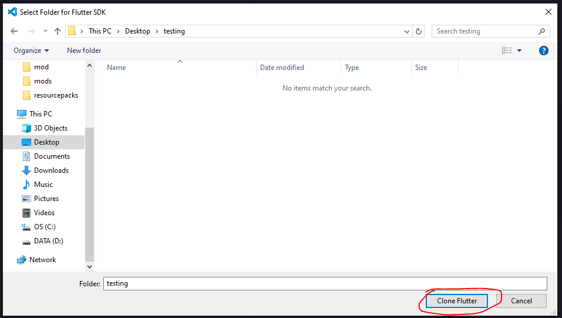

<div>
  <h3 align="center">
  Laporan Hasil Belajar <br>
  Mobile & Web Service
  </h3>

  <br>
  <br>
  <br>

  <p align="center">
    
  </p>

   <br>
  <br>
  <br>

  <p align="center">
    Disusun oleh: <br>
    Sultan Akmal Ghiffari (5220411047)
  </p>

   <br>
  <br>
  <br>

  <h3 align="center">
  Program Studi Informatika <br>
  Fakultas Sains Dan Teknologi <br>
  Universitas Teknologi Yogyakarta <br>
  2024
  </h3>
</div>

---

## Daftar Isi

- [Daftar Isi](#daftar-isi)
- [Week 1](#week-1)
    - [1. Review Bahasa Pemrograman](#-review-bahasa-pemrograman)
        - [1.1. **Mobile Client**](#11-mobile-client)
        - [1.2. **Web Client**](#12-web-client)
        - [1.3. **Web Server**](#13-web-server)
    - [2. Review Bahasa Pemrograman yang Pernah Dipelajari](#2-review-bahasa-pemrograman-yang-pernah-dipelajari)
        - [2.1. **Java**](#21-java)
        - [2.2. **Python**](#22-python)
        - [2.3. **JavaScript**](#23-javascript)
        - [2.4. **PHP**](#24-php)
    - [3. Menginstall Flutter](#3-menginstall-flutter)
    - [4. Menampilkan Hello World di Beberapa Bahasa Pemrograman](#4-menampilkan-hello-world-di-beberapa-bahasa-pemrograman)
        - [4.1. **Java**](#41-java)
        - [4.2. **Python**](#42-python)
        - [4.3. **JavaScript**](#43-javascript)
        - [4.4. **PHP**](#44-php)
- [Week 2](#week-2)
    - [1. Mencoba Flutter (Lanjutan Minggu lalu)](#1-mencoba-flutter-lanjutan-minggu-lalu)
    - [2. Flutter Widget](#2-flutter-widget)
        - [2.1. **Stateless & Stateful Widget**](#21-stateless--stateful-widget)
        - [2.2. **MaterialApp**](#22-materialapp)
        - [2.3. **Scaffold**](#23-scaffold)
        - [2.4. **AppBar**](#24-appbar)
        - [2.5. **Center**](#25-center)
        - [2.6. **Text**](#26-text)
        - [2.7. **Row & Column**](#27-row--column)
        - [2.8. **TextField**](#28-textfield)
        - [2.9. **ElevatedButton**](#29-elevatedbutton)
        - [2.10. **Contoh Implementasi Widget**](#210-contoh-implementasi-widget)
- [Week 3](#week-3)
    - [1. Flutter Widget Lanjutan](#1-flutter-widget-lanjutan)
        - [1.1. **Stack**](#11-stack)
        - [1.2. **Padding**](#12-padding)
        - [1.3. **Align**](#13-align)
        - [1.4. **Image**](#14-image)
        - [1.5. **Icon**](#15-icon)
        - [1.6. **Container**](#16-container)
    - [2. Widget ListView](#2-widget-listview)
        - [2.1. **ListView.builder**](#21-listviewbuilder)
        - [2.2. **ListView.separated**](#22-listviewseparated)
        - [2.3. **ListView.custom**](#23-listviewcustom)
    - [3. Widget GridView](#3-widget-gridview)
        - [3.1. **GridView.builder**](#31-gridviewbuilder)
        - [3.2. **GridView.custom**](#32-gridviewcustom)
        - [3.3. **GridView.count**](#32-gridviewcustom)
        - [3.4. **GridView.extent**](#34-gridviewextent)
    - [4. Contoh Implementasi](#4-contoh-implementasi)
    - [5. Flutter Navigation](#5-flutter-navigation)
- [Week 4](#week-4)
    - [Dokumentasi Tugas Pertemuan 4](#dokumentasi-tugas-pertemuan-4)
        - [Struktur](#struktur)
        - [Membuat Model Data untuk Login (data.dart)](#membuat-model-data-untuk-login-datadart)
        - [Membuat Form Login (home_page.dart)](#membuat-form-login-home_pagedart)
        - [Membuat Navigasi ke Halaman Menu Utama (main_page.dart)](#membuat-navigasi-ke-halaman-menu-utama-main_pagedart)
        - [Alur Singkat Aplikasi](#alur-singkat-aplikasi)
        - [Full Code beserta Penjelasan di Dalam Code](#full-code-beserta-penjelasan-di-dalam-code)
- [Week 5](#week-5)
    - [1. Mendesain dengan Figma](#1-mendesain-dengan-figma)
    - [2. REST API](#2-rest-api)
    - [2.1. **Komponen Utama REST API**](#21-komponen-utama-rest-api)
        - [**a. Resource**](#a-resource)
        - [**b. HTTP Methods**](#b-http-methods)
        - [**a. Stateless**](#c-stateless)
        - [**a. Representation**](#d-representation)
    - [2.2. **Karakteristik REST API**](#22-karakteristik-rest-api)
    - [2.3. **Keuntungan REST API**](#23-keuntungan-rest-api)
    - [2.4. **Postman}**](#24-postman)
    - [3. Implementasi API dan CRUD](#3-implementasi-api-dan-crud)
- [Week 6](#week-6)
    - [Dokumentasi Proggress Aplikasi](#dokumentasi-progress-aplikasi)
        - [1. Konversi Desain Figma to Flutter](#1-konversi-desain-figma-to-flutter)
        - [2. Membuat API untuk OTP dan Payment Gateaway](#2-membuat-api-untuk-otp-dan-payment-gateaway)
        - [3. Mengintegrasikan Desain Figma dengan API yang Sudah Dibuat](#3-mengintegrasikan-desain-figma-dengan-api-yang-sudah-dibuat)
        - [4. Simulasi OTP & CRUD pada Aplikasi Flutter](#4-simulasi-otp--crud-pada-aplikasi-flutter)
    - [Rekapan](#rekapan)
    - [List Improve untuk Minggu Selanjutnya](#list-improve-untuk-minggu-selanjutnya)

- [Referensi](#referensi)

---

# Week 1

## 1. Review Bahasa Pemrograman

Ada banyak sekali bahasa pemrograman dan framework yang dapat kita gunakan untuk mengembangkan sebuah aplikasi mobile atau web service.

#### 1.1. **Mobile Client**

Mobile Client merupakan suatu aplikasi yang beroperasi dan menampilkan interface di perangkat mobile, baik Android maupun iOS. Beberapa bahasa pemrograman yang sering digunakan untuk kebutuhan mobile client ialah :

- Java
- Kotlin
- Dart (Flutter)
- Swift
- JavaScript/TypeScript (React Native)
- C#
- C++

#### 1.2. **Web Client**

Web Client merupakan aplikasi yang berjalan dan ditampilkan kepada user melalui browser. Beberapa bahasa pemrograman yang sering digunakan untuk kebutuhan web client ialah :

- PHP (Laravel, Codeigniter, dll)
- JavaScript/ (React, Angular, Vue.js, dll)

#### 1.3. **Web Server**

Web Server bertanggung jawab untuk menyimpan, memproses, dan mengirimkan halaman web serta data lainnya kepada user melalui protokol HTTP (Hypertext Transfer Protocol) atau HTTPS (HTTP Secure). Beberapa bahasa pemrograman yang sering digunakan untuk kebutuhan web server ialah :

- PHP
- JavaScript/TypeScript (Node.js, Express.js, Next.js, dll)
- Ruby (Ruby on Rails)
- Go
- Python (Django, Flask, dll)

---

## 2. Review Bahasa Pemrograman yang Pernah Dipelajari

#### 2.1. **Java**

<br>

Java merupakan bahasa pertama yang saya pelajari. Masa itu sedang dalam masa pandemi COVID-19 dan waktu luang saya sangat banyak. Awalnya saya hanya iseng saat sedang scrolling media sosial, kemudian saya menemukan iklan mengenai kelas Java berbayar dan bersertifikat. Karena saya benar-benar tidak tahu ingin melakukan apa saat itu, akhirnya saya memutuskan untuk bergabung ke kelas tersebut.

Akhirnya saya mulai mempelajari mengenai bahasa Java. Namun baru mempelajari sedikit mengenai bahasa Java, saya tidak lagi melanjutkan kelas tersebut, dikarenakan pembelajaran dari kelas tersebut yang kurang menarik dan sulit dipahami.

#### 2.2. **Python**

<br>

Saya pertama kali mempelajari bahasa Python saat masuk kuliah, tepatnya pada mata kuliah Algoritma Pemrograman di semester 1. Kesan pertama saya terhadap bahasa ini ialah penulisan sintaks nya yang sangat jauh berbeda dengan bahasa Java. Saya cukup enjoy dengan bahasa ini karena cukup mudah dipelajari di awal.

#### 2.3. **JavaScript**

<br>

Saya pertama kali “menyentuh” bahasa ini saat semester 1, pada mata kuliah “Pengembangan Web dan Mobile”. Namun saat itu hanya diperkenalkan sedikit mengenai sintaks dasar Javascript. Saya baru benar-benar “mempelajari” bahasa ini saat semester 3 pada mata kuliah “Pemrograman Web”.

Hingga sekarang, saya sedang mendalami skill saya di Javascript dengan memperkuat Javascript murni dan mempelajari framework-framework dan library-library Javascript, seperti React, Next.js, Three.js, serta Node.js.

#### 2.4. **PHP**

 <br>

Selain Javascript, mata kuliah “Pemrograman Web” pada semester 3 ini juga menuntut saya untuk mempelajari bahasa pemrograman PHP. Saya agak sedikit bingung karena pada mata kuliah “Pemrograman Web Praktik”, bahasa yang digunakan untuk Back-End ialah Python, namun pada mata kuliah teori, bahasa yang digunakan ialah PHP. Saya kurang suka dengan bahasa ini dan melihat kemungkinan di masa depan, sepertinya saya tidak akan melanjutkan untuk mempelajari bahasa ini lagi.

---

## 3. Menginstall Flutter

Berikut merupakan langkah-langkah yang saya lakukan untuk menginstall Flutter :<br>

#### 1. Menginstall Android Studio

- Kunjungi website Android Studio dan klik download.

<p align="center">
  
</p>

- Setelah itu, run androidstudio.exe dan sisanya hanya klik next saja hingga Android Studio terinstall.

<p align="center">
  
</p>
<p align="center">
  
</p>
<p align="center">
  
</p>
<p align="center">
  
</p>

- Setelah Android Studio telah terinstall, klik Finish.

<p align="center">
  
</p>

#### 2. Menginstall Flutter

- Pergi ke halaman docs pada web flutter, lalu pilih sistem operasi. Disini saya memilih yang windows karena PC saya memiliki sistem operasi windows.

<p align="center">
  
</p>

- Lalu pilih yang android, karena kita akan melakukan pengembangan aplikasi android.

<p align="center">
  
</p>

- Karena terdapat pilihan untuk menginstall melalui Visual Studio Code, maka saya memilih untuk menginstall melalui Visual Studio Code saja.

<p align="center">
  
</p>

- Pada Visual Studio Code, install extension FLutter.

<p align="center">
  
</p>

- Ketik >flutter, lalu pilih Flutter:New Project.

<p align="center">
  
</p>

- Pada Visual Studio Code saya, terdapat error yang menunjukkan bahwa tidak ditemukan FLutter SDK. Maka saya download SDK terlebih dahulu.

<p align="center">
  
</p>

- Terdapat error yang menunjukkan bahwa gagal untuk meng-clone FLutter menggunakan Git.

<p align="center">
  
</p>

- Kemudian saya cek dengan prompt git --version.

<p align="center">
  
</p>

- Saya baru ingat bahwa saya baru saja mengganti SSD dan melakukan install ulang, sehingga Git belum terinstall. Oleh karena itu saya akan menginstall Git terlebih dahulu.

<p align="center">
  
</p>
<p align="center">
  
</p>

- Setelah selesai menginstall Git, download SDK dan pilih lokasi foldernya. Kemudian tunggu.

<p align="center">
  
</p>
<p align="center">
  
</p>
<p align="center">
  
</p>

- Setelah download selesai, klik Add SDK to PATH untuk menambahkan SDK ke PATH.

<p align="center">
  
</p>
<p align="center">
  
</p>

- Ketik flutter doctor pada terminal untuk memverifikasi instalasi.

<p align="center">
  
</p>

- Terdapat 3 issue yang ditemukan, saya akan memperbaiki issue yang pertama terlebih dahulu dengan membuka Android Studio dan menginstall setupnya.

<p align="center">
  
</p>
<p align="center">
  
</p>
<p align="center">
  
</p>
<p align="center">
  
</p>
<p align="center">
  
</p>
<p align="center">
  
</p>
<p align="center">
  
</p>
<p align="center">
  
</p>

- Setelah selesai, ketik prompt flutter doctor lagi pada terminal.

<p align="center">
  
</p>

- Dapat terlihat bahwa issue pertama telah selesai, tersisa 2 issue lagi yang perlu diperbaiki. Sekarang kita akan memperbaiki issue kedua yang bertuliskan :

> cmdline-tools component is missing

- Maka yang perlu dilakukan ialah membuka Android Studio kembali, klik More Actions dan pilih SDK Manager.

<p align="center">
  
</p>

- Kemudian pilih SDK Tools.

<p align="center">
  
</p>

- Centang Android SDK Command-line Tools (latest), lalu pilih OK.

<p align="center">
  
</p>
<p align="center">
  
</p>

- Jika sudah, pergi ke terminal dan ketik prompt flutter doctor untuk cek.

<p align="center">
  
</p>

- Dapat dilihat bahwa issue pertama dari issue nomor 2 telah terselesaikan. Sekarang kita akan memperbaiki issue ketiga (yang paling bawah).

<p align="center">
  
</p>

- Ketik prompt flutter doctor --android-licenses lalu ketik "y" setiap ada pertanyaan sampai semua lisensi package SDK diterima

<p align="center">
  
</p>

- flutter doctor untuk mengecek.

<p align="center">
  
</p>

- Dapat terlihat bahwa issue ketiga berhasil diperbaiki. Tersisa issue kedua yang bertuliskan :

> The current Visual Studio installation is incomplete.
> Please use Visual Studio Code Installer to complete the installation or reinstall Visual Studio Code.

- Issue diatas menjelaskan bahwa instalasi Visual Studio Code belum selesai. Maka yang perlu dilakukan ialah pergi ke search bar, ketik visual dan pilih Visual Studio Installer.

<p align="center">
  
</p>

- Klik Resume.

<p align="center">
  
</p>

- Kemudian terakhir klik Update.

<p align="center">
  
</p>

- Setelah itu cek lagi pada terminal dengan prompt flutter doctor. Dapat dilihat pada gambar dibawah bahwa tidak ada issue lagi yang ditemukan.

<p align="center">
  
</p>

#### Installasi Flutter Selesai

---

## 4. Menampilkan Hello World di Beberapa Bahasa Pemrograman

#### 4.1. Java

```java
class Test {
    public static void main(String []args) {
        System.out.println("Hello World");
    }
}
```

Terlihat ribet bukan? Pada bahasa Java, untuk menampilkan "Hello World" saja perlu untuk membuat class dan method main(), kemudian menuliskan System.out.println("");, jangan lupa tanda ";".
<br>

#### 4.2. Python

```python
print("Hello World")
```

Dibandingkan dengan bahasa yang lain, Python sangat sederhana, cukup dengan print("").
<br>

#### 4.3. JavaScript

```javascript
console.log("Hello World");
```

Tidak seperti Java, JavaScript tidak memerlukan class dan function. Cukup memanggil fungsi console.log("") saja.
<br>

#### 4.4. PHP

```php
<?php
echo "Hello World";
?>
```

Untuk bahasa PHP, kita perlu menggunakan perintah echo""; yang dibungkus oleh tag PHP, yaitu `<?php ... ?>`

---

# Week 2

## 1. Mencoba Flutter (Lanjutan Minggu Lalu)

Pada laporan minggu lalu, saya hanya melakukan instalasi flutter dan memperbaiki error-error yang ada, namun saya belum mencoba flutternya kembali. Maka sebelum saya membuat laporan mengenai flutter widget, saya akan mencoba flutter terlebih dahulu.

#### Membuat Project Flutter Baru

Disini saya akan membuat project baru dengan mengetik >flutter, lalu pilih yang new project.

<p align="center">
  
</p>

Pilih application.

<p align="center">
  
</p>

Pilih folder.

<p align="center">
  
</p>

Atur nama project flutternya.

<p align="center">
  
</p>

Project flutter telah dibuat.

<p align="center">
  
</p>

#### Mencoba Android Studio

Pertama-tama buka android studio terlebih dahulu, lalu klik more actions dan pilih Virtual Device.

<p align="center">
  
</p>

Klik tanda "+" untuk membuat Virtual Device.

<p align="center">
  
</p>

Pilih hardware dan klik Next

<p align="center">
  
</p>
<p align="center">
  
</p>
<p align="center">
  
</p>

Virtual Device telah dibuat.

<p align="center">
  
</p>

#### Menjalankan Flutter di VS Code

Pilih devicenya, lalu tunggu.

<p align="center">
  
</p>

Terdapat pesan error yang menunjukkan kalau gagal. Saya belum mengetahui penyebabnya apa.

<p align="center">
  
</p>

Sepertinya emulator gagal memulai karena Android Emulator Hypervisor Driver tidak terpasang. Oleh karena itu saya coba untuk mengatasi masalah ini.

Buka Control Panel, pergi ke Programs, lalu Programs and Features, kemudian klik Turn Windows features on or off di sebelah kiri, dan centang kotak untuk Hyper-V, WIndows Hypervisor Platform, dan Virtual Machine Platform, lalu klik OK.

<p align="center">
  
</p>

Karena diminta untuk restart PC, maka saya restart PC terlebih dahulu

<p align="center">
  
</p>

Karena emulator masih belum bisa dijalankan, saya mencoba untuk melakukan silent install, sesuai saran dari ChatGPT.

<p align="center">
  
</p>

Saya telah mencoba berbagai cara, namun masih belum dapat terselesaikan. Oleh karena itu, saya mencoba untuk mencoba flutternya tanpa emulator saja.

Ketik prompt flutter run di terminal, lalu ketik 1 untuk memilih yang windows.

<p align="center">
  
</p>

Flutter dapat dijalankan.

<p align="center">
  
</p>

---

## 2. Flutter Widget

Widget merupakan elemen dasar yang membentuk antarmuka pengguna (UI). Setiap komponen yang ada di layar, seperti tombol, teks, gambar, atau layout, semuanya adalah widget. Flutter Widget memungkinkan developer menciptakan interface yang responsif dengan mudah.

#### 2.1. **Stateless & Stateful Widget**

#### Stateless Widget

Stateless widget merupakan widget yang bersifat statis dan hanya dapat dibangun sekali berdasarkan data yang diberikan saat pembuatan.

```dart
class MyApp extends StatelessWidget {
  const MyApp({super.key});

  @override
  Widget build(BuildContext context) {
    return...
```

#### Stateful Widget

Stateful Widget widget widget yang memiliki status internal yang dapat berubah selama siklus hidup widget tersebut. Status ini bisa berubah sebagai respons terhadap interaksi pengguna atau perubahan data.

```dart
class MyHomePage extends StatefulWidget {
  const MyHomePage({super.key, required this.title});


  final String title;

  @override
  State<MyHomePage> createState() => _MyHomePageState();
}

class _MyHomePageState extends State<MyHomePage> {
  int _counter = 0;

  void _incrementCounter() {
    setState(() {

      _counter++;
    });
  }

  @override
  Widget build(BuildContext context) {

    return...
```

### 2.2. **MaterialApp**

MaterialApp merupakan salah satu widget yang paling penting, dimana widget ini mengatur berbagai aspek penting seperti tema, routing (navigasi), dan lain-lain. Widget ini dapat memudahkan developer untuk membangun UI yang konsisten.

```dart
MaterialApp(
  title: 'Belajar Flutter',
  home: MyHomePage(),
);
```

### 2.3. **Scaffold**

Scaffold merupakan widget yang menyediakan struktur dasar untuk tampilan UI aplikasi. Widget ini memungkinkan developer untuk mengatur elemen-elemen UI seperti AppBar, Drawer, dan lain-lain dengan mudah.

```dart
Scaffold(
  appBar: AppBar(
    title: Text('Contoh Scaffold'),
  ),
  body: Center(
    child: Text('Ini adalah body Scaffold'),
  ),
  floatingActionButton: FloatingActionButton(
    onPressed: () {},
    child: Icon(Icons.add),
  ),
);
```

### 2.4. **AppBar**

AppBar merupakan widget yang menampilkan bar di bagian atas aplikasi, umumnya digunakan untuk menampilkan judul. WIdget ini berfungsi untuk menyediakan navigasi dan informasi penting di bagian atas layar, termasuk ikon, judul, dan menu.

```dart
AppBar(
  title: Text('Belajar Flutter'),
  actions: [
    IconButton(
      icon: Icon(Icons.settings),
      onPressed: () {},
    ),
  ],
);
```

### 2.5. **Center**

Center merupakan widget yang menempatkan komponen ke bagian tengah. Fungsi dari widget ini ialah memudahkan developer untuk mengatur tata letak tiap komponen pada aplikasi.

```dart
Center(
  child: Text(
    'Belajar Flutter',
    style: TextStyle(fontSize: 20),
  ),
);
```

### 2.6. **Text**

Text merupakan widget yang digunakan untuk menampilkan teks. Widget ini memungkinkan developer untuk menampilkan informasi atau pesan kepada user dalam bentuk teks.

```dart
Text(
  'Ini adalah Text Widget',
  style: TextStyle(fontSize: 24, color: Colors.black),
  textAlign: TextAlign.center,
);
```

### 2.7. **Row & Column**

#### Row

Row merupakan widget yang mengatur komponen secara horizontal dalam satu baris.

```dart
Row(
  mainAxisAlignment: MainAxisAlignment.center,
  children: [
    Icon(Icons.star, color: Colors.yellow),
    SizedBox(width: 10),
    Text('Row Widget'),
  ],
);
```

#### Column

Kebalikan dari Row, Column mengatur komponen secara vertikal dalam satu kolom.

```dart
Column(
  mainAxisAlignment: MainAxisAlignment.center,
  children: [
    Icon(Icons.favorite, color: Colors.red),
    SizedBox(height: 10),
    Text('Column Widget'),
  ],
);
```

### 2.8. **TextField**

TextField merupakan widget yang memungkinkan user untuk memasukkan text. Widget ini biasanya digunakan untuk mengumpulkan input dari user, seperti nama, email, atau data lain.

```dart
TextField(
  onChanged: (text) {
    setState(() {
      inputText = text;
    });
  },
  decoration: InputDecoration(
    border: OutlineInputBorder(),
    labelText: 'Masukkan teks',
  ),
);
```

### 2.9. **ElevatedButton**

ElevatedButton merupakan widget tombol yang memiliki efek elevasi/bayangan dibawah buttonnya.

```dart
ElevatedButton(
  onPressed: _handleButtonPress,
  child: Text('Klik Saya'),
);
```

### 2.10. **Contoh Implementasi Widget**

Berikut merupakan contoh implementasi widget pada flutter beserta sedikit penjelasannya :

```dart
import 'package:flutter/material.dart';

void main() => runApp(MyApp());


class MyApp extends StatelessWidget {
  @override
  Widget build(BuildContext context) {
    return MaterialApp(
      title: 'Belajar Flutter',
      home: MyHomePage(),
    );
  }
}


class MyHomePage extends StatefulWidget {
  @override
  _MyHomePageState createState() => _MyHomePageState();
}


class _MyHomePageState extends State<MyHomePage> {
  String inputText = '';
  int _counter = 0;


  void _incrementCounter() {
    setState(() {
      _counter++;
    });
  }

  @override
  Widget build(BuildContext context) {
    return Scaffold(
      appBar: AppBar(
        title: Text('Belajar Flutter'),
      ),

      body: Center(
        child: Column(
          mainAxisAlignment: MainAxisAlignment.center,
          children: <Widget>[
            Text(
              'Masukkan teks :',
              style: TextStyle(fontSize: 16),
            ),

            SizedBox(height: 10),

            Padding(
              padding: const EdgeInsets.symmetric(horizontal: 20.0),
              child: TextField(
                onChanged: (text) {
                  setState(() {
                    inputText = text;
                  });
                },
                decoration: InputDecoration(
                  border: OutlineInputBorder(),
                  hintText: 'Masukkan teks di sini',
                ),
              ),
            ),

            SizedBox(height: 20),


            Text(
              'Hasil input : $inputText',
              style: TextStyle(fontSize: 18, fontWeight: FontWeight.bold),
            ),

            SizedBox(height: 40),


            ElevatedButton(
              onPressed: _incrementCounter,
              child: Text('Klik Saya'),
            ),

            SizedBox(height: 10),


            Text(
              'Jumlah klik : $_counter',
              style: TextStyle(fontSize: 18),
            ),
          ],
        ),
      ),
    );
  }
}
```

#### Aplikasi setelah di Run :

<p align="center">
  
</p>
<p align="center">
  
</p>

#### Penjelasan Kode :

- Kode diatas mengimplementasikan beberapa widget seperti AppBar, TextField, ElevatedButton, Text, dan lain-lain.
- Fungsi dari `main()` pada baris awal kode ialah fungsi untuk memanggil `MyApp`.
- Class `MyApp` merupakan nama yang saya berikan untuk StatelessWidget yang mendefinisikan aplikasi utama.
- Saya kemudian memberi nama class `MyHomePage` untuk StatefulWidget yang berfungsi sebagai halaman utama aplikasi.
- Saya juga membuat class `_MyHomePageState` untuk menyimpan dan mengelola data untuk input teks dan jumlah klik.
- Berikut merupakan fungsi dari masing-masing widget :
  - `MaterialApp` : Mengatur judul aplikasi dan halaman awal (home). Pada kode diatas, saya memberi judul "Belajar Flutter".
  - `Scaffold` : Mengatur widget AppBar, body, dan elemen lain.
  - `AppBar` : Menampilkan judul aplikasi. Pada kode diatas, saya memberi judul "Belajar Flutter".
  - `Center` : Mengatur posisi semua child widget ke tengah layar.
  - `Text` : Menampilkan text.
  - `TextField` : Mengambil input text dari user.
  - `ElevatedButton` : Menangani aksi klik dari user, dimana dalam kode diatas, fungsinya ialah menghitung jumlah klik.
  - `Column` : Mengatur tata letak vertikal semua child widget yang ditampung di dalamnya.

---
# Week 3

#### 1. **Flutter Widget Lanjutan**

Pada laporan minggu lalu, saya telah mempelajari beberapa widget dasar pada flutter. Pada laporan minggu ini, saya akan mempelajari widget lanjutan.

### 1.1. **Stack**

Stack merupakan widget yang menumpuk widget-widget lain di atas satu sama lain. Widget ini berguna untuk membuat tata letak yang lebih dinamis, seperti overlay dan latar belakang yang menutupi konten lainnya.

```dart
Stack(
  children: [
    Container(
      color: Colors.yellow,
      width: 150,
      height: 150,
    ),
    Positioned(
      right: 0,
      bottom: 0,
      child: Container(
        color: Colors.blue,
        width: 100,
        height: 100,
      ),
    ),
  ],
)
```

### 1.2. **Padding**

Padding merupakan widget yang memberikan ruang di sekitar widget lain. Widget ini berguna untuk membuat jarak yang konsisten antara elemen UI sehingga tampak lebih teratur dan tidak terlalu rapat.

```dart
Padding(
  padding: EdgeInsets.all(16.0),
  child: Text('Ini adalah teks dengan padding.'),
)
```

### 1.3. **Align**

Align merupakan widget yang memungkinkan developer untuk mengatur posisi widget anak di dalam widget induknya. Developer dapat menentukan posisi child widget dengan menggunakan properti ```alignment```.

```dart
Container(
  width: 200,
  height: 200,
  color: Colors.blue,
  child: Align(
    alignment: Alignment.bottomRight,
    child: Container(
      color: Colors.red,
      width: 50,
      height: 50,
    ),
  ),
)
```

### 1.4. **Image**

Image merupakan widget yang digunakan untuk menampilkan gambar dari berbagai sumber, seperti asset lokal, URL, atau file. Widget ini memungkinkan developer untuk mengintegrasikan elemen visual ke dalam aplikasi.

```dart
Image.asset(
  'assets2/background.jpg',
  fit: BoxFit.cover,
)

```

### 1.5. **Icon**

Icon merupakan widget yang digunakan untuk menampilkan ikon. Ukuran dan warna pada ikon dapat disesuaikan sesuai dengan kebutuhan developer. Icon sering digunakan untuk memberikan visual pada tombol.

```dart
Icon(
  Icons.home,
  size: 50,
  color: Colors.blue,
)
```

### 1.6. **Container**

Container merupakan widget yang dapat digunakan untuk mengatur dan menata layout widget lain. Developer dapat memberikan padding, margin, border, background color, dan lain lain.

```dart
Container(
  padding: EdgeInsets.all(20.0),
  decoration: BoxDecoration(
    color: Colors.blueAccent,
    borderRadius: BorderRadius.circular(15),
    boxShadow: [
      BoxShadow(
        color: Colors.black26,
        blurRadius: 10,
        offset: Offset(0, 5),
      ),
    ],
  ),
  child: Text(
    'Ini adalah Container dengan styling yang menarik.',
    style: TextStyle(color: Colors.white),
  ),
)
```


#### 2. **Widget ListView**

Widget ListView digunakan untuk menampilkan daftar yang dapat di scroll dari item. ListView dapat digunakan untuk menampilkan data yang banyak, seperti daftar item, kontak, atau daftar pesan.

### 2.1. **ListView.builder**

ListView.builder merupakan konstruktor yang memungkinkan developer untuk membuat list yang besar secara efisien.

```dart
ListView.builder(
  itemCount: 100,
  itemBuilder: (context, index) {
    return ListTile(
      title: Text('Item $index'),
    );
  },
)
```

### 2.2. **ListView.separated**

Mirip dengan ListView.builder, ListView.separated memungkinkan developer untuk memisahkan antar item pada list.

```dart
ListView.separated(
  itemCount: 100,
  itemBuilder: (context, index) {
    return ListTile(
      title: Text('Item $index'),
    );
  },
  separatorBuilder: (context, index) => Divider(),
)
```

### 2.3. **ListView.custom**

ListView.custom memungkinkan developer untuk membuat list dengan menggunakan delegate custom.

```dart
ListView.custom(
  childrenDelegate: SliverChildBuilderDelegate(
    (context, index) => ListTile(
      title: Text('Custom Item $index'),
    ),
    childCount: 100,
  ),
)
```


#### 3. **Widget GridView**

GridView merupakan widget yang digunakan untuk menampilkan dalam bentuk grid. Widget ini memungkinkan developer untuk mengatur tata letak yang lebih terstruktur.

### 3.1. **GridView.builder**

GridView.builder memungkinkan developer untuk membuat grid yang besar secara efisien tanpa membebani memori.

```dart
GridView.builder(
  gridDelegate: const SliverGridDelegateWithFixedCrossAxisCount(
    crossAxisCount: 3,
  ),
  itemCount: 9,
  itemBuilder: (context, index) {
    return Card(
      color: Colors.green[200],
      child: Center(
        child: Text('Item $index', style: const TextStyle(fontSize: 18)),
      ),
    );
  },
)

```

### 3.2. **GridView.custom**

GridView.custom memberi developer kontrol penuh atas bagaimana item grid dibangun.

```dart
GridView.custom(
  gridDelegate: const SliverGridDelegateWithFixedCrossAxisCount(
    crossAxisCount: 2,
  ),
  childrenDelegate: SliverChildBuilderDelegate(
    (BuildContext context, int index) {
      return Card(
        color: Colors.blue[200],
        child: Center(
          child: Text('Custom Item $index', style: const TextStyle(fontSize: 18)),
        ),
      );
    },
    childCount: 6,
  ),
)
```

### 3.3. **GridView.count**

GridView.count memungkinkan developer untuk membuat grid dengan jumlah kolom tertentu secara otomatis. Developer hanya perlu menentukan jumlah kolom, dan widget ini akan secara otomatis membagi item ke dalam grid.

```dart
GridView.count(
  crossAxisCount: 2,
  padding: const EdgeInsets.all(10),
  children: List.generate(6, (index) {
    return Card(
      color: Colors.red[200],
      child: Center(
        child: Text('Item $index', style: const TextStyle(fontSize: 18)),
      ),
    );
  }),
)

```

### 3.4. **GridView.extent**

GridView.extent merupakan widget yang memungkinkan developer untuk menentukan ukuran maksimum dari setiap item dalam grid. Widget ini akan mengatur item dalam kolom berdasarkan ukuran yang ditentukan.

```dart
GridView.extent(
  maxCrossAxisExtent: 100,
  padding: const EdgeInsets.all(10),
  children: List.generate(8, (index) {
    return Card(
      color: Colors.yellow[200],
      child: Center(
        child: Text('Item $index', style: const TextStyle(fontSize: 18)),
      ),
    );
  }),
)

```


#### 4. **Contoh Implementasi**

Berikut merupakan aplikasi sederhana yang saya buat untuk mendemonstrasikan widget-widget pada flutter beserta sedikit penjelasan dalam bentuk komentar/caption di dalam kode :

```dart
import 'package:flutter/material.dart';

void main() => runApp(MyApp()); //Fungsi utama yang menjalankan aplikasi dengan MyApp

class MyApp extends StatelessWidget { //Kelas utama aplikasi
  const MyApp({super.key});

  @override
  Widget build(BuildContext context) {
    return MaterialApp(
      title: 'Flutter Widget Lanjutan', //Judul aplikasi
      home: HomePage(), //Halaman utama aplikasi
    );
  }
}

class HomePage extends StatelessWidget { //Kelas untuk halaman utama
  const HomePage({super.key});

  @override
  Widget build(BuildContext context) {
    return Scaffold( //Struktur dasar halaman
      appBar: AppBar(
        title: const Text('Belajar Flutter'), //Judul di AppBar
      ),
      body: ListView(
        children: [
          ListTile(
            title: const Text('Flutter Widget Lanjutan'), //Judul item
            onTap: () { //Aksi saat item diklik
              Navigator.push(
                context,
                MaterialPageRoute(builder: (context) => const WidgetDemoPage()), //Navigasi ke WidgetDemoPage
              );
            },
          ),
          ListTile(
            title: const Text('Widget ListView'), //Judul item untuk ListView
            onTap: () { //Aksi saat item diklik
              Navigator.push(
                context,
                MaterialPageRoute(builder: (context) => const ListViewDemoPage()), //Navigasi ke ListViewDemoPage
              );
            },
          ),
          ListTile(
            title: const Text('Widget GridView'), //Judul item untuk GridView
            onTap: () { //Aksi saat item diklik
              Navigator.push(
                context,
                MaterialPageRoute(builder: (context) => const GridViewDemoPage()), //Navigasi ke GridViewDemoPage
              );
            },
          ),
        ],
      ),
    );
  }
}

class WidgetDemoPage extends StatelessWidget { //Kelas untuk halaman demo Widget
  const WidgetDemoPage({super.key});

  @override
  Widget build(BuildContext context) {
    return Scaffold(
      appBar: AppBar(title: const Text('Flutter Widget Lanjutan')), //Judul di AppBar
      body: ListView(
        padding: const EdgeInsets.all(10), //Tambahkan padding di sekeliling ListView
        children: [
          const Padding(
            padding: EdgeInsets.symmetric(vertical: 10),
            child: Text(
              'Stack memungkinkan developer untuk menumpuk widget satu di atas yang lain. '
              'Pada contoh di bawah, terdapat dua kotak yang ditumpuk, di mana kotak biru diposisikan '
              'di pojok kanan bawah kotak kuning.',
              style: TextStyle(fontSize: 16), //Styling teks
            ),
          ),
          Center(
            child: Container(
              width: 200,
              height: 200,
              color: Colors.grey[300], //Warna background
              child: Stack( //Widget Stack untuk menumpuk widget
                children: [
                  Positioned( //Posisi widget dalam Stack
                    left: 0,
                    top: 0,
                    child: Container(
                      color: Colors.yellow, //Warna kontainer 1
                      width: 150,
                      height: 150,
                    ),
                  ),
                  Positioned( //Widget lain dalam Stack, hasilnya nanti kotak kuning akan ditumpuk oleh kotak biru
                    right: 0,
                    bottom: 0,
                    child: Container(
                      color: Colors.blue, //Warna kontainer 2
                      width: 100,
                      height: 100,
                    ),
                  ),
                ],
              ),
            ),
          ),
          const SizedBox(height: 20),
          
          const Padding(
            padding: EdgeInsets.symmetric(vertical: 10),
            child: Text(
              'Padding memberikan ruang di sekitar konten dalam widget. '
              'Contoh di bawah menunjukkan teks dalam Container yang memiliki padding sebesar 20.',
              style: TextStyle(fontSize: 16), //Styling teks
            ),
          ),
          Container(
            color: Colors.green[200], //Warna background
            padding: const EdgeInsets.all(20.0), //Tambahkan padding di sekeliling konten
            child: const Text(
              'Halo Halo Halo Halo', //Teks di dalam kontainer
              style: TextStyle(fontSize: 16), //Styling teks
            ),
          ),
          const SizedBox(height: 20),

          const Padding(
            padding: EdgeInsets.symmetric(vertical: 10),
            child: Text(
              'Align memungkinkan developer memposisikan widget di tempat tertentu di dalam '
              'widget induk. Contoh di bawah menunjukkan kotak kuning ditumpuk oleh kotak biru.',
              style: TextStyle(fontSize: 16), //Styling teks
            ),
          ),
          Container(
            height: 100,
            color: Colors.blue[200], //Warna background
            child: Align(
              alignment: Alignment.bottomRight, //Posisi widget
              child: Container(
                color: Colors.red, //Warna kontainer
                width: 50,
                height: 50,
              ),
            ),
          ),
          const SizedBox(height: 20),

          const Padding(
            padding: EdgeInsets.symmetric(vertical: 10),
            child: Text(
              'Image adalah widget yang digunakan untuk menampilkan gambar dari asset. Contoh di bawah '
              'menampilkan gambar dari file asset.',
              style: TextStyle(fontSize: 16), //Styling teks
            ),
          ),
          Container(
            height: 200,
            decoration: BoxDecoration(
              border: Border.all(color: Colors.grey), //Tambahkan border di sekeliling kontainer
            ),
            child: Image.asset(
              'assets2/background.jpg', //Gambar yang ditampilkan
              fit: BoxFit.cover, //Pastikan gambar mengisi kontainer
            ),
          ),
          const SizedBox(height: 20),

          const Padding(
            padding: EdgeInsets.symmetric(vertical: 10),
            child: Text(
              'Icon adalah widget yang digunakan untuk menampilkan ikon dengan warna dan ukuran yang dapat disesuaikan.',
              style: TextStyle(fontSize: 16), //Styling teks
            ),
          ),
          Row(
            mainAxisAlignment: MainAxisAlignment.spaceAround, //Mengatur posisi ikon secara horizontal
            children: const [
              Icon(Icons.home, size: 50, color: Colors.blue), //Ikon rumah
              Icon(Icons.favorite, size: 50, color: Colors.red), //Ikon hati
              Icon(Icons.settings, size: 50, color: Colors.green), //Ikon pengaturan
            ],
          ),
          const SizedBox(height: 20),

          const Padding(
            padding: EdgeInsets.symmetric(vertical: 10),
            child: Text(
              'Container digunakan sebagai pembungkus untuk menambahkan padding, margin, warna latar belakang, atau batas pada widget.',
              style: TextStyle(fontSize: 16), //Styling teks
            ),
          ),
          Container(
            width: 200,
            height: 100,
            margin: const EdgeInsets.all(10), //Tambahkan margin di sekeliling kontainer
            padding: const EdgeInsets.all(20), //Tambahkan padding di dalam kontainer
            decoration: BoxDecoration(
              color: Colors.orange, //Warna background
              borderRadius: BorderRadius.circular(15), //Tambahkan border radius
              boxShadow: [ //Menambahkan bayangan
                BoxShadow(
                  color: Colors.black.withOpacity(0.2), //Tambahkan warna bayangan
                  spreadRadius: 2, //Radius penyebaran bayangan
                  blurRadius: 5, //Radius blur bayangan
                  offset: const Offset(3, 3), //Offset posisi bayangan
                ),
              ],
            ),
            child: const Center(
              child: Text(
                'Halo Halo Halo', //Teks di dalam kontainer
                style: TextStyle(fontSize: 16, color: Colors.white), //Styling teks
              ),
            ),
          ),
        ],
      ),
    );
  }
}

class ListViewDemoPage extends StatelessWidget { //Kelas untuk demo ListView
  const ListViewDemoPage({super.key});

  @override
  Widget build(BuildContext context) {
    return Scaffold(
      appBar: AppBar(title: const Text('Widget ListView')), //Judul di AppBar
      body: ListView(
        children: [
          const Divider(), //Pemisah
          const Padding(
            padding: EdgeInsets.all(8.0),
            child: Text(
              'ListView.builder',
              style: TextStyle(fontWeight: FontWeight.bold), //Styling teks
            ),
          ),
          SizedBox(
            height: 200, //Atur tinggi
            child: ListView.builder( //ListView dengan builder
              itemCount: 5, //Menetapkan jumlah item
              itemBuilder: (context, index) {
                return ListTile(
                  title: Text('Item $index'), //Judul item
                );
              },
            ),
          ),
          const Divider(), //Pemisah
          const Padding(
            padding: EdgeInsets.all(8.0),
            child: Text(
              'ListView.separated',
              style: TextStyle(fontWeight: FontWeight.bold), //Styling teks
            ),
          ),
          SizedBox(
            height: 200, //Atur tinggi
            child: ListView.separated( //ListView dengan pemisah
              itemCount: 5, //Menetapkan jumlah item
              separatorBuilder: (context, index) => const Divider(), //Pemisah
              itemBuilder: (context, index) {
                return ListTile(
                  title: Text('Item $index'), //Judul item
                );
              },
            ),
          ),
          const Divider(), //Pemisah
          const Padding(
            padding: EdgeInsets.all(8.0),
            child: Text(
              'ListView.custom',
              style: TextStyle(fontWeight: FontWeight.bold), //Styling teks
            ),
          ),
          SizedBox(
            height: 200, //Atur tinggi
            child: ListView.custom( //ListView dengan custom builder
              childrenDelegate: SliverChildBuilderDelegate(
                (context, index) => ListTile(
                  title: Text('Item $index'), //Judul item
                ),
                childCount: 5, //Menetapkan jumlah item
              ),
            ),
          ),
        ],
      ),
    );
  }
}

class GridViewDemoPage extends StatelessWidget { // Kelas untuk demo GridView
  const GridViewDemoPage({super.key});

  @override
  Widget build(BuildContext context) {
    return Scaffold(
      appBar: AppBar(title: const Text('Widget GridView')), // Judul di AppBar
      body: ListView(
        padding: const EdgeInsets.all(10), // Tambahkan padding di sekeliling ListView
        children: [
          const Padding(
            padding: EdgeInsets.symmetric(vertical: 10),
            child: Text(
              'GridView.count',
              style: TextStyle(fontWeight: FontWeight.bold), // Styling teks
            ),
          ),
          GridView.count(
            crossAxisCount: 2, // Menetapkan jumlah kolom
            padding: const EdgeInsets.all(10), // Tambahkan padding di sekeliling grid
            shrinkWrap: true, // Mengatur ukuran grid sesuai isi
            physics: const NeverScrollableScrollPhysics(), // Menonaktifkan scroll grid
            children: List.generate(6, (index) {
              return Card(
                color: Colors.green[200], // Warna background kartu
                child: Center(
                  child: Text('Item $index', style: const TextStyle(fontSize: 18)), // Teks di dalam kartu
                ),
              );
            }),
          ),
          const Padding(
            padding: EdgeInsets.symmetric(vertical: 10),
            child: Text(
              'GridView.builder',
              style: TextStyle(fontWeight: FontWeight.bold), // Styling teks
            ),
          ),
          GridView.builder(
            gridDelegate: const SliverGridDelegateWithFixedCrossAxisCount(
              crossAxisCount: 3, // Menetapkan jumlah kolom
              crossAxisSpacing: 10, // Mengatur jarak horizontal antar kolom
              mainAxisSpacing: 10, // Mengatur jarak vertikal antar baris
            ),
            shrinkWrap: true, // Mengatur ukuran grid sesuai isi
            physics: const NeverScrollableScrollPhysics(), // Menonaktifkan scroll grid
            itemCount: 10, // Menetapkan jumlah item
            itemBuilder: (context, index) {
              return Card(
                color: Colors.orange[200], // Warna background kartu
                child: Center(
                  child: Text('Item $index', style: const TextStyle(fontSize: 18)), // Teks di dalam kartu
                ),
              );
            },
          ),
          const Padding(
            padding: EdgeInsets.symmetric(vertical: 10),
            child: Text(
              'GridView.custom',
              style: TextStyle(fontWeight: FontWeight.bold), // Styling teks
            ),
          ),
          SizedBox(
            height: 200, // Atur tinggi
            child: GridView.custom(
              gridDelegate: SliverGridDelegateWithFixedCrossAxisCount(
                crossAxisCount: 2, // Menetapkan jumlah kolom
                crossAxisSpacing: 10,
                mainAxisSpacing: 10,
              ),
              childrenDelegate: SliverChildBuilderDelegate(
                (context, index) {
                  return Card(
                    color: Colors.purple[200], // Warna background kartu
                    child: Center(
                      child: Text('Custom Item $index', style: const TextStyle(fontSize: 18)), // Teks di dalam kartu
                    ),
                  );
                },
                childCount: 6, // Menetapkan jumlah item
              ),
            ),
          ),
          const Padding(
            padding: EdgeInsets.symmetric(vertical: 10),
            child: Text(
              'GridView.extent',
              style: TextStyle(fontWeight: FontWeight.bold), // Styling teks
            ),
          ),
          SizedBox(
            height: 200, // Atur tinggi
            child: GridView.extent(
              maxCrossAxisExtent: 120, // Mengatur lebar maksimum setiap item
              padding: const EdgeInsets.all(10),
              crossAxisSpacing: 10,
              mainAxisSpacing: 10,
              children: List.generate(8, (index) {
                return Card(
                  color: Colors.red[200], // Warna background kartu
                  child: Center(
                    child: Text('Extent Item $index', style: const TextStyle(fontSize: 18)), // Teks di dalam kartu
                  ),
                );
              }),
            ),
          ),
        ],
      ),
    );
  }
}
```

Setelah saya run, terdapat error seperti ini :
<p align="center">
  
</p>

Akibatnya, gambar tidak dapat ditampilkan.
<p align="center">
  
</p>

Ternyata, kita juga perlu untuk menambah assetnya pada file ```pupspec.yaml```. Disini, saya tambahkan asset gambar yang ingin saya masukkan pada file ```pupspec.yaml```.
<p align="center">
  
</p>

Sekarang, gambar sudah bisa ditampilkan.
<p align="center">
  
</p>

Hasil full kode setelah di run :

<p align="center">
  
</p>

- Halaman Flutter Widget Lanjutan

<p align="center">
  
</p>
<p align="center">
  
</p>

- Halaman Widget ListView

<p align="center">
  
</p>

- Halaman Widget GridView

<p align="center">
  
</p>
<p align="center">
  
</p>

#### 5. **Flutter Navigation**

Pada flutter, navigasi memungkinkan pengguna untuk berpindah antar halaman dalam aplikasi. Flutter menyediakan berbagai cara untuk navigasi.

Pada kode saya diatas, saya menggunakan navigasi untuk berpindah antara halaman menggunakan ```ListTile``` dan ```Navigator.push```.

```dart
ListTile(
  title: const Text('Flutter Widget Lanjutan'), //Judul item
  onTap: () { //Aksi saat item diklik
    Navigator.push(
      context,
      MaterialPageRoute(builder: (context) => const WidgetDemoPage()), //Navigasi ke WidgetDemoPage
    );
  },
),
```

Selain ```Navigator.push```, kita juga dapat menggunakan ```Navigator.pop``` untuk berpindah halaman, namun saya tidak menggunakan ```Navigator.pop``` pada kode saya. 

Cara kerja dari ```Navigator.pop``` ialah menutup halaman yang sedang ditampilkan dan mengembalikannya ke halaman sebelumnya dalam stack navigasi.

---
# Week 4

## Dokumentasi Tugas Pertemuan 4

<p align="center">
  
</p>

Tugas pertemuan 4 yang dikerjakan di kelas ialah membuat interface login dan menu sederhana untuk aplikasi kantin/warung.

### Struktur

Saya memisahkan screen di masing-masing file menjadi seperti ini :

<p align="center">
  
</p>

- ```main.dart``` berisi logika utama dan navigasi antara halaman login dan halaman setelah berhasil login, atau menu utama.
- ```page/home_page.dart``` berisi halaman login.
- ```page/main_page.dart``` berisi halaman setelah berhasil login, atau menu utama.
- ```model/data.dart``` merupakan class untuk menyimpan data login.

### Membuat Model Data untuk Login (```data.dart```)

File ini berfungsi untuk menyimpan data login. Class ```Data``` memiliki dua properti, yaitu ```username``` dan ```password``` yang akan digunakan untuk menyimpan input pengguna.

```dart
class Data {
  String? password;
  String? username;

  Data({this.password, this.username});
}
```

### Membuat Form Login (```home_page.dart```)

- Untuk membangun halaman login, saya menggunakan widget ```TextField``` agar dapat mengumpulkan input username dan password.
- Untuk menangani input, saya menggunakan ```TextEditingController```.
- Ketika tombol login ditekan, aplikasi akan memvalidasi input dan mengarahkan pengguna ke halaman menu ```MainPage```.

Textfield untuk username dan password :
```dart
  final passwordController = TextEditingController();
  final usernameController = TextEditingController();
```

Setiap kali pengguna mengisi form dan menekan tombol login, sistem akan menyimpan input data tersebut :

```dart
  void _login() {
    final username = usernameController.text;
    final password = passwordController.text;

    addToDataList(password, username);
    passwordController.clear();
    usernameController.clear();
    errorMessage = null;

    Navigator.of(context).push(MaterialPageRoute(
      builder: (context) => MainPage(username: username),
    ));
  }
```

Kode untuk membuat tampilan login :

```dart
  @override
  Widget build(BuildContext context) {
    return Scaffold(
      appBar: AppBar(
        title: const Center(child: Text("SulTenZ Cafe")),
        backgroundColor: Colors.orange,
        foregroundColor: Colors.white,
      ),
      body: Column(
        children: [
          const SizedBox(height: 50),
          Padding(
            padding: const EdgeInsets.symmetric(horizontal: 24),
            child: Image.asset(
              'assets4/login.jpg',
              width: MediaQuery.sizeOf(context).width * 1,
              height: 200,
              fit: BoxFit.cover,
            ),
          ),
          const SizedBox(height: 20),
          Padding(
            padding: const EdgeInsets.symmetric(horizontal: 24, vertical: 8),
            child: Container(
              width: MediaQuery.sizeOf(context).width,
              alignment: Alignment.center,
              decoration: BoxDecoration(
                borderRadius: BorderRadius.circular(8),
                color: Colors.orange.shade50,
              ),
              child: const Padding(
                padding: EdgeInsets.symmetric(horizontal: 24, vertical: 8),
                child: Text(
                  "Login",
                  style: TextStyle(fontSize: 18, color: Colors.black, fontWeight: FontWeight.w500),
                ),
              ),
            ),
          ),
          Padding(
            padding: const EdgeInsets.symmetric(horizontal: 24),
            child: Container(
              width: MediaQuery.sizeOf(context).width,
              decoration: BoxDecoration(
                borderRadius: BorderRadius.circular(8),
                color: Colors.grey.shade200,
              ),
              child: Padding(
                padding: const EdgeInsets.symmetric(horizontal: 12),
                child: TextField(
                  decoration: const InputDecoration(
                    labelText: "Username",
                    hintText: "Insert username...",
                    border: UnderlineInputBorder(
                      borderSide: BorderSide.none,
                    ),
                  ),
                  controller: usernameController,
                ),
              ),
            ),
          ),
          const SizedBox(height: 8),
          Padding(
            padding: const EdgeInsets.symmetric(horizontal: 24),
            child: Container(
              width: MediaQuery.sizeOf(context).width,
              decoration: BoxDecoration(
                borderRadius: BorderRadius.circular(8),
                color: Colors.grey.shade200,
              ),
              child: Padding(
                padding: const EdgeInsets.symmetric(horizontal: 12),
                child: TextField(
                  decoration: const InputDecoration(
                    labelText: "Password",
                    hintText: "Insert Password",
                    border: UnderlineInputBorder(
                      borderSide: BorderSide.none,
                    ),
                  ),
                  controller: passwordController,
                  obscureText: true,
                ),
              ),
            ),
          ),
          const SizedBox(height: 16),
          Padding(
            padding: const EdgeInsets.symmetric(horizontal: 24),
            child: Container(
              width: MediaQuery.sizeOf(context).width,
              decoration: BoxDecoration(
                borderRadius: BorderRadius.circular(8),
                color: Colors.orange,
              ),
              child: TextButton(
                onPressed: _login,
                child: const Row(
                  mainAxisAlignment: MainAxisAlignment.center,
                  children: [
                    Icon(
                      Icons.send_rounded,
                      color: Colors.white,
                    ),
                    SizedBox(width: 8),
                    Text(
                      "Login",
                      style: TextStyle(color: Colors.white),
                    ),
                  ],
                ),
              ),
            ),
          ),
        ],
      ),
    );
  }
```

<p align="center">
  
</p>

### Membuat Navigasi ke Halaman Menu Utama (```main_page.dart```)

- Setelah login, pengguna akan diarahkan ke halaman ```MainPage``` yang menampilkan nama pengguna dan daftar menu cafe.
- Pada halaman ini, data ```username``` yang telah diinput pada halaman login akan diteruskan dan ditampilkan pada tampilan selamat siang.
- Daftar menu ditampilkan dengan ```ListView.builder```.
- Saya juga membuat list yang berisi data menu yang akan ditampilkan.

Membuat ucapan selamat datang dengan ```Text``` :

```dart
Text(
    "Halo, $username. Selamat datang!",
    style: const TextStyle(fontSize: 20, fontWeight: FontWeight.bold),
),
```

Membuat daftar menu dengan ```ListView.builder``` :

```dart
ListView.builder(
    itemCount: menuItems.length,
    itemBuilder: (context, index) {
        return Card(
            margin: const EdgeInsets.symmetric(vertical: 10, horizontal: 15),
            child: ListTile(
                contentPadding: const EdgeInsets.all(10),
                leading: Image.asset(
                    menuItems[index]['image'],
                    width: 40,
                    height: 40,
                ),
                title: Text(
                    menuItems[index]['name']!,
                    style: const TextStyle(fontSize: 20, fontWeight: FontWeight.bold),
                ),
                subtitle: Text(
                    menuItems[index]['price']!,
                    style: const TextStyle(fontSize: 16, color: Colors.grey),
                ),
            ),
        );
    },
),
```

List yang berisi data menu yang akan ditampilkan :

```dart
  final List<Map<String, dynamic>> menuItems = const [
    {
      "name": "Mie Goreng",
      "price": "Rp 15.000",
      "image": 'assets4/noodle.png',
    },
    {
      "name": "Nasi Goreng",
      "price": "Rp 20.000",
      "image": 'assets4/fried_rice.png',
    },
    {
      "name": "Ayam Goreng",
      "price": "Rp 25.000",
      "image": 'assets4/hot_chicken.png',
    },
  ];
```

<p align="center">
  
</p>

### Alur Singkat Aplikasi

- Aplikasi dimulai dengan halaman login (```HomePage```), dimana pengguna memasukkan username dan password.
- Setelah login berhasil, aplikasi akan menyimpan data login pengguna dan mengarahkan ke halaman utama (```MainPage```).
- Di halaman utama, pengguna disambut dengan pesan selamat datang dan daftar menu yang tersedia di cafe.

### Full Code beserta Penjelasan di Dalam Code

#### ```lib/main.dart```

```dart
import 'package:flutter/material.dart';
import 'package:flutter_application_1/page/home_page.dart'; // Import halaman login

void main() {
  runApp(const MyApp());
}

class MyApp extends StatelessWidget { // Kelas MyApp sebagai widget utama aplikasi
  const MyApp({super.key}); // Constructor dengan parameter super.key untuk StatelessWidget

  @override
  Widget build(BuildContext context) {
    return MaterialApp( // MaterialApp untuk membangun tema dan routing aplikasi
        title: 'Belajar Flutter', // Judul aplikasi
        theme: ThemeData( // Pengaturan tema aplikasi
          useMaterial3: true,
        ),
        debugShowCheckedModeBanner: false,
        home: const HomePage()); // Halaman pertama aplikasi adalah HomePage
  }
}

class MyHomePage extends StatefulWidget { // StatefulWidget untuk halaman utama
  const MyHomePage({super.key, required this.title}); // Constructor dengan parameter title

  final String title; // Variabel untuk menampung judul halaman

  @override
  State<MyHomePage> createState() => _MyHomePageState(); // Menghubungkan ke State kelas _MyHomePageState
}

class _MyHomePageState extends State<MyHomePage> { // State kelas yang menyimpan perubahan data
  int _counter = 0; // Variabel counter untuk menyimpan jumlah klik
  String _name = ""; // Variabel name untuk menyimpan nama pengguna

  void _incrementCounter() { // Fungsi untuk menambah counter
    setState(() { // Memperbarui UI saat counter bertambah
      _counter++;
    });
  }

  void _setName(String value) { // Fungsi untuk mengatur nama
    setState(() { // Memperbarui UI dengan nama baru
      _name = value;
    });
  }

  @override
  Widget build(BuildContext context) {
    return Scaffold( // Scaffold sebagai struktur dasar halaman
      appBar: AppBar( // AppBar untuk header halaman
        backgroundColor: Theme.of(context).colorScheme.inversePrimary,
        title: Text(widget.title), // Menampilkan judul halaman dari widget.title
      ),
      body: Center( // Bagian body halaman di tengah
        child: Column( // Menyusun widget secara vertikal
          mainAxisAlignment: MainAxisAlignment.center, // Konten diatur ke tengah secara vertikal
          children: <Widget>[
            Padding( // Padding untuk mengatur jarak TextField
              padding: const EdgeInsets.symmetric(vertical: 0, horizontal: 50), // Mengatur jarak horizontal 50
              child: TextField( // Widget input teks untuk username
                decoration: const InputDecoration(hintText: "Insert username..."), // Placeholder untuk input username
                onChanged: (value) { // Aksi saat input berubah
                  _setName(value); // Mengatur nama sesuai input
                },
              ),
            ),
            Text(
              '$_name mengklik sebanyak', // Menampilkan nama pengguna yang klik
            ),
            Text(
              '$_counter kali', // Menampilkan jumlah klik counter
              style: Theme.of(context).textTheme.headlineMedium, // Mengatur styling teks counter
            ),
          ],
        ),
      ),
      floatingActionButton: FloatingActionButton( // Tombol floating
        onPressed: _incrementCounter, // Fungsi yang dipanggil saat tombol ditekan
        tooltip: 'Increment',
        child: const Icon(Icons.add),
      ),
    );
  }
}
```

#### ```lib/page/home_page.dart```

```dart
import 'package:flutter/material.dart';
import 'package:flutter_application_1/model/data.dart'; // Import class Data untuk menyimpan data login
import 'package:flutter_application_1/page/main_page.dart'; // Import halaman MainPage setelah login

class HomePage extends StatefulWidget { // StatefulWidget untuk halaman login
  const HomePage({super.key}); // Constructor dengan super.key

  @override
  State<StatefulWidget> createState() => _HomePageState(); // Menghubungkan ke State kelas _HomePageState
}

class _HomePageState extends State<HomePage> { // State kelas untuk menangani login
  final passwordController = TextEditingController(); // Controller untuk menangani input password
  final usernameController = TextEditingController(); // Controller untuk menangani input username
  List<Data> dataList = []; // List untuk menyimpan data login
  String? errorMessage; // Variabel untuk menampung pesan error

  void addToDataList(String password, String username) { // Fungsi untuk menambahkan data ke dalam list
    setState(() {
      dataList.add(Data(password: password, username: username)); // Menambahkan objek Data ke dataList
    });
  }

  @override
  void dispose() { // Fungsi untuk membersihkan controller saat widget dihapus
    passwordController.dispose(); // Membersihkan passwordController
    usernameController.dispose(); // Membersihkan usernameController
    super.dispose(); // Memanggil method dispose parent class
  }

  void _login() { // Fungsi untuk menangani login
    final username = usernameController.text; // Mengambil teks dari usernameController
    final password = passwordController.text; // Mengambil teks dari passwordController

    addToDataList(password, username); // Menambahkan data ke dalam dataList
    passwordController.clear(); // Mengosongkan input password
    usernameController.clear(); // Mengosongkan input username
    errorMessage = null; // Mengatur errorMessage menjadi null

    Navigator.of(context).push(MaterialPageRoute( // Pindah ke halaman MainPage setelah login
      builder: (context) => MainPage(username: username), // Mengirimkan username ke halaman MainPage
    ));
  }

  @override
  Widget build(BuildContext context) {
    return Scaffold( // Scaffold sebagai struktur dasar halaman login
      appBar: AppBar( // AppBar untuk header halaman
        title: const Center(child: Text("SulTenZ Cafe")), // Judul aplikasi di AppBar
        backgroundColor: Colors.orange,
        foregroundColor: Colors.white,
      ),
      body: Column( // Column untuk menyusun widget secara vertikal
        children: [
          const SizedBox(height: 50), // Mengatur spasi vertikal 50
          Padding( // Padding untuk gambar
            padding: const EdgeInsets.symmetric(horizontal: 24), // Mengatur jarak horizontal 24
            child: Image.asset( // Menampilkan gambar login
              'assets4/login.jpg', // Path gambar
              width: MediaQuery.sizeOf(context).width * 1, // Lebar gambar sesuai layar
              height: 200, // Tinggi gambar
              fit: BoxFit.cover, // Mengatur gambar agar sesuai container
            ),
          ),
          const SizedBox(height: 20), // Mengatur spasi vertikal 20
          Padding( // Padding untuk container teks "Login"
            padding: const EdgeInsets.symmetric(horizontal: 24, vertical: 8), // Jarak horizontal dan vertikal
            child: Container( // Container untuk teks "Login"
              width: MediaQuery.sizeOf(context).width, // Lebar container sesuai layar
              alignment: Alignment.center, // Teks di tengah
              decoration: BoxDecoration( // Dekorasi container
                borderRadius: BorderRadius.circular(8), // Mengatur border radius 8
                color: Colors.orange.shade50,
              ),
              child: const Padding( // Padding untuk teks "Login"
                padding: EdgeInsets.symmetric(horizontal: 24, vertical: 8), // Jarak dalam container
                child: Text(
                  "Login", // Teks "Login"
                  style: TextStyle(fontSize: 18, color: Colors.black, fontWeight: FontWeight.w500), // Men-styling teks
                ),
              ),
            ),
          ),
          // Input username dan password
          Padding(
            padding: const EdgeInsets.symmetric(horizontal: 24), // Padding untuk TextField
            child: Container( // Container untuk input username
              width: MediaQuery.sizeOf(context).width, // Lebar container sesuai layar
              decoration: BoxDecoration( // Dekorasi container
                borderRadius: BorderRadius.circular(8), // Mengatur border radius 8
                color: Colors.grey.shade200,
              ),
              child: Padding( // Padding dalam container
                padding: const EdgeInsets.symmetric(horizontal: 12), // Mengatur padding horizontal 12
                child: TextField( // Input username
                  decoration: const InputDecoration(
                    labelText: "Username", // Label "Username"
                    hintText: "Insert username...", // Placeholder input username
                    border: UnderlineInputBorder( // Border bawah untuk input
                      borderSide: BorderSide.none, // Tidak ada garis border
                    ),
                  ),
                  controller: usernameController, // Controller untuk input username
                ),
              ),
            ),
          ),
          const SizedBox(height: 8), // Mengatur spasi vertikal 8
          Padding( // Padding untuk input password
            padding: const EdgeInsets.symmetric(horizontal: 24),
            child: Container( // Container untuk input password
              width: MediaQuery.sizeOf(context).width,
              decoration: BoxDecoration( // Dekorasi container
                borderRadius: BorderRadius.circular(8), // Mengatur sudut melingkar 8
                color: Colors.grey.shade200,
              ),
              child: Padding( // Padding dalam container
                padding: const EdgeInsets.symmetric(horizontal: 12),
                child: TextField( // Input password
                  decoration: const InputDecoration(
                    labelText: "Password", // Label "Password"
                    hintText: "Insert Password", // Placeholder input password
                    border: UnderlineInputBorder( // Border bawah untuk input
                      borderSide: BorderSide.none,
                    ),
                  ),
                  controller: passwordController, // Controller untuk input password
                  obscureText: true, // Menyembunyikan teks untuk input password
                ),
              ),
            ),
          ),
          const SizedBox(height: 16), // Mengatur spasi vertikal 16
          Padding( // Padding untuk tombol login
            padding: const EdgeInsets.symmetric(horizontal: 24),
            child: Container( // Container untuk tombol login
              width: MediaQuery.sizeOf(context).width,
              decoration: BoxDecoration( // Dekorasi container
                borderRadius: BorderRadius.circular(8), // Mengatur border radius 8
                color: Colors.orange,
              ),
              child: TextButton( // Tombol login
                onPressed: _login, // Fungsi login saat ditekan
                child: const Row( // Row untuk menyusun ikon dan teks tombol secara horizontal
                  mainAxisAlignment: MainAxisAlignment.center, // Ikon dan teks di tengah
                  children: [
                    Icon(
                      Icons.send_rounded, // Ikon kirim
                      color: Colors.white,
                    ),
                    SizedBox(width: 8), // Jarak antara ikon dan teks
                    Text(
                      "Login", // Teks tombol "Login"
                      style: TextStyle(color: Colors.white),
                    ),
                  ],
                ),
              ),
            ),
          ),
        ],
      ),
    );
  }
}
```

#### ```lib/page/main_page.dart```

```dart
import 'package:flutter/material.dart';

class MainPage extends StatelessWidget { // Kelas MainPage sebagai widget stateless
  final String username; // Variabel untuk menyimpan username

  const MainPage({super.key, required this.username}); // Constructor untuk menerima username

  @override
  Widget build(BuildContext context) {
    return Scaffold( // Scaffold sebagai struktur dasar halaman
      appBar: AppBar( // AppBar untuk header halaman
        title: const Text("SulTenZ Cafe Menu"), // Judul halaman di AppBar
        backgroundColor: Colors.orange,
        foregroundColor: Colors.black,
      ),
      body: Column( // Column untuk menyusun widget secara vertikal
        children: [
          Padding( // Padding untuk mengatur jarak pada row
            padding: const EdgeInsets.all(16.0), // Mengatur jarak 16 di semua sisi
            child: Row( // Row untuk menampilkan icon dan teks sambutan
              children: [
                const Icon(Icons.person, size: 40, color: Colors.orange), // Icon pengguna
                const SizedBox(width: 8), // Mengatur jarak horizontal 8
                Text(
                  "Halo, $username. Selamat datang!", // Menampilkan pesan sambutan dengan username
                  style: const TextStyle(fontSize: 20, fontWeight: FontWeight.bold), // Men-styling teks
                ),
              ],
            ),
          ),
          Padding( // Padding untuk gambar makanan
            padding: const EdgeInsets.symmetric(horizontal: 16.0), // Mengatur jarak horizontal 16
            child: Image.asset( // Menampilkan gambar makanan
              'assets4/foods.jpg', // Path gambar
              width: double.infinity, // Lebar gambar sesuai layar
              height: 200, // Tinggi gambar
              fit: BoxFit.cover, // Mengatur gambar agar sesuai container
            ),
          ),
          Expanded( // Expanded agar ListView mengambil ruang tersisa
            child: ListView.builder( // ListView.builder untuk membuat daftar menu secara dinamis
              itemCount: menuItems.length, // Jumlah item menu
              itemBuilder: (context, index) { // Fungsi untuk membangun setiap item
                return Card( // Card untuk menampilkan setiap item menu
                  margin: const EdgeInsets.symmetric(vertical: 10, horizontal: 15), // Mengatur margin untuk card
                  child: ListTile( // ListTile untuk menampilkan informasi menu
                    contentPadding: const EdgeInsets.all(10), // Mengatur padding untuk konten ListTile
                    leading: Image.asset( // Gambar menu di sebelah kiri
                      menuItems[index]['image'], // Mengambil gambar dari list menu
                      width: 40, // Lebar gambar
                      height: 40, // Tinggi gambar
                    ),
                    title: Text(
                      menuItems[index]['name']!, // Nama menu
                      style: const TextStyle(fontSize: 20, fontWeight: FontWeight.bold), // Men-styling teks nama menu
                    ),
                    subtitle: Text(
                      menuItems[index]['price']!, // Harga menu
                      style: const TextStyle(fontSize: 16, color: Colors.grey), // Men-tyling teks harga
                    ),
                  ),
                );
              },
            ),
          ),
        ],
      ),
    );
  }

  final List<Map<String, dynamic>> menuItems = const [ // List untuk menyimpan item menu
    {
      "name": "Mie Goreng",
      "price": "Rp 15.000",
      "image": 'assets4/noodle.png',
    },
    {
      "name": "Nasi Goreng",
      "price": "Rp 20.000",
      "image": 'assets4/fried_rice.png',
    },
    {
      "name": "Ayam Goreng",
      "price": "Rp 25.000",
      "image": 'assets4/hot_chicken.png',
    },
  ];
}
```

#### ```lib/model/data.dart```

```dart
class Data { // Kelas untuk menyimpan data pengguna
  final String username; // Variabel untuk menyimpan username
  final String password; // Variabel untuk menyimpan password

  Data({required this.username, required this.password}); // Constructor dengan parameter username dan password
}
```

---
# Week 5

## 1. Mendesain dengan Figma

Dari tugas widget pada pertemuan ke-4, saya telah membuat tampilan login seperti ini :

<p align="center">
  
</p>

Karena ide yang saya usulkan di mata kuliah MWS teori ialah aplikasi resep makanan, maka pada praktikum ini saya akan desain menu login untuk aplikasi resep makanan.

Untuk desain aplikasinya saya akan mengambil dari figma community dan melakukan sedikit modifikasi.

<p align="center">
  
</p>

<p align="center">
  
</p>

Saya modifikasi sedikit menjadi seperti ini :

<p align="center">
  
</p>

**Catatan :** Desain masih merupakan prototype, masih ada kemungkinan tampilan final pada aplikasinya akan berbeda dengan desainnya.

---

## 2. REST API

REST API (Representational State Transfer Application Programming Interface) adalah sebuah interface yang memungkinkan sistem atau aplikasi yang berbeda untuk berkomunikasi satu sama lain melalui protokol HTTP/HTTPS dengan struktur data yang dapat dipahami. RESTful API menjadi pilihan populer karena fleksibilitasnya dan kemampuannya untuk digunakan oleh berbagai jenis client, seperti aplikasi web, mobile, atau IoT.

### 2.1 Komponen Utama REST API

#### a. Resource

Resource dalam REST API diidentifikasi menggunakan URI (Uniform Resource Identifier). Contoh :
- https://api.example.com/users : Mengakses data semua user.
- https://api.example.com/users/1 : Mengakses data user dengan ID 1.

Resource dapat mewakili objek seperti pengguna, produk, atau data lainnya yang dapat diakses atau dimanipulasi melalui endpoint API.

#### b. HTTP Methods

REST API menggunakan metode HTTP standar untuk berinteraksi dngan resource :
- GET : Mengambil data dari server.
- POST : Mengirim data baru ke server.
- PUT : Memperbarui data yang ada di server.
- DELETE : Menghapus data dari server.

Contoh :

|HTTP Method|Endpoint|Deskripsi|
|---|---|---|
|GET|/api/v1/users|Mengambil data semua user|
|POST|/api/v1/users|Membuat user baru|
|PUT|/api/v1/users/1|Memperbarui user dengan ID 1|
|DELETE|/api/v1/users/1|Menghapus user dengan ID 1|

#### c. Stateless

REST API bersifat stateless, artinya setiap permintaan dari client ke server harus berisi semua informasi yang diperlukan untuk memahami permintaan tersebut. Server tidak menyimpan informasi status dari permintaan sebelumnya. Hal ini memudahkan untuk menskalakan aplikasi, karena setiap server dapat menangani permintaan secara independen.

#### d. Representation

Representation adalah bentuk data yang dikirimkan antara client dan server untuk mewakili resource. REST API biasanya menggunakan format JSON (JavaScript Object Notation) atau XML (Extensible Markup Language) karena format ini mudah dibaca manusia dan diproses oleh komputer.
- JSON : Format yang umum digunakan dalam komunikasi REST API karena lebih ringan dan mudah dipahami.
- XML : Format yang lebih kompleks namun tetap dapat digunakan, terutama dalam aplikasi yang memerlukan struktur data yang lebih kaya.

Contoh data JSON untuk representasi user :

```json
{
  "id": 1,
  "name": "Sultan Akmal",
  "email": "sultanakmal@gmail.com"
}
```

### 2.2 Karakteristik REST API

- Client-Server Architecture : Memisahkan antarmuka pengguna (client) dari penyimpanan data (server), sehingga keduanya dapat dikembangkan dan dikembangkan secara mandiri.
- Stateless : Setiap permintaan dari client berisi semua informasi yang diperlukan sehingga tidak ada informasi status yang disimpan di server. Hal ini memungkinkan skalabilitas yang lebih baik.
- Cacheable : Respon dari server dapat di-cache oleh client atau oleh perantara (seperti CDN) untuk meningkatkan performa. Respon yang bisa di-cache diberi instruksi caching di header HTTP.
- Uniform Interface : REST API menggunakan aturan yang konsisten untuk interaksi dengan server, seperti metode HTTP yang sudah distandarisasi, URI yang deskriptif, dan format data yang jelas.
- Layered System : REST API dapat menggunakan beberapa layer dalam arsitektur untuk meningkatkan skalabilitas dan keamanan. Komponen tambahan (misalnya firewall, load balancer) dapat ditambahkan tanpa mempengaruhi client.
- Code on Demand (Opsional) : Pada beberapa REST API, server dapat mengirimkan kode executable (seperti JavaScript) kepada client untuk menjalankan fungsionalitas tertentu, meskipun ini jarang digunakan.

### 2.3 Keuntungan REST API

#### Keuntungan :
**a. Skalabilitas**
REST API memisahkan antara client dan server, memungkinkan setiap komponen untuk diskalakan dan dikembangkan secara independen. Struktur ini memungkinkan aplikasi untuk beradaptasi dengan cepat dan menghadapi beban tinggi, misalnya dengan menambah atau mengurangi server.
**b. Fleksibilitas**
REST API dapat digunakan oleh berbagai jenis client, termasuk aplikasi web, aplikasi mobile, atau perangkat IoT. Hal ini karena REST API menggunakan standar HTTP yang umum digunakan oleh hampir semua platform dan teknologi.
**c. Kemudahan Integrasi**
Data yang dikirim dalam format JSON atau XML dapat dengan mudah digunakan oleh berbagai bahasa pemrograman dan platform. Selain itu, REST API dirancang untuk beroperasi dengan baik melalui internet dan firewall, sehingga memungkinkan integrasi antara sistem yang berbeda.
**d. Mendukung Caching**
Dukungan untuk caching response pada client dan server dapat meningkatkan kinerja aplikasi, terutama untuk resource yang tidak berubah sering. Ini mengurangi latency dan beban pada server.
**e. Kemudahan Pemeliharaan**
Dengan arsitektur RESTful, pengembang dapat melakukan pengembangan dan pemeliharaan terhadap client dan server secara independen tanpa harus mengganggu sistem secara keseluruhan.

### 2.4 Postman

Postman adalah tool populer yang digunakan untuk mengembangkan, menguji, dan mendokumentasikan REST API. Postman menyediakan GUI yang mudah digunakan, memungkinkan developer untuk membuat, mengirim, mengelola, dan mengotomatisasi permintaan HTTP ke server, serta menerima dan menganalisis respon dari server.

Fitur utama dari Postman ialah sebagai berikut :
- Request Builder : Membuat dan mengelola permintaan HTTP dengan berbagai metode seperti GET, POST, PUT, dan DELETE.
- Environment : Menggunakan variabel untuk membuat lingkungan yang berbeda (misalnya, development, staging, production).
- Collections : Mengelompokkan permintaan ke dalam koleksi untuk organisasi dan otomatisasi.
- Testing and Automation : Menyusun pengujian otomatis untuk mengukur keandalan API menggunakan skrip.
- Documentation : Membuat dokumentasi yang terstruktur dan interaktif untuk API.
- Mock Server : Membuat mock server untuk menguji API meskipun backend belum selesai dikembangkan.

Dengan Postman, developer dapat melakukan testing fungsionalitas REST API lebih mudah dan lebih terstruktur, memungkinkan identifikasi kesalahan lebih dini dalam proses pengembangan API.

---

## 3. Implementasi API dan CRUD

Saya akan membuat API untuk login dan CRUD nya terlebih dahulu.

Pertama-tama saya membuat project baru dengan nama folder `food_recipe_app`.

<p align="center">
  
</p>

Kemudian saya membuat folder baru `resep_api` yang nantinya akan diisi oleh API untuk login dan CRUD membuat resep makanan.

Setelah itu, saya menginstall depensensi yang dibutuhkan.

<p align="center">
  
</p>

Kemudian pada folder `resep_api`, saya membuat beberapa folder dan file untuk API nya.

<p align="center">
  
</p>

Setelah itu, saya melakukan setup MongoDB Atlas pada `.env`.

```
MONGODB_URI=url_penghubung_saya
PORT=5000
```

Ini adalah kode untuk API yang telah saya buat beserta sedikit penjelasan dalam bentuk caption :

### `recipeController.js`

```js
// recipeController.js
const Recipe = require("../models/recipeModel"); // Mengimpor model Recipe dari file recipeModel.js

// POST data
const createRecipe = async (req, res) => {
  // Mendefinisikan fungsi untuk membuat resep baru
  try {
    const { name, ingredients, instructions } = req.body; // Mengambil data nama, bahan, dan instruksi dari body permintaan

    // Validasi manual
    const errors = []; // Menyimpan kesalahan validasi
    if (!name) errors.push("Name is required"); // Memeriksa apakah nama ada
    if (
      !ingredients ||
      !Array.isArray(ingredients) ||
      ingredients.length === 0
    ) {
      errors.push("Ingredients must be a non-empty array"); // Memeriksa apakah bahan adalah array non-kosong
    }
    if (!instructions) errors.push("Instructions are required"); // Memeriksa apakah instruksi ada

    if (errors.length > 0) {
      // Jika ada kesalahan validasi
      return res.status(400).json({
        status: "error",
        message: "Validation failed",
        errors: errors, // Mengembalikan kesalahan sebagai respons
      });
    }

    const recipe = new Recipe({ name, ingredients, instructions }); // Membuat objek resep baru
    await recipe.save(); // Menyimpan resep ke database
    res.status(201).json({
      status: "success",
      message: "Recipe created successfully",
      data: recipe, // Mengembalikan resep yang dibuat
    });
  } catch (error) {
    // Menangani kesalahan
    res.status(400).json({
      status: "error",
      message: error.message,
      details: error.errors
        ? Object.values(error.errors).map((err) => err.message)
        : [], // Mengembalikan detail kesalahan
    });
  }
};

// GET data
const getRecipes = async (req, res) => {
  // Mendefinisikan fungsi untuk mendapatkan semua resep
  try {
    const recipes = await Recipe.find(); // Mengambil semua resep dari database
    res.status(200).json(recipes); // Mengembalikan daftar resep sebagai respons
  } catch (error) {
    // Menangani kesalahan
    res.status(500).json({ message: error.message }); // Mengembalikan pesan kesalahan
  }
};

// GET data by id
const getRecipeById = async (req, res) => {
  // Mendefinisikan fungsi untuk mendapatkan resep berdasarkan ID
  try {
    const recipe = await Recipe.findById(req.params.id); // Mencari resep dengan ID dari parameter
    if (!recipe) {
      // Jika resep tidak ditemukan
      return res.status(404).json({ message: "Recipe not found" }); // Mengembalikan pesan tidak ditemukan
    }
    res.status(200).json(recipe); // Mengembalikan resep yang ditemukan sebagai respons
  } catch (error) {
    // Menangani kesalahan
    res.status(500).json({ message: error.message }); // Mengembalikan pesan kesalahan
  }
};

// PUT data (update)
const updateRecipe = async (req, res) => {
  // Mendefinisikan fungsi untuk memperbarui resep
  try {
    const { name, ingredients, instructions } = req.body; // Mengambil data dari body permintaan
    const recipe = await Recipe.findByIdAndUpdate(
      req.params.id, // Mencari resep berdasarkan ID dari parameter
      { name, ingredients, instructions }, // Data baru untuk diperbarui
      { new: true } // Mengembalikan objek resep yang diperbarui
    );
    if (!recipe) {
      // Jika resep tidak ditemukan
      return res.status(404).json({ message: "Recipe not found" }); // Mengembalikan pesan tidak ditemukan
    }
    res.status(200).json(recipe); // Mengembalikan resep yang diperbarui sebagai respons
  } catch (error) {
    // Menangani kesalahan
    res.status(400).json({ message: error.message }); // Mengembalikan pesan kesalahan
  }
};

// DEL data (delete)
const deleteRecipe = async (req, res) => {
  // Mendefinisikan fungsi untuk menghapus resep
  try {
    const recipe = await Recipe.findByIdAndDelete(req.params.id); // Mencari dan menghapus resep berdasarkan ID dari parameter
    if (!recipe) {
      // Jika resep tidak ditemukan
      return res.status(404).json({ message: "Recipe not found" }); // Mengembalikan pesan tidak ditemukan
    }
    res.status(200).json({ message: "Recipe deleted successfully" }); // Mengembalikan pesan berhasil menghapus
  } catch (error) {
    // Menangani kesalahan
    res.status(500).json({ message: error.message }); // Mengembalikan pesan kesalahan
  }
};

// Export controller
module.exports = {
  createRecipe,
  getRecipes,
  getRecipeById,
  updateRecipe,
  deleteRecipe,
};
```

### `recipeModel.js`

```js
// recipeModel.js
const mongoose = require("mongoose"); // Mengimpor library mongoose untuk berinteraksi dengan MongoDB

// Mendefinisikan skema untuk model resep
const recipeSchema = new mongoose.Schema({
  name: {
    type: String, // Tipe data untuk nama resep
    required: [true, "Recipe name is required"], // Validasi untuk memastikan nama resep ada
    trim: true, // Menghapus spasi di awal dan akhir
    minlength: [3, "Name must be at least 3 characters long"], // Validasi panjang minimum nama
  },
  ingredients: {
    type: [String], // Tipe data untuk daftar bahan
    required: [true, "At least one ingredient is required"], // Validasi untuk memastikan ada setidaknya satu bahan
    validate: {
      validator: function (v) {
        // Fungsi validasi untuk memeriksa apakah array bahan tidak kosong
        return v && v.length > 0; // Mengembalikan true jika ada bahan
      },
      message: "Recipe must have at least one ingredient", // Pesan kesalahan jika validasi gagal
    },
  },
  instructions: {
    type: String, // Tipe data untuk instruksi memasak
    required: [true, "Cooking instructions are required"], // Validasi untuk memastikan instruksi ada
    minlength: [10, "Instructions must be at least 10 characters long"], // Validasi panjang minimum instruksi
  },
  createdAt: {
    type: Date, // Tipe data untuk tanggal pembuatan
    default: Date.now, // Mengatur nilai default ke waktu saat ini
  },
});

// Membuat model Recipe berdasarkan skema yang telah didefinisikan
const Recipe = mongoose.model("Recipe", recipeSchema);

// Mengekspor model Recipe agar bisa digunakan di file lain
module.exports = Recipe;
```

### `recipeRoutes.js`

```js
// recipeRoutes.js
const express = require("express"); // Mengimpor library express untuk membuat rute
const {
  createRecipe,
  getRecipes,
  getRecipeById,
  updateRecipe,
  deleteRecipe,
} = require("../controllers/recipeController"); // Mengimpor fungsi-fungsi controller resep

const router = express.Router(); // Membuat instance router dari express

// Rute-rute CRUD (Create, Read, Update, Delete)
router.post("/recipes", createRecipe); // Membuat resep baru
router.get("/recipes", getRecipes); // Membaca semua resep
router.get("/recipes/:id", getRecipeById); // Membaca satu resep berdasarkan ID
router.put("/recipes/:id", updateRecipe); // Memperbarui resep berdasarkan ID
router.delete("/recipes/:id", deleteRecipe); // Menghapus resep berdasarkan ID

module.exports = router; // Mengekspor router agar bisa digunakan di file lain
```

### `server.js`

```js
// server.js
const express = require("express"); // Mengimpor library express untuk membuat aplikasi web
const mongoose = require("mongoose"); // Mengimpor library mongoose untuk berinteraksi dengan MongoDB
const dotenv = require("dotenv"); // Mengimpor library dotenv untuk mengelola variabel lingkungan
const recipeRoutes = require("./routes/recipeRoutes"); // Mengimpor rute resep

dotenv.config(); // Memuat variabel lingkungan dari file .env

const app = express(); // Membuat instance aplikasi Express

// Middleware
app.use(express.json()); // Middleware untuk mengurai JSON dari body permintaan

// Routes
app.use("/api", recipeRoutes); // Menghubungkan rute resep dengan prefiks '/api'

// Connect to MongoDB
mongoose
  .connect(process.env.MONGODB_URI) // Menghubungkan ke MongoDB menggunakan URI dari variabel lingkungan
  .then(() => {
    console.log("Connected to MongoDB"); // Menampilkan pesan jika berhasil terhubung
    app.listen(process.env.PORT, () => {
      // Memulai server pada port yang ditentukan di variabel lingkungan
      console.log(`Server running on port ${process.env.PORT}`); // Menampilkan pesan bahwa server sedang berjalan
    });
  })
  .catch((error) => console.log(error)); // Menangani kesalahan jika koneksi gagal
```

### Melakukan Uji Coba API di Postman

- #### POST

Disini, saya mencoba untuk menambahkan dummy data sebanyak 2 data, yaitu resep untuk nasi goreng spesial dan ayam goreng kremes.

<p align="center">
  
</p>

<p align="center">
  
</p>

Terlihat pada gambar di bawah, data berhasil ditambahkan.

<p align="center">
  
</p>

<p align="center">
  
</p>

- #### GET

Sekarang saya akan mencoba method GET untuk menampilkan dummy data yang telah saya tambahkan.

<p align="center">
  
</p>

<p align="center">
  
</p>

Dapat terlihat bahwa dummy data dapat ditampilkan.

- #### PUT

Sekarang, saya akan mencoba untuk mengubah value dari data pertama, dari :

```json
{
  "name": "Nasi Goreng Spesial",
  "ingredients": [
    "2 piring nasi putih",
    "2 butir telur",
    "3 siung bawang putih",
    "5 siung bawang merah",
    "2 sdm kecap manis",
    "1 sdt garam",
    "1/2 sdt merica"
  ],
  "instructions": "1. Haluskan bawang merah dan bawang putih\n2. Panaskan minyak, tumis bumbu halus hingga harum\n3. Masukkan telur, buat orak-arik\n4. Masukkan nasi putih\n5. Tambahkan kecap, garam, dan merica\n6. Aduk rata hingga matang"
}
```

menjadi :

```json
{
  "name": "Nasi Goreng Gymrat",
  "ingredients": [
    "2 piring nasi putih",
    "4 butir telur",
    "3 siung bawang putih",
    "3 siung bawang merah",
    "2 sdm kecap manis",
    "1 sdt garam",
    "1/2 sdt merica"
  ],
  "instructions": "1. Haluskan bawang merah dan bawang putih\n2. Panaskan minyak, tumis bumbu halus hingga harum\n3. Masukkan telur, buat orak-arik\n4. Masukkan nasi putih\n5. Tambahkan kecap, garam, dan merica\n6. Aduk rata hingga matang"
}
```

Yang perlu dilakukan ialah copy terlebih dahulu id data yang ingin diubah, lalu paste pada route endpoint id-nya.

<p align="center">
  
</p>

<p align="center">
  
</p>

Data telah terupdate.

<p align="center">
  
</p>

Coba gunakan method GET untuk mengecek, terlihat pada gambar, data terupdate.

<p align="center">
  
</p>

- #### DEL

Saya akan mencoba untuk menghapus 1 data, yaitu data yang tadi telah saya update.

Yang perlu dilakukan ialah copy terlebih dahulu id data yang ingin dihapus, lalu paste pada route endpoint id-nya.

<p align="center">
  
</p>

<p align="center">
  
</p>

Terdapat pesan bahwa resep berhasil dihapus.

<p align="center">
  
</p>

Gunakan method GET untuk menampilkan data, terlihat bahwa data telah terhapus.

<p align="center">
  
</p>

---
# Week 6

## Dokumentasi Progress Aplikasi

## 1. Konversi Desain Figma to Flutter

Ini adalah desain yang telah saya buat untuk aplikasi saya, beserta flow aplikasi yang telah saya atur sedemikian rupa :

<p align="center">
  
</p>

Untuk konversi desain figma ke flutter, saya menemukan sebuah cara yang saya dapat dari youtube, ini link videonya :

https://www.youtube.com/watch?v=t7lUSiddFd4

Tool yang akan digunakan ialah website https://www.dhiwise.com/.

- Pertama-tama buat akun terlebih dahulu.
- Kemudian pilih mobile app.
<p align="center">
  
</p>

- Pilih bring your designs to life untuk menggunakan desain kita.
<p align="center">
  
</p>

- Atur nama aplikasi, framework yang digunakan, akun figma, serta URL dari desain figma yang ingin dikonversi.
<p align="center">
  
</p>

- Disini saya memilih semua screen untuk dikonversi.
<p align="center">
  
</p>

- Untuk setup aplkasi, disini saya tidak melakukan setup apapun, jadi saya langsung continue saja.
<p align="center">
  
</p>

- Untuk state management saya memilih yang tanpa state management, dan versi flutternya saya menggunakan versi yang terbaru.
<p align="center">
  
</p>

- Tunggu hingga selesai.
<p align="center">
  
</p>

- Pilih splash screen dan next splash screen yang ingin digunakan.
<p align="center">
  
</p>
<p align="center">
  
</p>

- Preview kode sudah dibuat. Selanjutnya pilih build app untuk dibuatkan aplikasinya, lalu tunggu.
<p align="center">
  
</p>
<p align="center">
  
</p>

- Aplikasi sudah dibuat. Saatnya download kode dan melakukan modifikasi.
<p align="center">
  
</p>

- Ternyata, harus berbayar jika ingin mendownload kode.
<p align="center">
  
</p>

#### **Ya sudahlah, coding manual saja :)**

---

## 2. Membuat API untuk OTP dan Payment Gateaway

**Catatan :** Untuk API payment gateway mohon maaf saya belum bisa membuatnya pada laporan minggu ini. Saya akan membuat API payment gateaway untuk laporan minggu selanjutnya :pray:.

Disini saya memutuskan untuk membuat OTP nya ke gmail, karena walaupun peringatan nomor WA akan dibanned jika menggunakan fonnte, resiko tetaplah resiko, dan saya ingin menghindari resiko tersebut.

Berikut ialah kode API untuk OTP dengan sedikit penjelasan dalam bentuk caption :

### ```controllers/authController.js```
```js
// resep_api/controllers/authController.js
const User = require('../models/userModel');  // Mengambil model `User` dari file userModel.js untuk mengakses data pengguna di database.
const bcrypt = require('bcrypt');  // Untuk mengenkripsi password dan mencocokkannya saat login.
const nodemailer = require('nodemailer');  // Mengirimkan email untuk mengirimkan OTP ke pengguna.
const crypto = require('crypto');  // Menghasilkan kode OTP acak.

const MAX_LOGIN_ATTEMPTS = 3;  // Batas maksimum percobaan login yang salah.
const BAN_TIME = 10 * 60 * 1000;  // Durasi ban sementara dalam milidetik (10 menit).

// Membuat transporter untuk mengirim email melalui Gmail
const transporter = nodemailer.createTransport({
  service: 'gmail',
  auth: {
    user: process.env.EMAIL_USER,  // Mengambil alamat email dari environment variables.
    pass: process.env.EMAIL_PASS   // Mengambil password email dari environment variables.
  }
});

// Fungsi untuk mengirim email OTP
const sendOTPEmail = async (email, otp) => {
  const mailOptions = {
    from: process.env.EMAIL_USER,  // Alamat pengirim (diambil dari environment variables).
    to: email,  // Alamat tujuan (alamat email pengguna).
    subject: 'Your OTP Code',  // Judul email.
    text: `Your OTP code is: ${otp}`  // Isi email dengan kode OTP.
  };

  return transporter.sendMail(mailOptions);  // Mengirim email dan mengembalikan hasil pengiriman.
};

// Register
const register = async (req, res) => {
  try {
    const { username, email, password } = req.body;  // Mendapatkan data dari permintaan pengguna.

    // Cek apakah email sudah terdaftar
    const userExists = await User.findOne({ email });
    if (userExists) {
      return res.status(400).json({ message: 'Email already registered' });
    }

    // Menghasilkan OTP secara acak
    const otp = crypto.randomBytes(3).toString('hex').toUpperCase();

    // Membuat pengguna baru dengan data yang diterima
    const user = new User({ username, email, password, otp });

    // Menyimpan pengguna baru di database
    await user.save();

    // Mengirim OTP ke email pengguna
    await sendOTPEmail(email, otp);

    res.status(201).json({
      status: 'success',
      message: 'User registered. OTP has been sent to your email.'
    });
  } catch (error) {
    res.status(500).json({ message: error.message });  // Menangani kesalahan dan mengembalikan pesan error.
  }
};

// Verifikasi OTP saat register
const verifyOTP = async (req, res) => {
  try {
    const { email, otp } = req.body;  // Mendapatkan email dan OTP dari permintaan pengguna.

    // Mencari pengguna berdasarkan email
    const user = await User.findOne({ email });
    if (!user) {
      return res.status(404).json({ message: 'User not found' });
    }

    // Memeriksa kecocokan OTP
    if (user.otp !== otp) {
      return res.status(400).json({ message: 'Invalid OTP' });
    }

    // Memperbarui status verifikasi pengguna
    user.isVerified = true;
    user.otp = undefined;  // Menghapus OTP setelah diverifikasi.
    await user.save();

    res.status(200).json({
      status: 'success',
      message: 'Account verified successfully.'
    });
  } catch (error) {
    res.status(500).json({ message: error.message });  // Menangani kesalahan dan mengembalikan pesan error.
  }
};

// Login
const login = async (req, res) => {
  try {
    const { email, password } = req.body;  // Mendapatkan email dan password dari permintaan pengguna.

    // Mencari pengguna berdasarkan email
    const user = await User.findOne({ email });
    if (!user) {
      return res.status(404).json({ message: 'User not found' });
    }

    // Memeriksa apakah pengguna dalam status banned
    if (user.banExpires && user.banExpires > Date.now()) {
      const remainingTime = Math.ceil((user.banExpires - Date.now()) / 60000);
      return res.status(403).json({
        message: `Account is temporarily banned. Try again in ${remainingTime} minute(s).`
      });
    }

    // Memeriksa apakah akun pengguna sudah diverifikasi
    if (!user.isVerified) {
      return res.status(403).json({ message: 'Account not verified. Please verify your account.' });
    }

    // Memeriksa kecocokan password
    const isMatch = await bcrypt.compare(password, user.password);
    if (!isMatch) {
      user.loginAttempts += 1;  // Menambah jumlah percobaan login yang gagal.

      // Jika login gagal mencapai batas maksimum, melakukan ban sementara
      if (user.loginAttempts >= MAX_LOGIN_ATTEMPTS) {
        user.banExpires = new Date(Date.now() + BAN_TIME);
        user.loginAttempts = 0;
      }

      await user.save();

      return res.status(400).json({ message: 'Invalid credentials' });
    }

    // Reset loginAttempts dan banExpires jika login berhasil
    user.loginAttempts = 0;
    user.banExpires = null;
    await user.save();

    res.status(200).json({
      status: 'success',
      message: 'Login successful.'
    });
  } catch (error) {
    res.status(500).json({ message: error.message });  // Menangani kesalahan dan mengembalikan pesan error.
  }
};

// Mengekspor fungsi untuk digunakan di tempat lain
module.exports = {
  register,
  verifyOTP,
  login
};
```

### ```models/userModel.js```
```js
// resep_api/models/userModel.js
const mongoose = require('mongoose');  // Mengimpor Mongoose untuk interaksi dengan MongoDB.
const bcrypt = require('bcrypt');  // Mengimpor bcrypt untuk melakukan hashing pada password.

// Skema untuk user
const userSchema = new mongoose.Schema({
  username: {
    type: String,
    required: [true, 'Username is required'],  // Field username wajib diisi.
    unique: true,  // Setiap username harus unik.
    trim: true  // Menghapus spasi di awal dan akhir username.
  },
  email: {
    type: String,
    required: [true, 'Email is required'],  // Field email wajib diisi.
    unique: true,  // Setiap email harus unik.
    trim: true  // Menghapus spasi di awal dan akhir email.
  },
  password: {
    type: String,
    required: [true, 'Password is required'],  // Field password wajib diisi.
    minlength: [6, 'Password must be at least 6 characters long']  // Minimal panjang password adalah 6 karakter.
  },
  otp: {
    type: String,
    required: false  // Field OTP tidak wajib diisi.
  },
  isVerified: {
    type: Boolean,
    default: false  // Secara default, akun tidak terverifikasi saat pertama kali dibuat.
  },
  loginAttempts: {
    type: Number,
    default: 0  // Jumlah percobaan login gagal awalnya di-set ke 0.
  },
  banExpires: {
    type: Date,
    default: null  // Waktu kedaluwarsa ban (blokir sementara), secara default null (tidak diblokir).
  },
  createdAt: {
    type: Date,
    default: Date.now  // Menyimpan waktu pembuatan user saat dokumen dibuat.
  }
});

// Middleware untuk hashing password sebelum disimpan ke database
userSchema.pre('save', async function (next) {
  if (!this.isModified('password')) return next();  // Jika password tidak diubah, lanjutkan ke proses berikutnya.
  this.password = await bcrypt.hash(this.password, 10);  // Hash password dengan bcrypt, dengan salt 10.
  next();  // Lanjutkan ke proses berikutnya.
});

// Membuat model User berdasarkan skema yang telah ditentukan
const User = mongoose.model('User', userSchema);

module.exports = User;  // Mengekspor model User agar bisa digunakan di tempat lain.
```

### ```routes/authRoutes.js```
```js
// resep_api/routes/authRoutes.js
const express = require('express');  // Mengimpor express untuk membuat router.
const { register, verifyOTP, login, verifyLoginOTP } = require('../controllers/authController');  // Mengimpor fungsi-fungsi dari authController.

const router = express.Router();  // Membuat instance router dari express.

// Rute untuk register
router.post('/register', register);  // Rute POST untuk pendaftaran pengguna baru.
router.post('/verify-register', verifyOTP);  // Rute POST untuk verifikasi OTP saat registrasi.

// Rute untuk login
router.post('/login', login);  // Rute POST untuk login pengguna.

module.exports = router;  // Mengekspor router agar dapat digunakan di file utama aplikasi.
```

### ```server.js```
```js
// resep_api/server.js
const express = require('express'); // Mengimpor library express untuk membuat aplikasi web
const mongoose = require('mongoose'); // Mengimpor library mongoose untuk berinteraksi dengan MongoDB
const dotenv = require('dotenv'); // Mengimpor library dotenv untuk mengelola variabel lingkungan
const recipeRoutes = require('./routes/recipeRoutes'); // Mengimpor rute resep

dotenv.config(); // Memuat variabel lingkungan dari file .env

const app = express(); // Membuat instance aplikasi Express

// Middleware
app.use(express.json()); // Middleware untuk mengurai JSON dari body permintaan

// Routes
app.use('/api', recipeRoutes); // Menghubungkan rute resep dengan prefiks '/api'

// Connect ke MongoDB
mongoose
  .connect(process.env.MONGODB_URI) // Menghubungkan ke MongoDB menggunakan URI dari variabel lingkungan
  .then(() => {
    console.log('Connected to MongoDB'); // Menampilkan pesan jika berhasil terhubung
    app.listen(process.env.PORT, () => { // Memulai server pada port yang ditentukan di variabel lingkungan
      console.log(`Server running on port ${process.env.PORT}`); // Menampilkan pesan bahwa server sedang berjalan
    });
  })
  .catch((error) => console.log(error)); // Menangani kesalahan jika koneksi gagal

// Login

const authRoutes = require('./routes/authRoutes');

// Routes
app.use('/api', recipeRoutes);
app.use('/api/auth', authRoutes); // Menambahkan rute auth
```

---

## 3. Mengintegrasikan Desain Figma dengan API yang Sudah Dibuat

Berikut ialah kode flutter yang telah mengintegrasikan API yang sudah dibuat beserta sedkit penjelasan dalam bentuk caption :

### ```main.dart```
```dart
// lib/main.dart
import 'package:flutter/material.dart';  // Mengimpor paket Material untuk desain UI di Flutter.
import 'package:flutter_application/screens/added_recipe.dart';  // Mengimpor layar untuk resep yang ditambahkan.
import 'package:flutter_application/screens/create_recipe.dart';  // Mengimpor layar untuk membuat resep.
import 'screens/login.dart';  // Mengimpor layar login.
import 'screens/register.dart';  // Mengimpor layar registrasi.
import 'screens/verify_register.dart';  // Mengimpor layar verifikasi registrasi.
import 'screens/home.dart';  // Mengimpor layar utama.

void main() {
  runApp(const MyApp());  // Memanggil aplikasi utama.
}

class MyApp extends StatelessWidget {
  const MyApp({super.key});

  @override
  Widget build(BuildContext context) {
    return MaterialApp(
      title: 'Recipe App',  // Menetapkan judul aplikasi.
      theme: ThemeData(
        primarySwatch: Colors.orange,  // Mengatur warna utama aplikasi menjadi oranye.
        scaffoldBackgroundColor: Colors.white,  // Mengatur warna latar belakang menjadi putih.
      ),
      initialRoute: '/login',  // Menetapkan rute awal aplikasi ke layar login.
      routes: {
        '/login': (context) => const LoginScreen(),  // Rute untuk layar login.
        '/register': (context) => const RegisterScreen(),  // Rute untuk layar registrasi.
        '/verify-register': (context) => const VerifyRegisterScreen(),  // Rute untuk layar verifikasi registrasi.
        '/home': (context) => const HomeScreen(),  // Rute untuk layar utama setelah login.
        '/added-recipes': (context) => const AddedRecipeScreen(),  // Rute untuk layar daftar resep yang telah ditambahkan.
        '/create-recipe': (context) => const CreateRecipeScreen(),  // Rute untuk layar membuat resep baru.
      },
    );
  }
}
```

### ```screens/login.dart```
```dart
// lib/screens/login.dart
import 'package:flutter/material.dart'; // Import library material untuk UI Flutter
import 'package:http/http.dart' as http; // Import library HTTP untuk request ke backend
import 'dart:convert'; // Import library untuk encode dan decode data JSON

// Membuat StatefulWidget untuk login screen
class LoginScreen extends StatefulWidget {
  const LoginScreen({super.key});

  @override
  _LoginScreenState createState() => _LoginScreenState();
}

class _LoginScreenState extends State<LoginScreen> {
  final _formKey = GlobalKey<FormState>(); // Key untuk form validation
  final _emailController = TextEditingController(); // Controller untuk input email
  final _passwordController = TextEditingController(); // Controller untuk input password
  bool _isLoading = false; // Status loading untuk button login

  // Fungsi login async yang kirim request ke API login
  Future<void> _login() async {
    if (!_formKey.currentState!.validate()) return; // Validasi form

    setState(() => _isLoading = true); // Set status loading ke true

    try {
      // Mengirim POST request ke endpoint login
      final response = await http.post(
        Uri.parse('http://10.0.2.2:5000/api/auth/login'), // URL endpoint
        headers: {'Content-Type': 'application/json'}, // Headers request
        body: json.encode({
          'email': _emailController.text, // Isi data email dari input
          'password': _passwordController.text, // Isi data password dari input
        }),
      );

      if (response.statusCode == 200) {
        // Jika login berhasil
        Navigator.pushReplacementNamed(context, '/home'); // Pindah ke halaman home
      } else {
        final error = json.decode(response.body); // Ambil error message dari response
        ScaffoldMessenger.of(context).showSnackBar(
          SnackBar(content: Text(error['message'])), // Show error message
        );
      }
    } catch (e) {
      // Jika ada error koneksi
      ScaffoldMessenger.of(context).showSnackBar(
        const SnackBar(content: Text('Terjadi kesalahan koneksi')),
      );
    } finally {
      setState(() => _isLoading = false); // Set loading status ke false
    }
  }

  @override
  Widget build(BuildContext context) {
    return Scaffold(
      body: SafeArea(
        child: Padding(
          padding: const EdgeInsets.all(20.0), // Padding di sekitar elemen UI
          child: Form(
            key: _formKey, // Set form key untuk validasi
            child: Column(
              crossAxisAlignment: CrossAxisAlignment.stretch, // Membuat kolom menempati full lebar
              children: [
                const SizedBox(height: 40), // Space vertikal kosong
                const Text(
                  'Halo,',
                  style: TextStyle(
                    fontSize: 24,
                    fontWeight: FontWeight.bold,
                  ),
                ),
                const Text(
                  'Selamat datang!',
                  style: TextStyle(fontSize: 16),
                ),
                const SizedBox(height: 40), // Space vertikal kosong
                TextFormField(
                  controller: _emailController, // Set controller untuk email
                  decoration: InputDecoration(
                    labelText: 'Email', // Label input
                    labelStyle: const TextStyle(color: Colors.black), // Style label
                    border: const OutlineInputBorder(), // Border default
                    focusedBorder: OutlineInputBorder(
                      borderSide: const BorderSide(color: Colors.orange, width: 2), // Border saat fokus
                      borderRadius: BorderRadius.circular(12), // Radius border
                    ),
                    enabledBorder: OutlineInputBorder(
                      borderSide: const BorderSide(color: Colors.orange, width: 2), // Border saat tidak fokus
                      borderRadius: BorderRadius.circular(12), // Radius border
                    ),
                  ),
                  validator: (value) {
                    if (value == null || value.isEmpty) {
                      return 'Masukkan email Anda'; // Pesan validasi jika kosong
                    }
                    return null;
                  },
                ),
                const SizedBox(height: 20), // Space vertikal kosong
                TextFormField(
                  controller: _passwordController, // Set controller untuk password
                  decoration: InputDecoration(
                    labelText: 'Password', // Label input
                    labelStyle: const TextStyle(color: Colors.black), // Style label
                    border: const OutlineInputBorder(), // Border default
                    focusedBorder: OutlineInputBorder(
                      borderSide: const BorderSide(color: Colors.orange, width: 2), // Border saat fokus
                      borderRadius: BorderRadius.circular(12), // Radius border
                    ),
                    enabledBorder: OutlineInputBorder(
                      borderSide: const BorderSide(color: Colors.orange, width: 2), // Border saat tidak fokus
                      borderRadius: BorderRadius.circular(12), // Radius border
                    ),
                  ),
                  obscureText: true, // Mengatur input jadi karakter bintang untuk password
                  validator: (value) {
                    if (value == null || value.isEmpty) {
                      return 'Masukkan password Anda'; // Pesan validasi jika kosong
                    }
                    return null;
                  },
                ),
                const SizedBox(height: 10), // Space vertikal kosong
                TextButton(
                  onPressed: () {
                    // Implementasi fitur lupa password
                  },
                  style: TextButton.styleFrom(
                    foregroundColor: Colors.orange, // Warna teks
                  ),
                  child: const Text('Lupa Password?'), // Teks button
                ),
                const SizedBox(height: 20), // Space vertikal kosong
                ElevatedButton(
                  onPressed: _isLoading ? null : _login, // Jika loading, onPressed null
                  style: ElevatedButton.styleFrom(
                    backgroundColor: Colors.orange, // Warna background button
                    padding: const EdgeInsets.symmetric(vertical: 15), // Padding dalam button
                  ),
                  child: _isLoading
                      ? const CircularProgressIndicator() // Indicator loading
                      : const Text(
                          'Sign In',
                          style: TextStyle(color: Colors.black), // Teks button saat tidak loading
                        ),
                ),
                const SizedBox(height: 20), // Space vertikal kosong
                Row(
                  mainAxisAlignment: MainAxisAlignment.center, // Posisikan di tengah secara horizontal
                  children: [
                    const Text('Belum punya akun?'), // Teks ajakan daftar
                    TextButton(
                      onPressed: () {
                        Navigator.pushNamed(context, '/register'); // Pindah ke halaman register
                      },
                      style: TextButton.styleFrom(
                        foregroundColor: Colors.orange, // Warna teks button
                      ),
                      child: const Text('Daftar sekarang'), // Teks button
                    ),
                  ],
                ),
              ],
            ),
          ),
        ),
      ),
    );
  }
}
```

### ```screens/register.dart```
```dart
// lib/screens/register.dart
import 'package:flutter/material.dart'; // Import library material untuk UI
import 'package:http/http.dart' as http; // Import library HTTP untuk request ke backend
import 'dart:convert'; // Import library untuk encode dan decode data JSON

// Membuat StatefulWidget untuk register screen
class RegisterScreen extends StatefulWidget {
  const RegisterScreen({super.key});

  @override
  _RegisterScreenState createState() => _RegisterScreenState();
}

class _RegisterScreenState extends State<RegisterScreen> {
  final _formKey = GlobalKey<FormState>(); // Key untuk form validation
  final _nameController = TextEditingController(); // Controller untuk input nama
  final _emailController = TextEditingController(); // Controller untuk input email
  final _passwordController = TextEditingController(); // Controller untuk input password
  bool _acceptTerms = false; // Status checkbox Terms & Conditions
  bool _isLoading = false; // Status loading untuk button sign-up

  // Fungsi register async yang kirim request ke API register
  Future<void> _register() async {
    if (!_formKey.currentState!.validate() || !_acceptTerms) { // Validasi form dan checkbox
      if (!_acceptTerms) {
        ScaffoldMessenger.of(context).showSnackBar(
          const SnackBar(content: Text('Please accept terms and conditions')), // Show pesan error jika checkbox tidak dicentang
        );
      }
      return;
    }

    setState(() => _isLoading = true); // Set status loading ke true

    try {
      // Kirim POST request ke endpoint register
      final response = await http.post(
        Uri.parse('http://10.0.2.2:5000/api/auth/register'), // URL endpoint
        headers: {'Content-Type': 'application/json'}, // Headers request
        body: json.encode({
          'username': _nameController.text, // Isi data username dari input
          'email': _emailController.text, // Isi data email dari input
          'password': _passwordController.text, // Isi data password dari input
        }),
      );

      if (response.statusCode == 201) { // Jika register berhasil
        Navigator.pushReplacementNamed(
          context,
          '/verify-register', // Pindah ke halaman verifikasi registrasi
          arguments: _emailController.text, // Kirim email sebagai argument
        );
      } else {
        final error = json.decode(response.body); // Ambil error message dari response
        ScaffoldMessenger.of(context).showSnackBar(
          SnackBar(content: Text(error['message'])), // Show error message
        );
      }
    } catch (e) {
      ScaffoldMessenger.of(context).showSnackBar(
        const SnackBar(content: Text('Connection error')), // Show pesan error koneksi
      );
    } finally {
      setState(() => _isLoading = false); // Set loading status ke false
    }
  }

  @override
  Widget build(BuildContext context) {
    return Scaffold(
      appBar: AppBar(
        title: const Text('Buat akun'), // Set judul app bar
        backgroundColor: Colors.transparent, // Background app bar transparan
        elevation: 0, // Hilangkan bayangan pada app bar
        foregroundColor: Colors.black, // Warna teks app bar
      ),
      body: SafeArea(
        child: Padding(
          padding: const EdgeInsets.all(20.0), // Padding di sekitar elemen UI
          child: Form(
            key: _formKey, // Set form key untuk validasi
            child: Column(
              crossAxisAlignment: CrossAxisAlignment.stretch, // Membuat kolom full lebar
              children: [
                const Text(
                  'Buat akun agar dapat\nmasuk ke aplikasi', // Teks deskripsi
                  style: TextStyle(fontSize: 16),
                ),
                const SizedBox(height: 30), // Space vertikal kosong
                TextFormField(
                  controller: _nameController, // Set controller untuk nama
                  decoration: InputDecoration(
                    labelText: 'Nama', // Label input
                    labelStyle: const TextStyle(color: Colors.black), // Style label
                    border: const OutlineInputBorder(), // Border default
                    focusedBorder: OutlineInputBorder(
                      borderSide: const BorderSide(color: Colors.orange, width: 2), // Border saat fokus
                      borderRadius: BorderRadius.circular(12), // Radius border
                    ),
                    enabledBorder: OutlineInputBorder(
                      borderSide: const BorderSide(color: Colors.orange, width: 2), // Border saat tidak fokus
                      borderRadius: BorderRadius.circular(12), // Radius border
                    ),
                  ),
                  validator: (value) { // Validator untuk nama
                    if (value == null || value.isEmpty) {
                      return 'Please enter your name'; // Pesan jika nama kosong
                    }
                    return null;
                  },
                ),
                const SizedBox(height: 20), // Space vertikal kosong
                TextFormField(
                  controller: _emailController, // Set controller untuk email
                  decoration: InputDecoration(
                    labelText: 'Email', // Label input
                    labelStyle: const TextStyle(color: Colors.black), // Style label
                    border: const OutlineInputBorder(), // Border default
                    focusedBorder: OutlineInputBorder(
                      borderSide: const BorderSide(color: Colors.orange, width: 2), // Border saat fokus
                      borderRadius: BorderRadius.circular(12), // Radius border
                    ),
                    enabledBorder: OutlineInputBorder(
                      borderSide: const BorderSide(color: Colors.orange, width: 2), // Border saat tidak fokus
                      borderRadius: BorderRadius.circular(12), // Radius border
                    ),
                  ),
                  validator: (value) { // Validator untuk email
                    if (value == null || value.isEmpty) {
                      return 'Please enter your email'; // Pesan jika email kosong
                    }
                    return null;
                  },
                ),
                const SizedBox(height: 20), // Space vertikal kosong
                TextFormField(
                  controller: _passwordController, // Set controller untuk password
                  decoration: InputDecoration(
                    labelText: 'Password', // Label input
                    labelStyle: const TextStyle(color: Colors.black), // Style label
                    border: const OutlineInputBorder(), // Border default
                    focusedBorder: OutlineInputBorder(
                      borderSide: const BorderSide(color: Colors.orange, width: 2), // Border saat fokus
                      borderRadius: BorderRadius.circular(12), // Radius border
                    ),
                    enabledBorder: OutlineInputBorder(
                      borderSide: const BorderSide(color: Colors.orange, width: 2), // Border saat tidak fokus
                      borderRadius: BorderRadius.circular(12), // Radius border
                    ),
                  ),
                  obscureText: true, // Buat input jadi bintang untuk password
                  validator: (value) { // Validator untuk password
                    if (value == null || value.isEmpty) {
                      return 'Please enter your password'; // Pesan jika password kosong
                    }
                    return null;
                  },
                ),
                const SizedBox(height: 20), // Space vertikal kosong
                Row(
                  children: [
                    Checkbox(
                      value: _acceptTerms, // Status checkbox
                      onChanged: (value) {
                        setState(() => _acceptTerms = value!); // Update status checkbox
                      },
                      activeColor: Colors.orange, // Warna aktif checkbox
                    ),
                    const Text('Terima Syarat & Ketentuan'), // Label checkbox
                  ],
                ),
                const SizedBox(height: 20), // Space vertikal kosong
                ElevatedButton(
                  onPressed: _isLoading ? null : _register, // Jika loading, onPressed null
                  style: ElevatedButton.styleFrom(
                    padding: const EdgeInsets.symmetric(vertical: 15), // Padding dalam button
                    backgroundColor: Colors.orange, // Warna background button
                  ),
                  child: _isLoading
                      ? const CircularProgressIndicator() // Indicator loading
                      : const Text('Sign Up', style: TextStyle(color: Colors.black)), // Teks button
                ),
                const SizedBox(height: 20), // Space vertikal kosong
                Row(
                  mainAxisAlignment: MainAxisAlignment.center, // Center alignment
                  children: [
                    const Text('Sudah punya akun?'), // Teks prompt sign-in
                    TextButton(
                      onPressed: () {
                        Navigator.pop(context); // Kembali ke halaman sebelumnya (login)
                      },
                      child: Text('Sign in', style: TextStyle(color: Colors.orange)), // Teks button
                    ),
                  ],
                ),
              ],
            ),
          ),
        ),
      ),
    );
  }
}
```

### ```screens/verify_register.dart```
```dart
// lib/screens/verify_register.dart
import 'package:flutter/material.dart'; // Library material untuk widget UI
import 'package:http/http.dart' as http; // Library HTTP untuk request ke backend
import 'dart:convert'; // Library JSON untuk encode/decode data

// Membuat StatefulWidget untuk screen verifikasi registrasi
class VerifyRegisterScreen extends StatefulWidget {
  const VerifyRegisterScreen({super.key});

  @override
  _VerifyRegisterScreenState createState() => _VerifyRegisterScreenState();
}

class _VerifyRegisterScreenState extends State<VerifyRegisterScreen> {
  final _otpController = TextEditingController(); // Controller untuk input OTP
  bool _isLoading = false; // Status loading untuk button
  late String _email; // Variabel email yang didapat dari argument

  @override
  void didChangeDependencies() { // Mendapatkan email dari argument route
    super.didChangeDependencies();
    _email = ModalRoute.of(context)!.settings.arguments as String; // Ambil argument email
  }

  // Fungsi verifikasi OTP
  Future<void> _verifyOTP() async {
    if (_otpController.text.isEmpty) { // Validasi jika OTP kosong
      ScaffoldMessenger.of(context).showSnackBar(
        const SnackBar(content: Text('Please enter OTP code')), // Show pesan error
      );
      return;
    }

    setState(() => _isLoading = true); // Set status loading

    try {
      // Kirim POST request ke endpoint verifikasi OTP
      final response = await http.post(
        Uri.parse('http://10.0.2.2:5000/api/auth/verify-register'), // URL endpoint verifikasi
        headers: {'Content-Type': 'application/json'}, // Headers request
        body: json.encode({
          'email': _email, // Kirim email ke backend
          'otp': _otpController.text, // Kirim OTP ke backend
        }),
      );

      if (response.statusCode == 200) { // Jika verifikasi berhasil
        Navigator.pushReplacementNamed(context, '/home'); // Pindah ke halaman home
      } else {
        final error = json.decode(response.body); // Ambil error dari response
        ScaffoldMessenger.of(context).showSnackBar(
          SnackBar(content: Text(error['message'])), // Show error message
        );
      }
    } catch (e) {
      ScaffoldMessenger.of(context).showSnackBar(
        const SnackBar(content: Text('Connection error')), // Show pesan error koneksi
      );
    } finally {
      setState(() => _isLoading = false); // Set loading status ke false
    }
  }

  @override
  Widget build(BuildContext context) {
    return Scaffold(
      appBar: AppBar(
        title: const Text('Verifikasi'), // Set judul AppBar
        backgroundColor: Colors.transparent, // Set background AppBar transparan
        elevation: 0, // Hilangkan shadow pada AppBar
        foregroundColor: Colors.black, // Warna teks AppBar
      ),
      body: SafeArea(
        child: Padding(
          padding: const EdgeInsets.all(20.0), // Padding konten
          child: Column(
            crossAxisAlignment: CrossAxisAlignment.stretch, // Membuat kolom full lebar
            children: [
              const Text(
                'Masukkan kode OTP', // Teks instruksi
                style: TextStyle(
                  fontSize: 24,
                  fontWeight: FontWeight.bold,
                ),
              ),
              const SizedBox(height: 30), // Space vertikal
              TextFormField(
                controller: _otpController, // Set controller OTP
                decoration: InputDecoration(
                  labelText: 'Kode OTP', // Label input OTP
                  labelStyle: const TextStyle(color: Colors.black), // Style label
                  border: const OutlineInputBorder(
                    borderSide: BorderSide(color: Colors.orange), // Border default
                  ),
                  focusedBorder: const OutlineInputBorder(
                    borderSide: BorderSide(color: Colors.orange), // Border saat fokus
                  ),
                  enabledBorder: const OutlineInputBorder(
                    borderSide: BorderSide(color: Colors.orange), // Border saat tidak fokus
                  ),
                ),
                keyboardType: TextInputType.number, // Input khusus angka
                textAlign: TextAlign.center, // Text input center
                style: const TextStyle(letterSpacing: 8.0, fontSize: 20), // Style input
              ),
              const SizedBox(height: 30), // Space vertikal
              ElevatedButton(
                onPressed: _isLoading ? null : _verifyOTP, // Jika loading, onPressed null
                style: ElevatedButton.styleFrom(
                  padding: const EdgeInsets.symmetric(vertical: 15), // Padding button
                  backgroundColor: Colors.orange, // Warna background button
                ),
                child: _isLoading
                    ? const CircularProgressIndicator() // Indicator loading
                    : const Text('Verifikasi', style: TextStyle(color: Colors.black)), // Teks button
              ),
            ],
          ),
        ),
      ),
    );
  }
}
```

### ```screens/home.dart```
```dart
// lib/screens/home.dart
import 'package:flutter/material.dart';  // Mengimpor paket material design Flutter.
import 'added_recipe.dart';  // Mengimpor layar 'AddedRecipeScreen' untuk menampilkan resep yang ditambahkan.

class Recipe {  // Kelas model untuk menyimpan data resep.
  final String name;
  final String chef;
  final double rating;
  final String imageUrl;

  const Recipe({
    required this.name,
    required this.chef,
    required this.rating,
    required this.imageUrl,
  });
}

class HomeScreen extends StatefulWidget {  // Stateful widget untuk layar beranda aplikasi.
  static const List<Recipe> _recipes = [  
    // Daftar resep yang ditampilkan pada halaman utama (Sementara saya membuat list untuk sekedar tampilan saja,
    // untuk selanjutnya saya ingin fetch API unofficial dari orang yang saya temukan di github untuk menampilkan
    // resep-resep masakan yang sudah ada)
    Recipe(
      name: 'Nasi Goreng Spesial',
      chef: 'Chef John',
      rating: 4.5,
      imageUrl: 'https://via.placeholder.com/150',
    ),
    Recipe(
      name: 'Soto Ayam',
      chef: 'Chef Sarah',
      rating: 4.8,
      imageUrl: 'https://via.placeholder.com/150',
    ),
    Recipe(
      name: 'Rendang Daging',
      chef: 'Chef Michael',
      rating: 4.7,
      imageUrl: 'https://via.placeholder.com/150',
    ),
    Recipe(
      name: 'Mie Goreng',
      chef: 'Chef Lisa',
      rating: 4.3,
      imageUrl: 'https://via.placeholder.com/150',
    ),
  ];

  const HomeScreen({super.key});

  @override
  State<HomeScreen> createState() => _HomeScreenState();
}

class _HomeScreenState extends State<HomeScreen> {
  int _selectedIndex = 0;  // Menyimpan indeks navigasi bawah yang dipilih.

  void _onItemTapped(int index) {  // Fungsi untuk menangani navigasi antar halaman.
    setState(() {
      _selectedIndex = index;
    });

    if (index == 2) {  // Navigasi ke layar 'AddedRecipeScreen' saat ikon bookmark ditekan.
      Navigator.push(
        context,
        MaterialPageRoute(builder: (context) => const AddedRecipeScreen()),
      ).then((_) {
        setState(() {
          _selectedIndex = 0;
        });
      });
    }
  }

  @override
  Widget build(BuildContext context) {
    return Scaffold(
      body: SafeArea(  // Memastikan konten tidak berada di bawah area notifikasi perangkat.
        child: Column(
          crossAxisAlignment: CrossAxisAlignment.start,
          children: [
            Padding(  // Menampilkan sapaan dan ikon profil.
              padding: const EdgeInsets.all(16.0),
              child: Row(
                children: [
                  Column(
                    crossAxisAlignment: CrossAxisAlignment.start,
                    children: [
                      const Text(
                        'Halo,',
                        style: TextStyle(
                          fontSize: 24,
                          fontWeight: FontWeight.bold,
                        ),
                      ),
                      Text(
                        'Mau masak apa hari ini?',
                        style: TextStyle(
                          fontSize: 16,
                          color: Colors.grey[600],
                        ),
                      ),
                    ],
                  ),
                  const Spacer(),
                  CircleAvatar(
                    backgroundColor: Colors.orange[100],
                    child: const Icon(
                      Icons.person,
                      color: Colors.orange,
                    ),
                  ),
                ],
              ),
            ),

            // Search bar
            Padding(
              padding: const EdgeInsets.symmetric(horizontal: 16.0),
              child: TextField(
                decoration: InputDecoration(
                  hintText: 'Cari resep',  // Placeholder untuk kolom pencarian.
                  prefixIcon: const Icon(Icons.search),
                  suffixIcon: Container(
                    margin: const EdgeInsets.all(8),
                    padding: const EdgeInsets.all(8),
                    decoration: BoxDecoration(
                      color: Colors.orange,
                      borderRadius: BorderRadius.circular(8),
                    ),
                    child: const Icon(
                      Icons.tune,
                      color: Colors.white,
                      size: 20,
                    ),
                  ),
                  border: OutlineInputBorder(
                    borderRadius: BorderRadius.circular(12),
                    borderSide: const BorderSide(color: Colors.orange),
                  ),
                  enabledBorder: OutlineInputBorder(
                    borderRadius: BorderRadius.circular(12),
                    borderSide: const BorderSide(color: Colors.orange, width: 2),
                  ),
                  focusedBorder: OutlineInputBorder(
                    borderRadius: BorderRadius.circular(12),
                    borderSide: const BorderSide(color: Colors.orange, width: 2),
                  ),
                ),
              ),
            ),

            const SizedBox(height: 20),

            // Recipe grid
            Expanded(
              child: GridView.builder(
                padding: const EdgeInsets.all(16),
                gridDelegate: const SliverGridDelegateWithFixedCrossAxisCount(
                  crossAxisCount: 2,
                  childAspectRatio: 0.8,
                  crossAxisSpacing: 16,
                  mainAxisSpacing: 16,
                ),
                itemCount: HomeScreen._recipes.length,
                itemBuilder: (context, index) {
                  final recipe = HomeScreen._recipes[index];
                  return RecipeCard(recipe: recipe);
                },
              ),
            ),
          ],
        ),
      ),
      bottomNavigationBar: BottomNavigationBar(  // Bar navigasi bawah dengan ikon untuk halaman berbeda.
        type: BottomNavigationBarType.fixed,
        currentIndex: _selectedIndex,
        selectedItemColor: Colors.orange,
        unselectedItemColor: Colors.grey,
        onTap: _onItemTapped,
        items: const [
          BottomNavigationBarItem(
            icon: Icon(Icons.home),
            label: 'Home',
          ),
          BottomNavigationBarItem(
            icon: Icon(Icons.favorite),
            label: 'Favorite',
          ),
          BottomNavigationBarItem(
            icon: Icon(Icons.bookmark),
            label: 'Saved',
          ),
          BottomNavigationBarItem(
            icon: Icon(Icons.person),
            label: 'Profile',
          ),
        ],
      ),
    );
  }
}


class RecipeCard extends StatelessWidget {  // Kartu untuk menampilkan informasi tiap resep.
  final Recipe recipe;

  const RecipeCard({
    super.key,
    required this.recipe,
  });

  @override
  Widget build(BuildContext context) {
    return Card(
      elevation: 2,
      shape: RoundedRectangleBorder(
        borderRadius: BorderRadius.circular(12),
      ),
      child: Column(
        crossAxisAlignment: CrossAxisAlignment.start,
        children: [
          ClipRRect(  // Menampilkan gambar resep di bagian atas kartu.
            borderRadius: const BorderRadius.vertical(top: Radius.circular(12)),
            child: Stack(
              children: [
                Image.network(
                  recipe.imageUrl,
                  height: 150,
                  width: double.infinity,
                  fit: BoxFit.cover,
                ),
                Positioned(  // Posisi rating di kanan atas gambar.
                  top: 8,
                  right: 8,
                  child: Container(
                    padding: const EdgeInsets.symmetric(
                      horizontal: 8,
                      vertical: 4,
                    ),
                    decoration: BoxDecoration(
                      color: Colors.black.withOpacity(0.6),
                      borderRadius: BorderRadius.circular(12),
                    ),
                    child: Row(
                      mainAxisSize: MainAxisSize.min,
                      children: [
                        const Icon(
                          Icons.star,
                          color: Colors.amber,
                          size: 16,
                        ),
                        const SizedBox(width: 4),
                        Text(
                          recipe.rating.toString(),
                          style: const TextStyle(
                            color: Colors.white,
                            fontSize: 12,
                          ),
                        ),
                      ],
                    ),
                  ),
                ),
              ],
            ),
          ),
          Padding(
            padding: const EdgeInsets.all(12.0),
            child: Column(
              crossAxisAlignment: CrossAxisAlignment.start,
              children: [
                Text(
                  recipe.name,  // Menampilkan nama resep.
                  style: const TextStyle(
                    fontWeight: FontWeight.bold,
                    fontSize: 16,
                  ),
                  maxLines: 2,
                  overflow: TextOverflow.ellipsis,
                ),
                const SizedBox(height: 4),
                Row(  // Menampilkan nama koki di bawah nama resep.
                  children: [
                    const Icon(
                      Icons.person,
                      size: 16,
                      color: Colors.grey,
                    ),
                    const SizedBox(width: 4),
                    Text(
                      'By ${recipe.chef}',
                      style: TextStyle(
                        color: Colors.grey[600],
                        fontSize: 12,
                      ),
                    ),
                  ],
                ),
              ],
            ),
          ),
        ],
      ),
    );
  }
}

```

### ```screens/added_recipe.dart```
```dart
// lib/screens/added_recipe.dart
import 'package:flutter/material.dart';
import 'package:http/http.dart' as http;
import 'dart:convert';
import 'create_recipe.dart';
import 'home.dart';
import 'added_recipe_detail.dart'; // Import halaman detail resep
import 'edit_recipe.dart'; // Import halaman edit resep

// Widget utama untuk layar resep yang telah ditambahkan
class AddedRecipeScreen extends StatefulWidget {
  const AddedRecipeScreen({super.key});

  @override
  State<AddedRecipeScreen> createState() => _AddedRecipeScreenState();
}

class _AddedRecipeScreenState extends State<AddedRecipeScreen> {
  List<dynamic> _recipes = []; // Daftar resep yang diambil dari server
  bool _isLoading = true; // Indikator loading untuk menunggu data
  int _selectedIndex = 2; // Indeks item yang dipilih di bottom navigation

  @override
  void initState() {
    super.initState();
    _fetchRecipes(); // Memanggil fungsi untuk mengambil resep saat inisialisasi
  }

  // Fungsi untuk mengambil resep dari API
  Future<void> _fetchRecipes() async {
    try {
      // Melakukan permintaan GET untuk mengambil resep
      final response = await http.get(
        Uri.parse('http://10.0.2.2:5000/api/recipes'),
        headers: {
          'Authorization': 'Bearer your-token-here',
          'Content-Type': 'application/json',
        },
      );

      if (response.statusCode == 200) {
        // Jika permintaan berhasil, perbarui state dengan resep yang diambil
        setState(() {
          _recipes = json.decode(response.body); // Mengubah JSON ke List
          _isLoading = false; // Mengubah status loading
        });
      } else {
        throw Exception('Failed to load recipes'); // Menangani kesalahan jika permintaan gagal
      }
    } catch (e) {
      // Menangani kesalahan dan menampilkan pesan
      setState(() => _isLoading = false);
      ScaffoldMessenger.of(context).showSnackBar(
        SnackBar(content: Text('Error: ${e.toString()}')),
      );
    }
  }

  // Fungsi untuk menghapus resep
  Future<void> _deleteRecipe(String recipeId) async {
    try {
      final response = await http.delete(
        Uri.parse('http://10.0.2.2:5000/api/recipes/$recipeId'),
        headers: {
          'Authorization': 'Bearer your-token-here', // Login belum disempurnakan, belum ada JWT
          'Content-Type': 'application/json',
        },
      );

      if (response.statusCode == 200) {
        // Jika penghapusan berhasil, ambil ulang daftar resep
        _fetchRecipes();
      } else {
        throw Exception('Failed to delete recipe');
      }
    } catch (e) {
      ScaffoldMessenger.of(context).showSnackBar(
        SnackBar(content: Text('Error: ${e.toString()}')),
      );
    }
  }

  // Fungsi untuk menangani navigasi saat item dipilih di bottom navigation
  void _onItemTapped(int index) {
    switch (index) {
      case 0:
        // Navigasi ke halaman Home
        Navigator.pushReplacement(
          context,
          MaterialPageRoute(builder: (context) => const HomeScreen()),
        );
        break;
      case 1:
        // Implement navigasi ke halaman favorit (Work in Proggress)
        break;
      case 2:
        // Halaman yang sama
        break;
      case 3:
        // Implement navigasi ke halaman profil (Work in Proggress)
        break;
    }
  }

  @override
  Widget build(BuildContext context) {
    return Scaffold(
      appBar: AppBar(
        title: const Text(
          'Resep Anda', // Judul layar
          style: TextStyle(color: Colors.black),
        ),
        backgroundColor: Colors.white,
        elevation: 0, // Menghilangkan bayangan
        centerTitle: true,
      ),
      body: _isLoading
          ? const Center(child: CircularProgressIndicator()) // Tampilkan indikator loading
          : _recipes.isEmpty
              ? Center(
                  child: Column(
                    mainAxisAlignment: MainAxisAlignment.center ,
                    children: [
                      const Text(
                        'Belum ada resep yang ditambahkan', // Pesan jika tidak ada resep
                        style: TextStyle(fontSize: 16, color: Colors.grey),
                      ),
                      const SizedBox(height: 16),
                      ElevatedButton(
                        onPressed: () => Navigator.push(
                          context,
                          MaterialPageRoute(
                            builder: (context) => const CreateRecipeScreen(),
                          ),
                        ),
                        child: const Text('Tambah Resep Sekarang'), // Tombol untuk menambah resep
                      ),
                    ],
                  ),
                )
              : ListView.builder(
                  padding: const EdgeInsets.all(16), // Padding untuk ListView
                  itemCount: _recipes.length, // Jumlah item dalam ListView
                  itemBuilder: (context, index) {
                    final recipe = _recipes[index]; // Mengambil resep berdasarkan index
                    return Card(
                      margin: const EdgeInsets.only(bottom: 16), // Margin di bawah kartu
                      shape: RoundedRectangleBorder(
                        borderRadius: BorderRadius.circular(12), // Membulatkan sudut
                      ),
                      child: ListTile(
                        contentPadding: const EdgeInsets.all(16), // Padding di dalam ListTile
                        title: Text(
                          recipe['name'], // Menampilkan nama resep
                          style: const TextStyle(
                            fontWeight: FontWeight.bold,
                            fontSize: 16,
                          ),
                        ),
                        subtitle: Column(
                          crossAxisAlignment: CrossAxisAlignment.start,
                          children: [
                            const SizedBox(height: 8),
                            Text(
                              'Bahan: ${recipe['ingredients'].join(", ")}', // Menampilkan bahan
                              maxLines: 2,
                              overflow: TextOverflow.ellipsis, // Mengatur overflow teks
                            ),
                          ],
                        ),
                        onTap: () {
                          // Navigasi ke halaman detail resep
                          Navigator.push(
                            context,
                            MaterialPageRoute(
                              builder: (context) => AddedRecipeDetailScreen(
                                recipeName: recipe['name'], // Nama resep
                                ingredients: List<String>.from(recipe['ingredients']), // Bahan resep
                                instructions: recipe['instructions'] ?? 'Tidak ada instruksi', // Instruksi resep
                              ),
                            ),
                          );
                        },
                        trailing: Row(
                          mainAxisSize: MainAxisSize.min, // Ukuran minimum baris
                          children: [
                            IconButton(
                              icon: const Icon(Icons.edit), // Tombol edit
                              onPressed: () {
                                // Navigasi ke halaman edit resep
                                Navigator.push(
                                  context,
                                  MaterialPageRoute(
                                    builder: (context) => EditRecipeScreen(
                                      recipeId: recipe['_id'], // ID resep
                                      currentName: recipe['name'], // Nama resep
                                      currentIngredients: List<String>.from(recipe['ingredients']), // Bahan resep
                                      currentInstructions: recipe['instructions'] ?? 'Tidak ada instruksi', // Instruksi resep
                                    ),
                                  ),
                                );
                              },
                            ),
                            IconButton(
                              icon: const Icon(Icons.delete_outline), // Tombol hapus
                              onPressed: () async {
                                // Panggil fungsi penghapusan resep
                                await _deleteRecipe(recipe['_id']);
                              },
                            ),
                          ],
                        ),
                      ),
                    );
                  },
                ),
      // Tombol untuk menambah resep baru
      floatingActionButton: FloatingActionButton(
        onPressed: () => Navigator.push(
          context,
          MaterialPageRoute(builder: (context) => const CreateRecipeScreen()),
        ),
        child: const Icon(Icons.add, color: Colors.white), // Ikon untuk tombol tambah
        backgroundColor: Colors.orange,
      ),
      bottomNavigationBar: BottomNavigationBar( // Bar navigasi bawah dengan ikon untuk halaman berbeda
        type: BottomNavigationBarType.fixed,
        currentIndex: _selectedIndex, // Indeks item yang dipilih
        selectedItemColor: Colors.orange, // Warna item terpilih
        unselectedItemColor: Colors.grey, // Warna item tidak terpilih
        onTap: _onItemTapped, // Fungsi untuk menangani item yang dipilih
        items: const [
          BottomNavigationBarItem(
            icon: Icon(Icons.home),
            label: 'Home',
          ),
          BottomNavigationBarItem(
            icon: Icon(Icons.favorite),
            label: 'Favorite',
          ),
          BottomNavigationBarItem(
            icon: Icon(Icons.bookmark),
            label: 'Saved',
          ),
          BottomNavigationBarItem(
            icon: Icon(Icons.person),
            label: 'Profile',
          ),
        ],
      ),
    );
  }
}
```

### ```screens/added_recipe_detail.dart```
```dart
// lib/screens/added_recipe_detail.dart
import 'package:flutter/material.dart';

class AddedRecipeDetailScreen extends StatelessWidget {
  // Parameter yang diperlukan untuk menampilkan detail resep
  final String recipeName; // Nama resep
  final List<String> ingredients; // Daftar bahan resep
  final String instructions; // Instruksi pembuatan

  const AddedRecipeDetailScreen({
    Key? key,
    required this.recipeName,
    required this.ingredients,
    required this.instructions,
  }) : super(key: key);

  @override
  Widget build(BuildContext context) {
    return Scaffold(
      appBar: AppBar(
        title: Text(recipeName), // Menampilkan nama resep sebagai judul
        backgroundColor: Colors.orange, // Warna latar belakang AppBar
      ),
      body: Padding(
        padding: const EdgeInsets.all(16.0),
        child: Column(
          crossAxisAlignment: CrossAxisAlignment.start,
          children: [
            // Judul bagian bahan
            Text(
              'Bahan',
              style: TextStyle(fontSize: 20, fontWeight: FontWeight.bold),
            ),
            SizedBox(height: 8), // Spasi antar elemen
            // Menampilkan daftar bahan sebagai satu teks
            Text(ingredients.join(", "), style: TextStyle(fontSize: 16)),
            SizedBox(height: 16), // Spasi antara bagian bahan dan instruksi
            // Judul bagian instruksi
            Text(
              'Instruksi',
              style: TextStyle(fontSize: 20, fontWeight: FontWeight.bold),
            ),
            SizedBox(height: 8),
            // Menampilkan instruksi sebagai teks
            Text(instructions, style: TextStyle(fontSize: 16)),
          ],
        ),
      ),
    );
  }
}
```

### ```screens/create_recipe.dart```
```dart
// lib/screens/create_recipe.dart
import 'package:flutter/material.dart';
import 'package:http/http.dart' as http;
import 'dart:convert';

class CreateRecipeScreen extends StatefulWidget {
  const CreateRecipeScreen({super.key});

  @override
  State<CreateRecipeScreen> createState() => _CreateRecipeScreenState();
}

class _CreateRecipeScreenState extends State<CreateRecipeScreen> {
  // Key untuk validasi form
  final _formKey = GlobalKey<FormState>();
  
  // Controllers untuk menangani input pengguna
  final _nameController = TextEditingController();
  final _ingredientsController = TextEditingController();
  final _instructionsController = TextEditingController();
  
  // Menyimpan status loading saat proses pengiriman data
  bool _isLoading = false;

  // Fungsi untuk submit resep ke backend
  Future<void> _submitRecipe() async {
    // Memvalidasi form, jika tidak valid, return
    if (!_formKey.currentState!.validate()) return;

    setState(() => _isLoading = true); // Mengaktifkan indikator loading

    try {
      // Membuat permintaan POST ke server untuk menambahkan resep baru
      final response = await http.post(
        Uri.parse('http://10.0.2.2:5000/api/recipes'),
        headers: {
          'Authorization': 'Bearer your-token-here', // Token otorisasi
          'Content-Type': 'application/json',
        },
        body: json.encode({
          // Mengambil nilai dari controller dan menyiapkan JSON body
          'name': _nameController.text,
          'ingredients': _ingredientsController.text.split(',').map((e) => e.trim()).toList(),
          'instructions': _instructionsController.text,
        }),
      );

      if (response.statusCode == 201) {
        if (!mounted) return; // Cek jika widget masih dalam tree
        Navigator.pop(context); // Kembali ke layar sebelumnya
        ScaffoldMessenger.of(context).showSnackBar(
          const SnackBar(content: Text('Resep berhasil ditambahkan')),
        );
      } else {
        throw Exception('Failed to create recipe');
      }
    } catch (e) {
      // Menampilkan error jika koneksi gagal
      ScaffoldMessenger.of(context).showSnackBar(
        SnackBar(content: Text('Error: ${e.toString()}')),
      );
    } finally {
      setState(() => _isLoading = false); // Nonaktifkan indikator loading
    }
  }

  @override
  Widget build(BuildContext context) {
    return Scaffold(
      appBar: AppBar(
        title: const Text(
          'Tambahkan Resep',
          style: TextStyle(color: Colors.black), // Warna teks judul
        ),
        backgroundColor: Colors.white, // Warna latar belakang AppBar
        elevation: 0, // Menghilangkan shadow
        centerTitle: true, // Memusatkan judul
        leading: IconButton(
          icon: const Icon(Icons.arrow_back, color: Colors.black),
          onPressed: () => Navigator.pop(context),
        ),
      ),
      body: Form(
        key: _formKey, // Key untuk validasi form
        child: ListView(
          padding: const EdgeInsets.all(16),
          children: [
            TextFormField(
              controller: _nameController,
              decoration: InputDecoration(
                labelText: 'Nama Resep',
                labelStyle: TextStyle(color: Colors.black),
                hintText: 'Masukkan nama resep',
                border: OutlineInputBorder(
                  borderRadius: BorderRadius.circular(12),
                ),
                focusedBorder: const OutlineInputBorder(
                  borderSide: BorderSide(color: Colors.orange),
                ),
                enabledBorder: const OutlineInputBorder(
                  borderSide: BorderSide(color: Colors.orange),
                ),
              ),
              validator: (value) {
                if (value == null || value.isEmpty) {
                  return 'Nama resep tidak boleh kosong';
                }
                return null;
              },
            ),
            const SizedBox(height: 16),
            TextFormField(
              controller: _ingredientsController,
              decoration: InputDecoration(
                labelText: 'Bahan',
                labelStyle: TextStyle(color: Colors.black),
                hintText: 'Masukkan bahan-bahan',
                border: OutlineInputBorder(
                  borderRadius: BorderRadius.circular(12),
                ),
                focusedBorder: const OutlineInputBorder(
                  borderSide: BorderSide(color: Colors.orange),
                ),
                enabledBorder: const OutlineInputBorder(
                  borderSide: BorderSide(color: Colors.orange),
                ),
              ),
              validator: (value) {
                if (value == null || value.isEmpty) {
                  return 'Bahan tidak boleh kosong';
                }
                return null;
              },
              maxLines: 3, // Dapat memasukkan beberapa baris teks
            ),
            const SizedBox(height: 16),
            TextFormField(
              controller: _instructionsController,
              decoration: InputDecoration(
                labelText: 'Langkah-Langkah',
                labelStyle: TextStyle(color: Colors.black),
                hintText: 'Masukkan langkah-langkah',
                border: OutlineInputBorder(
                  borderRadius: BorderRadius.circular(12),
                ),
                focusedBorder: const OutlineInputBorder(
                  borderSide: BorderSide(color: Colors.orange),
                ),
                enabledBorder: const OutlineInputBorder(
                  borderSide: BorderSide(color: Colors.orange),
                ),
              ),
              validator: (value) {
                if (value == null || value.isEmpty) {
                  return 'Langkah-langkah tidak boleh kosong';
                }
                return null;
              },
              maxLines: 5, // Beberapa baris untuk instruksi
            ),
            const SizedBox(height: 24),
            ElevatedButton(
              onPressed: _isLoading ? null : _submitRecipe,
              style: ElevatedButton.styleFrom(
                padding: const EdgeInsets.symmetric(vertical: 16),
                shape: RoundedRectangleBorder(
                  borderRadius: BorderRadius.circular(12),
                ),
                backgroundColor: Colors.orange,
              ),
              child: _isLoading
                  ? const CircularProgressIndicator()
                  : Text(
                      'Simpan',
                      style: TextStyle(color: Colors.black),
                    ),
            ),
          ],
        ),
      ),
    );
  }

  @override
  void dispose() {
    _nameController.dispose();
    _ingredientsController.dispose();
    _instructionsController.dispose();
    super.dispose(); // Membersihkan controller saat widget dibuang
  }
}
```

### ```screens/edit_recipe.dart```
```dart
// lib/screens/edit_recipe.dart
import 'package:flutter/material.dart';
import 'package:http/http.dart' as http;
import 'dart:convert';

// Widget untuk layar edit resep
class EditRecipeScreen extends StatefulWidget {
  final String recipeId; // ID resep yang akan diedit
  final String currentName; // Nama resep saat ini
  final List<String> currentIngredients; // Bahan-bahan saat ini
  final String currentInstructions; // Langkah-langkah saat ini

  const EditRecipeScreen({
    Key? key,
    required this.recipeId,
    required this.currentName,
    required this.currentIngredients,
    required this.currentInstructions,
  }) : super(key: key);

  @override
  State<EditRecipeScreen> createState() => _EditRecipeScreenState();
}

class _EditRecipeScreenState extends State<EditRecipeScreen> {
  final _formKey = GlobalKey<FormState>(); // Kunci untuk form
  late TextEditingController _nameController; // Controller untuk nama resep
  late TextEditingController _ingredientsController; // Controller untuk bahan
  late TextEditingController _instructionsController; // Controller untuk langkah-langkah
  bool _isLoading = false; // Indikator loading saat mengirim data

  @override
  void initState() {
    super.initState();
    // Inisialisasi controllers dengan nilai awal dari widget
    _nameController = TextEditingController(text: widget.currentName);
    _ingredientsController = TextEditingController(text: widget.currentIngredients.join(', '));
    _instructionsController = TextEditingController(text: widget.currentInstructions);
  }

  // Fungsi untuk mengirim data resep yang telah diedit ke server
  Future<void> _submitRecipe() async {
    // Validasi form sebelum pengiriman
    if (!_formKey.currentState!.validate()) return;

    setState(() => _isLoading = true); // Tampilkan loading

    try {
      // Mengirim permintaan PUT untuk memperbarui resep di server
      final response = await http.put(
        Uri.parse('http://10.0.2.2:5000/api/recipes/${widget.recipeId}'),
        headers: {
          'Authorization': 'Bearer your-token-here', // Token otorisasi
          'Content-Type': 'application/json',
        },
        body: json.encode({
          'name': _nameController.text, // Nama resep baru
          'ingredients': _ingredientsController.text.split(',').map((e) => e.trim()).toList(), // Mengonversi bahan ke list
          'instructions': _instructionsController.text, // Langkah-langkah baru
        }),
      );

      // Jika berhasil, kembali ke layar sebelumnya dan tampilkan pesan
      if (response.statusCode == 200) {
        if (!mounted) return;
        Navigator.pop(context);
        ScaffoldMessenger.of(context).showSnackBar(
          const SnackBar(content: Text('Resep berhasil diperbarui')),
        );
      } else {
        throw Exception('Failed to update recipe'); // Menangani kesalahan jika permintaan gagal
      }
    } catch (e) {
      // Menampilkan pesan kesalahan jika ada
      ScaffoldMessenger.of(context).showSnackBar(
        SnackBar(content: Text('Error: ${e.toString()}')),
      );
    } finally {
      setState(() => _isLoading = false); // Menyembunyikan loading
    }
  }

  @override
  Widget build(BuildContext context) {
    return Scaffold(
      appBar: AppBar(
        title: const Text(
          'Edit Resep', // Judul aplikasi
          style: TextStyle(color: Colors.black),
        ),
        backgroundColor: Colors.white,
        elevation: 0, // Menghilangkan bayangan
        centerTitle: true,
        leading: IconButton(
          icon: const Icon(Icons.arrow_back, color: Colors.black), // Tombol kembali
          onPressed: () => Navigator.pop(context),
        ),
      ),
      body: Form(
        key: _formKey, // Menghubungkan form dengan kunci
        child: ListView(
          padding: const EdgeInsets.all(16), // Padding di sekitar form
          children: [
            // Field untuk nama resep
            TextFormField(
              controller: _nameController,
              decoration: InputDecoration(
                labelText: 'Nama Resep',
                labelStyle: const TextStyle(color: Colors.black),
                hintText: 'Masukkan nama resep',
                border: OutlineInputBorder(
                  borderRadius: BorderRadius.circular(12),
                ),
                focusedBorder: const OutlineInputBorder(
                  borderSide: BorderSide(color: Colors.orange),
                ),
                enabledBorder: const OutlineInputBorder(
                  borderSide: BorderSide(color: Colors.orange),
                ),
              ),
              validator: (value) {
                // Validasi nama resep
                if (value == null || value.isEmpty) {
                  return 'Nama resep tidak boleh kosong';
                }
                return null;
              },
            ),
            const SizedBox(height: 16),
            // Field untuk bahan
            TextFormField(
              controller: _ingredientsController,
              decoration: InputDecoration(
                labelText: 'Bahan',
                labelStyle: const TextStyle(color: Colors.black),
                hintText: 'Masukkan bahan-bahan',
                border: OutlineInputBorder(
                  borderRadius: BorderRadius.circular(12),
                ),
                focusedBorder: const OutlineInputBorder(
                  borderSide: BorderSide(color: Colors.orange),
                ),
                enabledBorder: const OutlineInputBorder(
                  borderSide: BorderSide(color: Colors.orange),
                ),
              ),
              validator: (value) {
                // Validasi bahan
                if (value == null || value.isEmpty) {
                  return 'Bahan tidak boleh kosong';
                }
                return null;
              },
              maxLines: 3, // Batasan baris untuk bahan
            ),
            const SizedBox(height: 16),
            // Field untuk langkah-langkah
            TextFormField(
              controller: _instructionsController,
              decoration: InputDecoration(
                labelText: 'Langkah-Langkah',
                labelStyle: const TextStyle(color: Colors.black),
                hintText: 'Masukkan langkah-langkah',
                border: OutlineInputBorder(
                  borderRadius: BorderRadius.circular(12),
                ),
                focusedBorder: const OutlineInputBorder(
                  borderSide: BorderSide(color: Colors.orange),
                ),
                enabledBorder: const OutlineInputBorder(
                  borderSide: BorderSide(color: Colors.orange),
                ),
              ),
              validator: (value) {
                // Validasi langkah-langkah
                if (value == null || value.isEmpty) {
                  return 'Langkah-langkah tidak boleh kosong';
                }
                return null;
              },
              maxLines: 5, // Batasan baris untuk langkah-langkah
            ),
            const SizedBox(height: 24),
            // Tombol untuk menyimpan perubahan
            ElevatedButton(
              onPressed: _isLoading ? null : _submitRecipe, // Nonaktifkan jika loading
              style: ElevatedButton.styleFrom(
                padding: const EdgeInsets.symmetric(vertical: 16),
                shape: RoundedRectangleBorder(
                  borderRadius: BorderRadius.circular(12),
                ),
                backgroundColor: Colors.orange,
              ),
              child: _isLoading
                  ? const CircularProgressIndicator() // Tampilkan indikator loading
                  : const Text(
                      'Simpan', // Teks tombol
                      style: TextStyle(color: Colors.black),
                    ),
            ),
          ],
        ),
      ),
    );
  }

  @override
  void dispose() {
    // Membersihkan controllers saat widget dibuang
    _nameController.dispose();
    _ingredientsController.dispose();
    _instructionsController.dispose();
    super.dispose();
  }
}
```

---

## 4. Simulasi OTP & CRUD pada Aplikasi Flutter

- Daftar akun.
<p align="center">
  
</p>

- Diminta untuk memasukkan kode OTP.
<p align="center">
  
</p>

- Kode masuk ke Gmail.
<p align="center">
  
</p>
<p align="center">
  
</p>

- Berhasil masuk ke halaman Home. Untuk sementara halaman yang berfungsi hanya halaman home dan saved (Added Recipe).
<p align="center">
  
</p>

- Tampilan halaman Added Recipe. Terdapat list resep yang telah saya coba untuk masukkan ke database pada pertemuan sebelumnya. Artinya, API ter-fetch dengan benar.
<p align="center">
  
</p>

- Percobaan menambahkan resep baru.
<p align="center">
  
</p>

- Resep berhasil ditambahkan.
<p align="center">
  
</p>
<p align="center">
  
</p>

- Percobaan mengedit resep.
<p align="center">
  
</p>
<p align="center">
  
</p>

- Resep berhasil diedit.
<p align="center">
  
</p>

- Melihat resep.
<p align="center">
  
</p>
<p align="center">
  
</p>

- Percobaan menghapus resep.
<p align="center">
  
</p>

- Berhasil menghapus resep.
<p align="center">
  
</p>

### Rekapan

Pada laporan diatas, saya telah berhasil mengintegrasikan API dengan desain figma yang telah saya ubah menjadi kode flutter.
- Konversi Figma to Flutter -> **Done**
- API Login, Register, OTP Register -> **Done**
- API Payment Gateaway -> **Not Yet**

### List Improve untuk Minggu Selanjutnya

- Menyempurnakan login (JWT)
- Menambahkan API Payment Gateaway (User perlu membayar jika ingin menambahkan resep sendiri), mungkin akan saya buat langsung setelah pulang dari pertemuan 7 besok **(mungkin)**
- Fetch API online yang saya dapat dari github (untuk halaman Home)

---

## Referensi

- Modul Praktikum
- https://api.flutter.dev/flutter/widgets/widgets-library.html
- https://docs.flutter.dev/ui/widgets