# Week 1 (Minggu Pertama)

**Tanggal**: 19 September 2024

**Nama**: Sultan Akmal Ghiffari
**NPM**: 5220411047

---

# Daftar Isi

- [Daftar Isi](#daftar-isi)
- [1. Mencoba Flutter (Lanjutan Minggu lalu)](#1-mencoba-flutter-lanjutan-minggu-lalu)
- [2. Flutter Widget](#2-flutter-widget)
  - [2.1. **Stateless & Stateful Widget**](#21-stateless--stateful-widget)
  - [2.2. **MaterialApp**](#22-materialapp)
  - [2.3. **Scaffold**](#23-scaffold)
  - [2.4. **AppBar**](#24-appbar)
  - [2.5. **Center**](#25-center)
  - [2.6. **Text**](#26-text)
  - [2.7. **Row & Column**](#27-row--column)
  - [2.8. **TextField**](#28-textfield)
  - [2.9. **ElevatedButton**](#29-elevatedbutton)
  - [2.10. **Contoh Implementasi Widget**](#210-contoh-implementasi-widget)

---

## 1. Mencoba Flutter (Lanjutan Minggu Lalu)

Pada laporan minggu lalu, saya hanya melakukan instalasi flutter dan memperbaiki error-error yang ada, namun saya belum mencoba flutternya kembali. Maka sebelum saya membuat laporan mengenai flutter widget, saya akan mencoba flutter terlebih dahulu.

#### Membuat Project Flutter Baru

Disini saya akan membuat project baru dengan mengetik >flutter, lalu pilih yang new project.

<p align="center">
  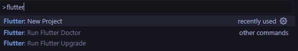
</p>

Pilih application.

<p align="center">
  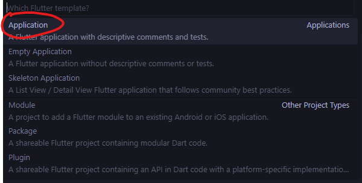
</p>

Pilih folder.

<p align="center">
  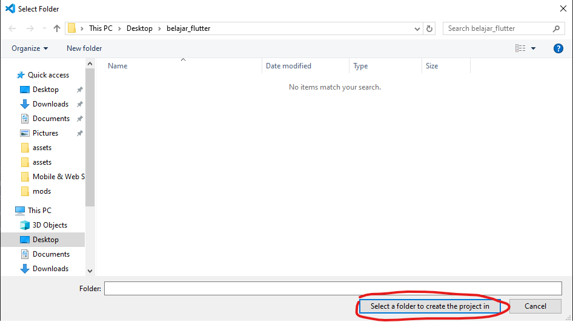
</p>

Atur nama project flutternya.

<p align="center">
  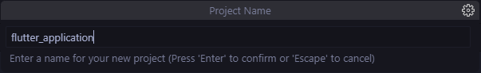
</p>

Project flutter telah dibuat.

<p align="center">
  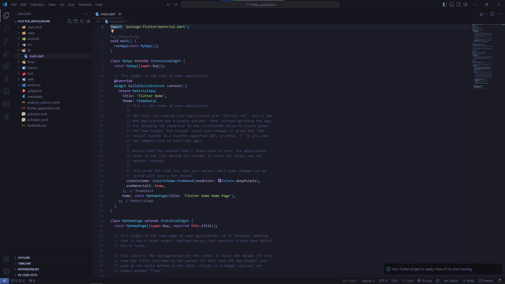
</p>

#### Mencoba Android Studio

Pertama-tama buka android studio terlebih dahulu, lalu klik more actions dan pilih Virtual Device.

<p align="center">
  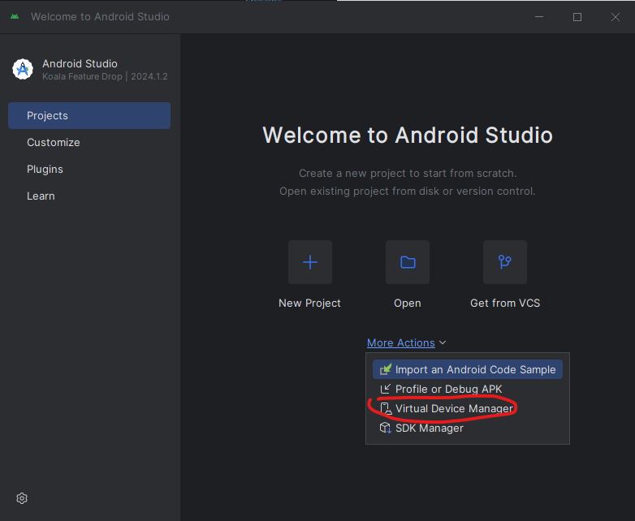
</p>

Klik tanda "+" untuk membuat Virtual Device.

<p align="center">
  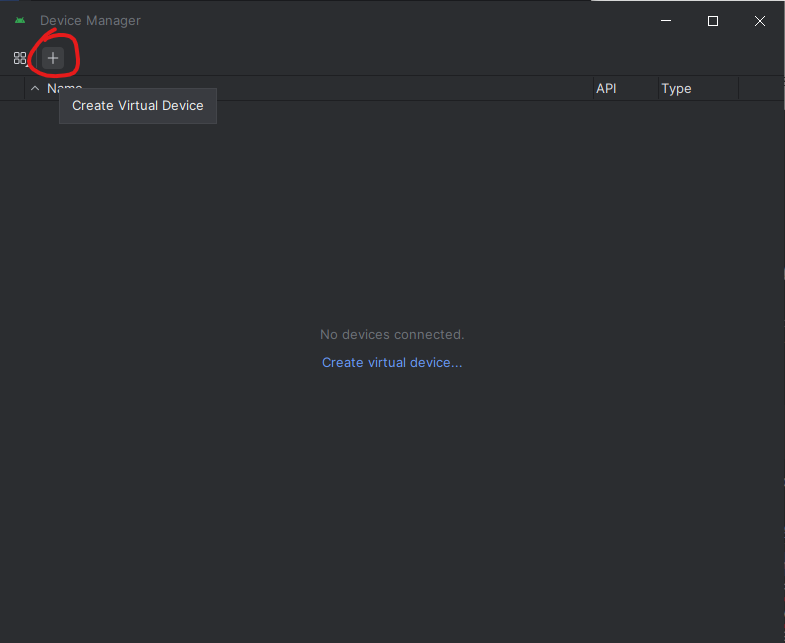
</p>

Pilih hardware dan klik Next

<p align="center">
  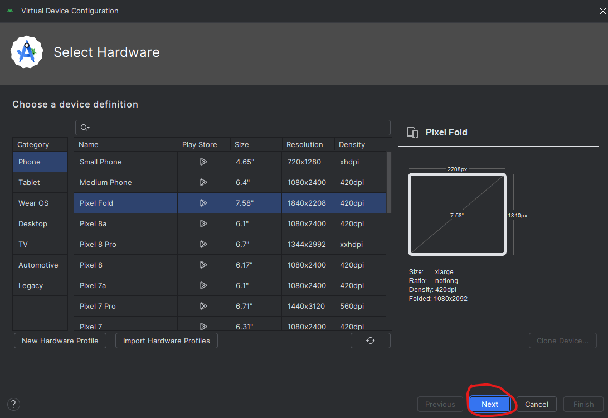
</p>
<p align="center">
  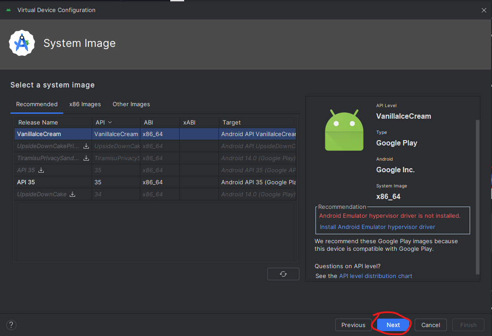
</p>
<p align="center">
  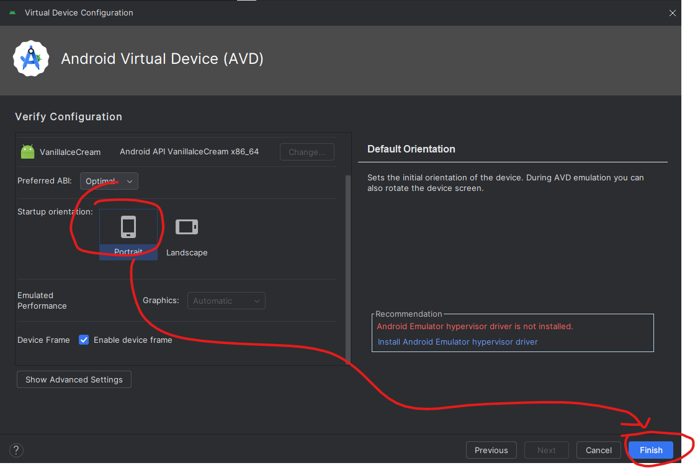
</p>

Virtual Device telah dibuat.

<p align="center">
  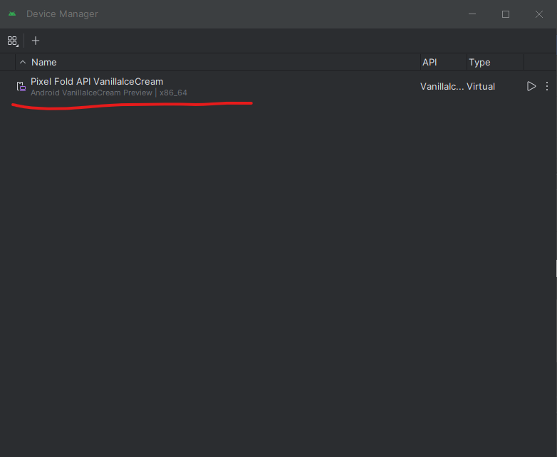
</p>

#### Menjalankan Flutter di VS Code

Pilih devicenya, lalu tunggu.

<p align="center">
  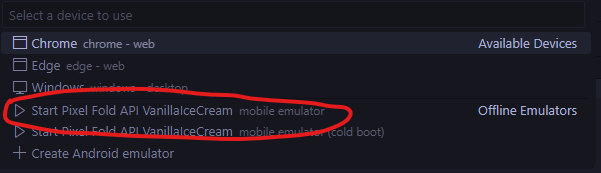
</p>

Terdapat pesan error yang menunjukkan kalau gagal. Saya belum mengetahui penyebabnya apa.

<p align="center">
  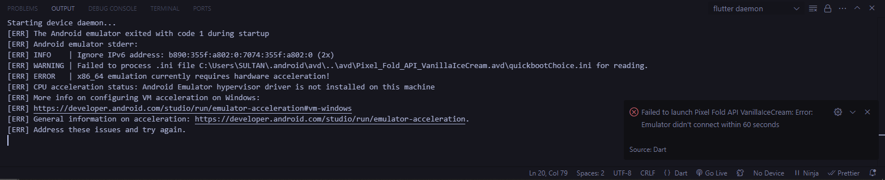
</p>

Sepertinya emulator gagal memulai karena Android Emulator Hypervisor Driver tidak terpasang. Oleh karena itu saya coba untuk mengatasi masalah ini.

Buka Control Panel, pergi ke Programs, lalu Programs and Features, kemudian klik Turn Windows features on or off di sebelah kiri, dan centang kotak untuk Hyper-V, WIndows Hypervisor Platform, dan Virtual Machine Platform, lalu klik OK.

<p align="center">
  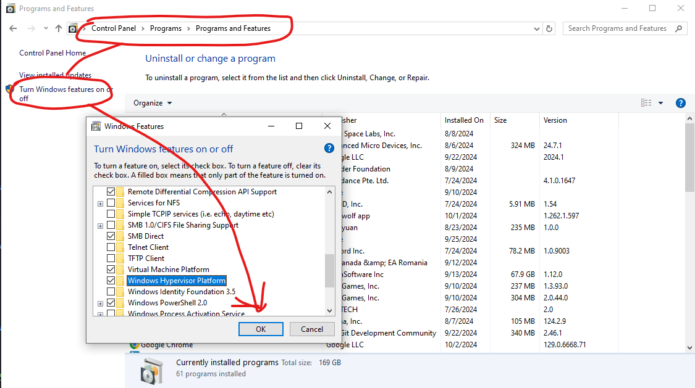
</p>

Karena diminta untuk restart PC, maka saya restart PC terlebih dahulu

<p align="center">
  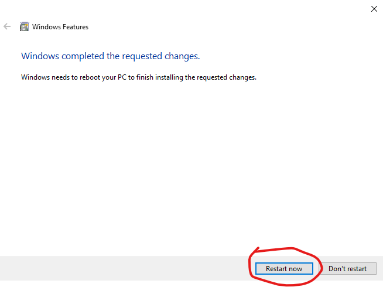
</p>

Karena emulator masih belum bisa dijalankan, saya mencoba untuk melakukan silent install, sesuai saran dari ChatGPT.

<p align="center">
  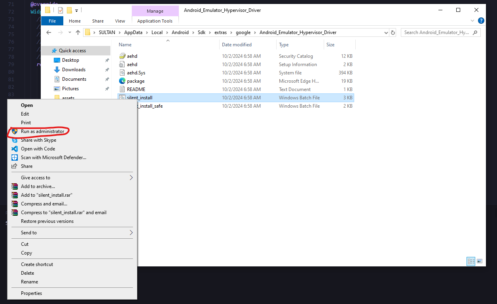
</p>

Saya telah mencoba berbagai cara, namun masih belum dapat terselesaikan. Oleh karena itu, saya mencoba untuk mencoba flutternya tanpa emulator saja.

Ketik prompt flutter run di terminal, lalu ketik 1 untuk memilih yang windows.

<p align="center">
  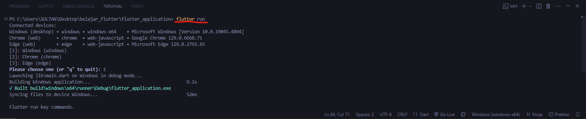
</p>

Flutter dapat dijalankan.

<p align="center">
  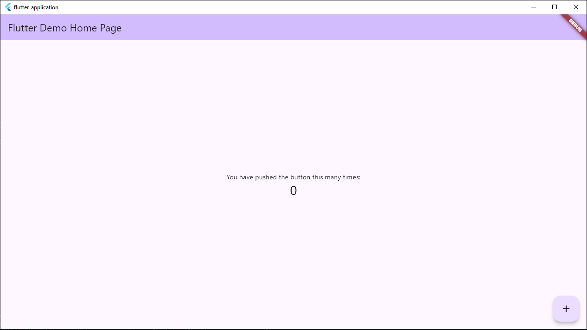
</p>

---

## 2. Flutter Widget

Widget merupakan elemen dasar yang membentuk antarmuka pengguna (UI). Setiap komponen yang ada di layar, seperti tombol, teks, gambar, atau layout, semuanya adalah widget. Flutter Widget memungkinkan developer menciptakan interface yang responsif dengan mudah.

#### 2.1. **Stateless & Stateful Widget**

#### Stateless Widget

Stateless widget merupakan widget yang bersifat statis dan hanya dapat dibangun sekali berdasarkan data yang diberikan saat pembuatan.

```dart
class MyApp extends StatelessWidget {
  const MyApp({super.key});

  @override
  Widget build(BuildContext context) {
    return...
```

#### Stateful Widget

Stateful Widget widget widget yang memiliki status internal yang dapat berubah selama siklus hidup widget tersebut. Status ini bisa berubah sebagai respons terhadap interaksi pengguna atau perubahan data.

```dart
class MyHomePage extends StatefulWidget {
  const MyHomePage({super.key, required this.title});


  final String title;

  @override
  State<MyHomePage> createState() => _MyHomePageState();
}

class _MyHomePageState extends State<MyHomePage> {
  int _counter = 0;

  void _incrementCounter() {
    setState(() {

      _counter++;
    });
  }

  @override
  Widget build(BuildContext context) {

    return...
```

### 2.2. **MaterialApp**

MaterialApp merupakan salah satu widget yang paling penting, dimana widget ini mengatur berbagai aspek penting seperti tema, routing (navigasi), dan lain-lain. Widget ini dapat memudahkan developer untuk membangun UI yang konsisten.

```dart
MaterialApp(
  title: 'Belajar Flutter',
  home: MyHomePage(),
);
```

### 2.3. **Scaffold**

Scaffold merupakan widget yang menyediakan struktur dasar untuk tampilan UI aplikasi. Widget ini memungkinkan developer untuk mengatur elemen-elemen UI seperti AppBar, Drawer, dan lain-lain dengan mudah.

```dart
Scaffold(
  appBar: AppBar(
    title: Text('Contoh Scaffold'),
  ),
  body: Center(
    child: Text('Ini adalah body Scaffold'),
  ),
  floatingActionButton: FloatingActionButton(
    onPressed: () {},
    child: Icon(Icons.add),
  ),
);
```

### 2.4. **AppBar**

AppBar merupakan widget yang menampilkan bar di bagian atas aplikasi, umumnya digunakan untuk menampilkan judul. WIdget ini berfungsi untuk menyediakan navigasi dan informasi penting di bagian atas layar, termasuk ikon, judul, dan menu.

```dart
AppBar(
  title: Text('Belajar Flutter'),
  actions: [
    IconButton(
      icon: Icon(Icons.settings),
      onPressed: () {},
    ),
  ],
);
```

### 2.5. **Center**

Center merupakan widget yang menempatkan komponen ke bagian tengah. Fungsi dari widget ini ialah memudahkan developer untuk mengatur tata letak tiap komponen pada aplikasi.

```dart
Center(
  child: Text(
    'Belajar Flutter',
    style: TextStyle(fontSize: 20),
  ),
);
```

### 2.6. **Text**

Text merupakan widget yang digunakan untuk menampilkan teks. Widget ini memungkinkan developer untuk menampilkan informasi atau pesan kepada user dalam bentuk teks.

```dart
Text(
  'Ini adalah Text Widget',
  style: TextStyle(fontSize: 24, color: Colors.black),
  textAlign: TextAlign.center,
);
```

### 2.7. **Row & Column**

#### Row

Row merupakan widget yang mengatur komponen secara horizontal dalam satu baris.

```dart
Row(
  mainAxisAlignment: MainAxisAlignment.center,
  children: [
    Icon(Icons.star, color: Colors.yellow),
    SizedBox(width: 10),
    Text('Row Widget'),
  ],
);
```

#### Column

Kebalikan dari Row, Column mengatur komponen secara vertikal dalam satu kolom.

```dart
Column(
  mainAxisAlignment: MainAxisAlignment.center,
  children: [
    Icon(Icons.favorite, color: Colors.red),
    SizedBox(height: 10),
    Text('Column Widget'),
  ],
);
```

### 2.8. **TextField**

TextField merupakan widget yang memungkinkan user untuk memasukkan text. Widget ini biasanya digunakan untuk mengumpulkan input dari user, seperti nama, email, atau data lain.

```dart
TextField(
  onChanged: (text) {
    setState(() {
      inputText = text;
    });
  },
  decoration: InputDecoration(
    border: OutlineInputBorder(),
    labelText: 'Masukkan teks',
  ),
);
```

### 2.9. **ElevatedButton**

ElevatedButton merupakan widget tombol yang memiliki efek elevasi/bayangan dibawah buttonnya.

```dart
ElevatedButton(
  onPressed: _handleButtonPress,
  child: Text('Klik Saya'),
);
```

### 2.10. **Contoh Implementasi Widget**

Berikut merupakan contoh implementasi widget pada flutter beserta sedikit penjelasannya :

```dart
import 'package:flutter/material.dart';

void main() => runApp(MyApp());


class MyApp extends StatelessWidget {
  @override
  Widget build(BuildContext context) {
    return MaterialApp(
      title: 'Belajar Flutter',
      home: MyHomePage(),
    );
  }
}


class MyHomePage extends StatefulWidget {
  @override
  _MyHomePageState createState() => _MyHomePageState();
}


class _MyHomePageState extends State<MyHomePage> {
  String inputText = '';
  int _counter = 0;


  void _incrementCounter() {
    setState(() {
      _counter++;
    });
  }

  @override
  Widget build(BuildContext context) {
    return Scaffold(
      appBar: AppBar(
        title: Text('Belajar Flutter'),
      ),

      body: Center(
        child: Column(
          mainAxisAlignment: MainAxisAlignment.center,
          children: <Widget>[
            Text(
              'Masukkan teks :',
              style: TextStyle(fontSize: 16),
            ),

            SizedBox(height: 10),

            Padding(
              padding: const EdgeInsets.symmetric(horizontal: 20.0),
              child: TextField(
                onChanged: (text) {
                  setState(() {
                    inputText = text;
                  });
                },
                decoration: InputDecoration(
                  border: OutlineInputBorder(),
                  hintText: 'Masukkan teks di sini',
                ),
              ),
            ),

            SizedBox(height: 20),


            Text(
              'Hasil input : $inputText',
              style: TextStyle(fontSize: 18, fontWeight: FontWeight.bold),
            ),

            SizedBox(height: 40),


            ElevatedButton(
              onPressed: _incrementCounter,
              child: Text('Klik Saya'),
            ),

            SizedBox(height: 10),


            Text(
              'Jumlah klik : $_counter',
              style: TextStyle(fontSize: 18),
            ),
          ],
        ),
      ),
    );
  }
}
```

#### Aplikasi setelah di Run :

<p align="center">
  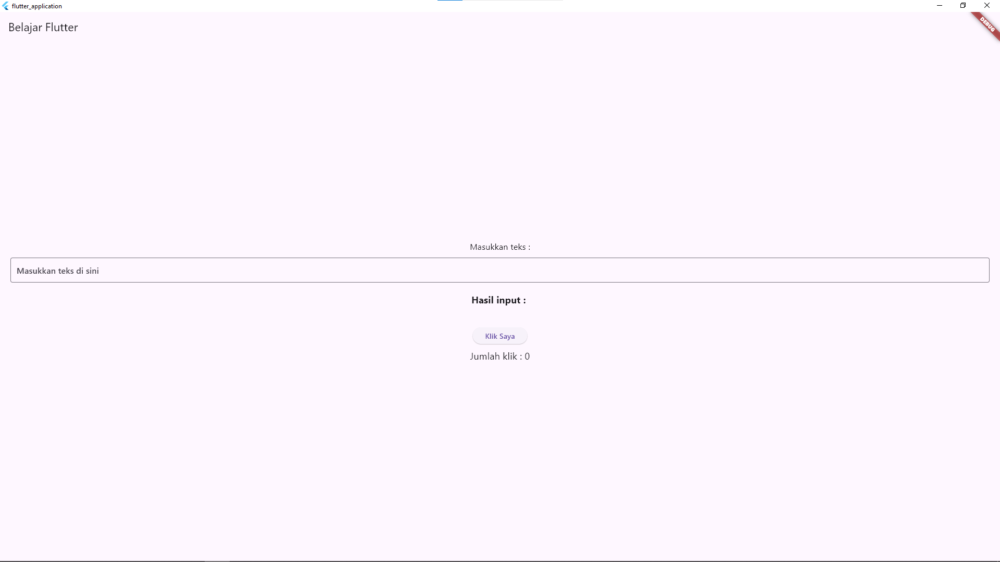
</p>
<p align="center">
  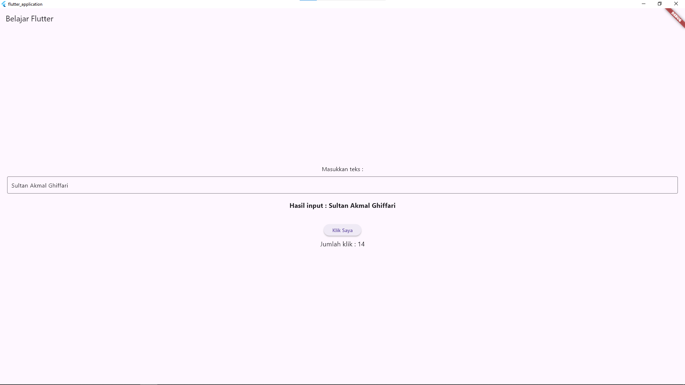
</p>

#### Penjelasan Kode :

- Kode diatas mengimplementasikan beberapa widget seperti AppBar, TextField, ElevatedButton, Text, dan lain-lain.
- Fungsi dari `main()` pada baris awal kode ialah fungsi untuk memanggil `MyApp`.
- Class `MyApp` merupakan nama yang saya berikan untuk StatelessWidget yang mendefinisikan aplikasi utama.
- Saya kemudian memberi nama class `MyHomePage` untuk StatefulWidget yang berfungsi sebagai halaman utama aplikasi.
- Saya juga membuat class `_MyHomePageState` untuk menyimpan dan mengelola data untuk input teks dan jumlah klik.
- Berikut merupakan fungsi dari masing-masing widget :
  - `MaterialApp` : Mengatur judul aplikasi dan halaman awal (home). Pada kode diatas, saya memberi judul "Belajar Flutter".
  - `Scaffold` : Mengatur widget AppBar, body, dan elemen lain.
  - `AppBar` : Menampilkan judul aplikasi. Pada kode diatas, saya memberi judul "Belajar Flutter".
  - `Center` : Mengatur posisi semua child widget ke tengah layar.
  - `Text` : Menampilkan text.
  - `TextField` : Mengambil input text dari user.
  - `ElevatedButton` : Menangani aksi klik dari user, dimana dalam kode diatas, fungsinya ialah menghitung jumlah klik.
  - `Column` : Mengatur tata letak vertikal semua child widget yang ditampung di dalamnya.

---
