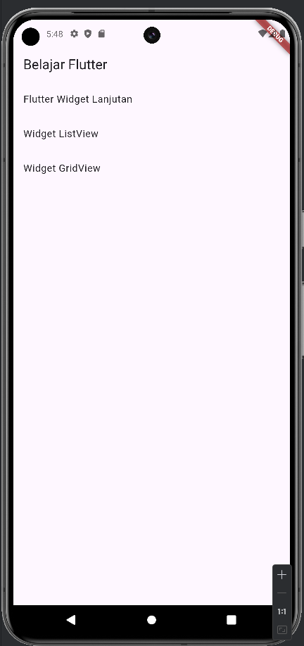
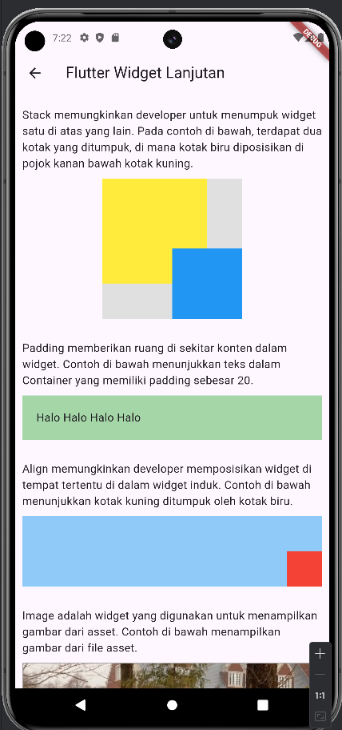
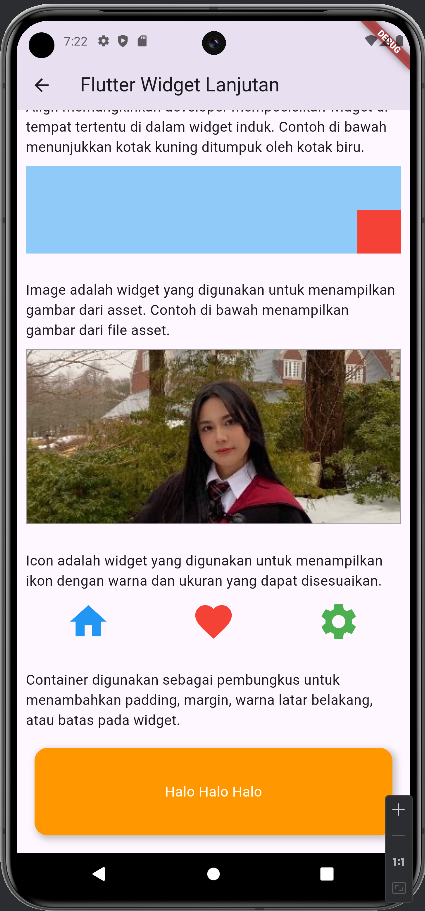
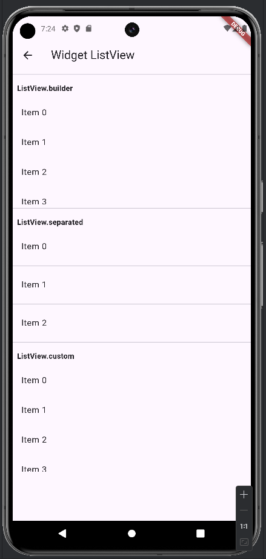
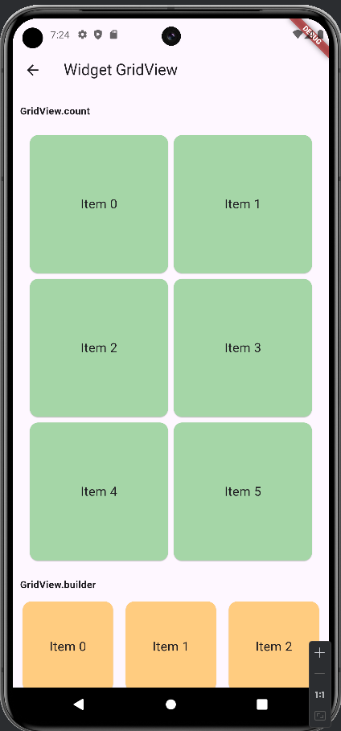
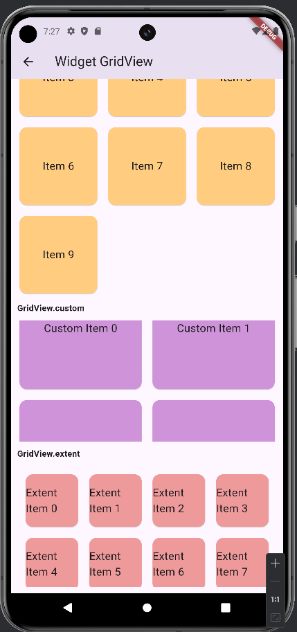

# Week 3 (Minggu Ketiga)

**Tanggal**: 3 Oktober 2024

**Nama**: Sultan Akmal Ghiffari
**NPM**: 5220411047

---

# Daftar Isi

- [Daftar Isi](#daftar-isi)
- [1. Flutter Widget Lanjutan](#1-flutter-widget-lanjutan)
  - [1.1. **Stack**](#11-stack)
  - [1.2. **Padding**](#12-padding)
  - [1.3. **Align**](#13-align)
  - [1.4. **Image**](#14-image)
  - [1.5. **Icon**](#15-icon)
  - [1.6. **Container**](#16-container)
- [2. Widget ListView](#2-widget-listview)
  - [2.1. **ListView.builder**](#21-listviewbuilder)
  - [2.2. **ListView.separated**](#22-listviewseparated)
  - [2.3. **ListView.custom**](#23-listviewcustom)
- [3. Widget GridView](#3-widget-gridview)
  - [3.1. **GridView.builder**](#31-gridviewbuilder)
  - [3.2. **GridView.custom**](#32-gridviewcustom)
  - [3.3. **GridView.count**](#32-gridviewcustom)
  - [3.4. **GridView.extent**](#34-gridviewextent)
- [4. Contoh Implementasi](#4-flutter-navigation)
- [5. Flutter Navigation](#5-flutter-navigation)
- [Referensi](#referensi)

#### 1. **Flutter Widget Lanjutan**

Pada laporan minggu lalu, saya telah mempelajari beberapa widget dasar pada flutter. Pada laporan minggu ini, saya akan mempelajari widget lanjutan.

### 1.1. **Stack**

Stack merupakan widget yang menumpuk widget-widget lain di atas satu sama lain. Widget ini berguna untuk membuat tata letak yang lebih dinamis, seperti overlay dan latar belakang yang menutupi konten lainnya.

```dart
Stack(
  children: [
    Container(
      color: Colors.yellow,
      width: 150,
      height: 150,
    ),
    Positioned(
      right: 0,
      bottom: 0,
      child: Container(
        color: Colors.blue,
        width: 100,
        height: 100,
      ),
    ),
  ],
)
```

### 1.2. **Padding**

Padding merupakan widget yang memberikan ruang di sekitar widget lain. Widget ini berguna untuk membuat jarak yang konsisten antara elemen UI sehingga tampak lebih teratur dan tidak terlalu rapat.

```dart
Padding(
  padding: EdgeInsets.all(16.0),
  child: Text('Ini adalah teks dengan padding.'),
)
```

### 1.3. **Align**

Align merupakan widget yang memungkinkan developer untuk mengatur posisi widget anak di dalam widget induknya. Developer dapat menentukan posisi child widget dengan menggunakan properti ```alignment```.

```dart
Container(
  width: 200,
  height: 200,
  color: Colors.blue,
  child: Align(
    alignment: Alignment.bottomRight,
    child: Container(
      color: Colors.red,
      width: 50,
      height: 50,
    ),
  ),
)
```

### 1.4. **Image**

Image merupakan widget yang digunakan untuk menampilkan gambar dari berbagai sumber, seperti asset lokal, URL, atau file. Widget ini memungkinkan developer untuk mengintegrasikan elemen visual ke dalam aplikasi.

```dart
Image.asset(
  'assets/background.jpg',
  fit: BoxFit.cover,
)

```

### 1.5. **Icon**

Icon merupakan widget yang digunakan untuk menampilkan ikon. Ukuran dan warna pada ikon dapat disesuaikan sesuai dengan kebutuhan developer. Icon sering digunakan untuk memberikan visual pada tombol.

```dart
Icon(
  Icons.home,
  size: 50,
  color: Colors.blue,
)
```

### 1.6. **Container**

Container merupakan widget yang dapat digunakan untuk mengatur dan menata layout widget lain. Developer dapat memberikan padding, margin, border, background color, dan lain lain.

```dart
Container(
  padding: EdgeInsets.all(20.0),
  decoration: BoxDecoration(
    color: Colors.blueAccent,
    borderRadius: BorderRadius.circular(15),
    boxShadow: [
      BoxShadow(
        color: Colors.black26,
        blurRadius: 10,
        offset: Offset(0, 5),
      ),
    ],
  ),
  child: Text(
    'Ini adalah Container dengan styling yang menarik.',
    style: TextStyle(color: Colors.white),
  ),
)
```


#### 2. **Widget ListView**

Widget ListView digunakan untuk menampilkan daftar yang dapat di scroll dari item. ListView dapat digunakan untuk menampilkan data yang banyak, seperti daftar item, kontak, atau daftar pesan.

### 2.1. **ListView.builder**

ListView.builder merupakan konstruktor yang memungkinkan developer untuk membuat list yang besar secara efisien.

```dart
ListView.builder(
  itemCount: 100,
  itemBuilder: (context, index) {
    return ListTile(
      title: Text('Item $index'),
    );
  },
)
```

### 2.2. **ListView.separated**

Mirip dengan ListView.builder, ListView.separated memungkinkan developer untuk memisahkan antar item pada list.

```dart
ListView.separated(
  itemCount: 100,
  itemBuilder: (context, index) {
    return ListTile(
      title: Text('Item $index'),
    );
  },
  separatorBuilder: (context, index) => Divider(),
)
```

### 2.3. **ListView.custom**

ListView.custom memungkinkan developer untuk membuat list dengan menggunakan delegate custom.

```dart
ListView.custom(
  childrenDelegate: SliverChildBuilderDelegate(
    (context, index) => ListTile(
      title: Text('Custom Item $index'),
    ),
    childCount: 100,
  ),
)
```


#### 3. **Widget GridView**

GridView merupakan widget yang digunakan untuk menampilkan dalam bentuk grid. Widget ini memungkinkan developer untuk mengatur tata letak yang lebih terstruktur.

### 3.1. **GridView.builder**

GridView.builder memungkinkan developer untuk membuat grid yang besar secara efisien tanpa membebani memori.

```dart
GridView.builder(
  gridDelegate: const SliverGridDelegateWithFixedCrossAxisCount(
    crossAxisCount: 3,
  ),
  itemCount: 9,
  itemBuilder: (context, index) {
    return Card(
      color: Colors.green[200],
      child: Center(
        child: Text('Item $index', style: const TextStyle(fontSize: 18)),
      ),
    );
  },
)

```

### 3.2. **GridView.custom**

GridView.custom memberi developer kontrol penuh atas bagaimana item grid dibangun.

```dart
GridView.custom(
  gridDelegate: const SliverGridDelegateWithFixedCrossAxisCount(
    crossAxisCount: 2,
  ),
  childrenDelegate: SliverChildBuilderDelegate(
    (BuildContext context, int index) {
      return Card(
        color: Colors.blue[200],
        child: Center(
          child: Text('Custom Item $index', style: const TextStyle(fontSize: 18)),
        ),
      );
    },
    childCount: 6,
  ),
)
```

### 3.3. **GridView.count**

GridView.count memungkinkan developer untuk membuat grid dengan jumlah kolom tertentu secara otomatis. Developer hanya perlu menentukan jumlah kolom, dan widget ini akan secara otomatis membagi item ke dalam grid.

```dart
GridView.count(
  crossAxisCount: 2,
  padding: const EdgeInsets.all(10),
  children: List.generate(6, (index) {
    return Card(
      color: Colors.red[200],
      child: Center(
        child: Text('Item $index', style: const TextStyle(fontSize: 18)),
      ),
    );
  }),
)

```

### 3.4. **GridView.extent**

GridView.extent merupakan widget yang memungkinkan developer untuk menentukan ukuran maksimum dari setiap item dalam grid. Widget ini akan mengatur item dalam kolom berdasarkan ukuran yang ditentukan.

```dart
GridView.extent(
  maxCrossAxisExtent: 100,
  padding: const EdgeInsets.all(10),
  children: List.generate(8, (index) {
    return Card(
      color: Colors.yellow[200],
      child: Center(
        child: Text('Item $index', style: const TextStyle(fontSize: 18)),
      ),
    );
  }),
)

```


#### 4. **Contoh Implementasi**

Berikut merupakan aplikasi sederhana yang saya buat untuk mendemonstrasikan widget-widget pada flutter beserta sedikit penjelasan dalam bentuk komentar/caption di dalam kode :

```dart
import 'package:flutter/material.dart';

void main() => runApp(MyApp()); //Fungsi utama yang menjalankan aplikasi dengan MyApp

class MyApp extends StatelessWidget { //Kelas utama aplikasi
  const MyApp({super.key});

  @override
  Widget build(BuildContext context) {
    return MaterialApp(
      title: 'Flutter Widget Lanjutan', //Judul aplikasi
      home: HomePage(), //Halaman utama aplikasi
    );
  }
}

class HomePage extends StatelessWidget { //Kelas untuk halaman utama
  const HomePage({super.key});

  @override
  Widget build(BuildContext context) {
    return Scaffold( //Struktur dasar halaman
      appBar: AppBar(
        title: const Text('Belajar Flutter'), //Judul di AppBar
      ),
      body: ListView(
        children: [
          ListTile(
            title: const Text('Flutter Widget Lanjutan'), //Judul item
            onTap: () { //Aksi saat item diklik
              Navigator.push(
                context,
                MaterialPageRoute(builder: (context) => const WidgetDemoPage()), //Navigasi ke WidgetDemoPage
              );
            },
          ),
          ListTile(
            title: const Text('Widget ListView'), //Judul item untuk ListView
            onTap: () { //Aksi saat item diklik
              Navigator.push(
                context,
                MaterialPageRoute(builder: (context) => const ListViewDemoPage()), //Navigasi ke ListViewDemoPage
              );
            },
          ),
          ListTile(
            title: const Text('Widget GridView'), //Judul item untuk GridView
            onTap: () { //Aksi saat item diklik
              Navigator.push(
                context,
                MaterialPageRoute(builder: (context) => const GridViewDemoPage()), //Navigasi ke GridViewDemoPage
              );
            },
          ),
        ],
      ),
    );
  }
}

class WidgetDemoPage extends StatelessWidget { //Kelas untuk halaman demo Widget
  const WidgetDemoPage({super.key});

  @override
  Widget build(BuildContext context) {
    return Scaffold(
      appBar: AppBar(title: const Text('Flutter Widget Lanjutan')), //Judul di AppBar
      body: ListView(
        padding: const EdgeInsets.all(10), //Tambahkan padding di sekeliling ListView
        children: [
          const Padding(
            padding: EdgeInsets.symmetric(vertical: 10),
            child: Text(
              'Stack memungkinkan developer untuk menumpuk widget satu di atas yang lain. '
              'Pada contoh di bawah, terdapat dua kotak yang ditumpuk, di mana kotak biru diposisikan '
              'di pojok kanan bawah kotak kuning.',
              style: TextStyle(fontSize: 16), //Styling teks
            ),
          ),
          Center(
            child: Container(
              width: 200,
              height: 200,
              color: Colors.grey[300], //Warna background
              child: Stack( //Widget Stack untuk menumpuk widget
                children: [
                  Positioned( //Posisi widget dalam Stack
                    left: 0,
                    top: 0,
                    child: Container(
                      color: Colors.yellow, //Warna kontainer 1
                      width: 150,
                      height: 150,
                    ),
                  ),
                  Positioned( //Widget lain dalam Stack, hasilnya nanti kotak kuning akan ditumpuk oleh kotak biru
                    right: 0,
                    bottom: 0,
                    child: Container(
                      color: Colors.blue, //Warna kontainer 2
                      width: 100,
                      height: 100,
                    ),
                  ),
                ],
              ),
            ),
          ),
          const SizedBox(height: 20),
          
          const Padding(
            padding: EdgeInsets.symmetric(vertical: 10),
            child: Text(
              'Padding memberikan ruang di sekitar konten dalam widget. '
              'Contoh di bawah menunjukkan teks dalam Container yang memiliki padding sebesar 20.',
              style: TextStyle(fontSize: 16), //Styling teks
            ),
          ),
          Container(
            color: Colors.green[200], //Warna background
            padding: const EdgeInsets.all(20.0), //Tambahkan padding di sekeliling konten
            child: const Text(
              'Halo Halo Halo Halo', //Teks di dalam kontainer
              style: TextStyle(fontSize: 16), //Styling teks
            ),
          ),
          const SizedBox(height: 20),

          const Padding(
            padding: EdgeInsets.symmetric(vertical: 10),
            child: Text(
              'Align memungkinkan developer memposisikan widget di tempat tertentu di dalam '
              'widget induk. Contoh di bawah menunjukkan kotak kuning ditumpuk oleh kotak biru.',
              style: TextStyle(fontSize: 16), //Styling teks
            ),
          ),
          Container(
            height: 100,
            color: Colors.blue[200], //Warna background
            child: Align(
              alignment: Alignment.bottomRight, //Posisi widget
              child: Container(
                color: Colors.red, //Warna kontainer
                width: 50,
                height: 50,
              ),
            ),
          ),
          const SizedBox(height: 20),

          const Padding(
            padding: EdgeInsets.symmetric(vertical: 10),
            child: Text(
              'Image adalah widget yang digunakan untuk menampilkan gambar dari asset. Contoh di bawah '
              'menampilkan gambar dari file asset.',
              style: TextStyle(fontSize: 16), //Styling teks
            ),
          ),
          Container(
            height: 200,
            decoration: BoxDecoration(
              border: Border.all(color: Colors.grey), //Tambahkan border di sekeliling kontainer
            ),
            child: Image.asset(
              'assets/background.jpg', //Gambar yang ditampilkan
              fit: BoxFit.cover, //Pastikan gambar mengisi kontainer
            ),
          ),
          const SizedBox(height: 20),

          const Padding(
            padding: EdgeInsets.symmetric(vertical: 10),
            child: Text(
              'Icon adalah widget yang digunakan untuk menampilkan ikon dengan warna dan ukuran yang dapat disesuaikan.',
              style: TextStyle(fontSize: 16), //Styling teks
            ),
          ),
          Row(
            mainAxisAlignment: MainAxisAlignment.spaceAround, //Mengatur posisi ikon secara horizontal
            children: const [
              Icon(Icons.home, size: 50, color: Colors.blue), //Ikon rumah
              Icon(Icons.favorite, size: 50, color: Colors.red), //Ikon hati
              Icon(Icons.settings, size: 50, color: Colors.green), //Ikon pengaturan
            ],
          ),
          const SizedBox(height: 20),

          const Padding(
            padding: EdgeInsets.symmetric(vertical: 10),
            child: Text(
              'Container digunakan sebagai pembungkus untuk menambahkan padding, margin, warna latar belakang, atau batas pada widget.',
              style: TextStyle(fontSize: 16), //Styling teks
            ),
          ),
          Container(
            width: 200,
            height: 100,
            margin: const EdgeInsets.all(10), //Tambahkan margin di sekeliling kontainer
            padding: const EdgeInsets.all(20), //Tambahkan padding di dalam kontainer
            decoration: BoxDecoration(
              color: Colors.orange, //Warna background
              borderRadius: BorderRadius.circular(15), //Tambahkan border radius
              boxShadow: [ //Menambahkan bayangan
                BoxShadow(
                  color: Colors.black.withOpacity(0.2), //Tambahkan warna bayangan
                  spreadRadius: 2, //Radius penyebaran bayangan
                  blurRadius: 5, //Radius blur bayangan
                  offset: const Offset(3, 3), //Offset posisi bayangan
                ),
              ],
            ),
            child: const Center(
              child: Text(
                'Halo Halo Halo', //Teks di dalam kontainer
                style: TextStyle(fontSize: 16, color: Colors.white), //Styling teks
              ),
            ),
          ),
        ],
      ),
    );
  }
}

class ListViewDemoPage extends StatelessWidget { //Kelas untuk demo ListView
  const ListViewDemoPage({super.key});

  @override
  Widget build(BuildContext context) {
    return Scaffold(
      appBar: AppBar(title: const Text('Widget ListView')), //Judul di AppBar
      body: ListView(
        children: [
          const Divider(), //Pemisah
          const Padding(
            padding: EdgeInsets.all(8.0),
            child: Text(
              'ListView.builder',
              style: TextStyle(fontWeight: FontWeight.bold), //Styling teks
            ),
          ),
          SizedBox(
            height: 200, //Atur tinggi
            child: ListView.builder( //ListView dengan builder
              itemCount: 5, //Menetapkan jumlah item
              itemBuilder: (context, index) {
                return ListTile(
                  title: Text('Item $index'), //Judul item
                );
              },
            ),
          ),
          const Divider(), //Pemisah
          const Padding(
            padding: EdgeInsets.all(8.0),
            child: Text(
              'ListView.separated',
              style: TextStyle(fontWeight: FontWeight.bold), //Styling teks
            ),
          ),
          SizedBox(
            height: 200, //Atur tinggi
            child: ListView.separated( //ListView dengan pemisah
              itemCount: 5, //Menetapkan jumlah item
              separatorBuilder: (context, index) => const Divider(), //Pemisah
              itemBuilder: (context, index) {
                return ListTile(
                  title: Text('Item $index'), //Judul item
                );
              },
            ),
          ),
          const Divider(), //Pemisah
          const Padding(
            padding: EdgeInsets.all(8.0),
            child: Text(
              'ListView.custom',
              style: TextStyle(fontWeight: FontWeight.bold), //Styling teks
            ),
          ),
          SizedBox(
            height: 200, //Atur tinggi
            child: ListView.custom( //ListView dengan custom builder
              childrenDelegate: SliverChildBuilderDelegate(
                (context, index) => ListTile(
                  title: Text('Item $index'), //Judul item
                ),
                childCount: 5, //Menetapkan jumlah item
              ),
            ),
          ),
        ],
      ),
    );
  }
}

class GridViewDemoPage extends StatelessWidget { // Kelas untuk demo GridView
  const GridViewDemoPage({super.key});

  @override
  Widget build(BuildContext context) {
    return Scaffold(
      appBar: AppBar(title: const Text('Widget GridView')), // Judul di AppBar
      body: ListView(
        padding: const EdgeInsets.all(10), // Tambahkan padding di sekeliling ListView
        children: [
          const Padding(
            padding: EdgeInsets.symmetric(vertical: 10),
            child: Text(
              'GridView.count',
              style: TextStyle(fontWeight: FontWeight.bold), // Styling teks
            ),
          ),
          GridView.count(
            crossAxisCount: 2, // Menetapkan jumlah kolom
            padding: const EdgeInsets.all(10), // Tambahkan padding di sekeliling grid
            shrinkWrap: true, // Mengatur ukuran grid sesuai isi
            physics: const NeverScrollableScrollPhysics(), // Menonaktifkan scroll grid
            children: List.generate(6, (index) {
              return Card(
                color: Colors.green[200], // Warna background kartu
                child: Center(
                  child: Text('Item $index', style: const TextStyle(fontSize: 18)), // Teks di dalam kartu
                ),
              );
            }),
          ),
          const Padding(
            padding: EdgeInsets.symmetric(vertical: 10),
            child: Text(
              'GridView.builder',
              style: TextStyle(fontWeight: FontWeight.bold), // Styling teks
            ),
          ),
          GridView.builder(
            gridDelegate: const SliverGridDelegateWithFixedCrossAxisCount(
              crossAxisCount: 3, // Menetapkan jumlah kolom
              crossAxisSpacing: 10, // Mengatur jarak horizontal antar kolom
              mainAxisSpacing: 10, // Mengatur jarak vertikal antar baris
            ),
            shrinkWrap: true, // Mengatur ukuran grid sesuai isi
            physics: const NeverScrollableScrollPhysics(), // Menonaktifkan scroll grid
            itemCount: 10, // Menetapkan jumlah item
            itemBuilder: (context, index) {
              return Card(
                color: Colors.orange[200], // Warna background kartu
                child: Center(
                  child: Text('Item $index', style: const TextStyle(fontSize: 18)), // Teks di dalam kartu
                ),
              );
            },
          ),
          const Padding(
            padding: EdgeInsets.symmetric(vertical: 10),
            child: Text(
              'GridView.custom',
              style: TextStyle(fontWeight: FontWeight.bold), // Styling teks
            ),
          ),
          SizedBox(
            height: 200, // Atur tinggi
            child: GridView.custom(
              gridDelegate: SliverGridDelegateWithFixedCrossAxisCount(
                crossAxisCount: 2, // Menetapkan jumlah kolom
                crossAxisSpacing: 10,
                mainAxisSpacing: 10,
              ),
              childrenDelegate: SliverChildBuilderDelegate(
                (context, index) {
                  return Card(
                    color: Colors.purple[200], // Warna background kartu
                    child: Center(
                      child: Text('Custom Item $index', style: const TextStyle(fontSize: 18)), // Teks di dalam kartu
                    ),
                  );
                },
                childCount: 6, // Menetapkan jumlah item
              ),
            ),
          ),
          const Padding(
            padding: EdgeInsets.symmetric(vertical: 10),
            child: Text(
              'GridView.extent',
              style: TextStyle(fontWeight: FontWeight.bold), // Styling teks
            ),
          ),
          SizedBox(
            height: 200, // Atur tinggi
            child: GridView.extent(
              maxCrossAxisExtent: 120, // Mengatur lebar maksimum setiap item
              padding: const EdgeInsets.all(10),
              crossAxisSpacing: 10,
              mainAxisSpacing: 10,
              children: List.generate(8, (index) {
                return Card(
                  color: Colors.red[200], // Warna background kartu
                  child: Center(
                    child: Text('Extent Item $index', style: const TextStyle(fontSize: 18)), // Teks di dalam kartu
                  ),
                );
              }),
            ),
          ),
        ],
      ),
    );
  }
}
```

Hasil kode setelah di run :

<p align="center">
  
</p>

- Halaman Flutter Widget Lanjutan

<p align="center">
  
</p>
<p align="center">
  
</p>

- Halaman Widget ListView

<p align="center">
  
</p>

- Halaman Widget GridView

<p align="center">
  
</p>
<p align="center">
  
</p>

#### 5. **Flutter Navigation**

Pada flutter, navigasi memungkinkan pengguna untuk berpindah antar halaman dalam aplikasi. Flutter menyediakan berbagai cara untuk navigasi.

Pada kode saya diatas, saya menggunakan navigasi untuk berpindah antara halaman menggunakan ```ListTile``` dan ```Navigator.push```.

```dart
ListTile(
  title: const Text('Flutter Widget Lanjutan'), //Judul item
  onTap: () { //Aksi saat item diklik
    Navigator.push(
      context,
      MaterialPageRoute(builder: (context) => const WidgetDemoPage()), //Navigasi ke WidgetDemoPage
    );
  },
),
```

Selain ```Navigator.push```, kita juga dapat menggunakan ```Navigator.pop``` untuk berpindah halaman, namun saya tidak menggunakan ```Navigator.pop``` pada kode saya. 

Cara kerja dari ```Navigator.pop``` ialah menutup halaman yang sedang ditampilkan dan mengembalikannya ke halaman sebelumnya dalam stack navigasi.


#### **Referensi**
- Modul Praktikum
- https://api.flutter.dev/flutter/widgets/widgets-library.html