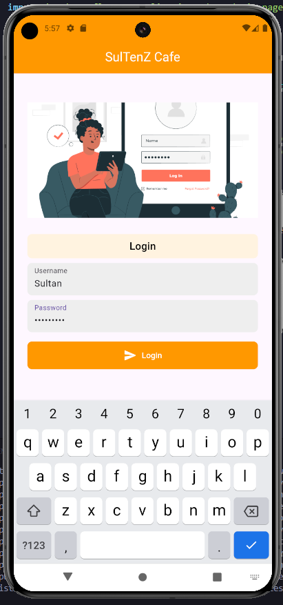

# Week 4 (Minggu Keempat)

**Tanggal**: 10 Oktober 2024

**Nama**: Sultan Akmal Ghiffari

**NPM**: 5220411047

---

## Dokumentasi Tugas Pertemuan 4

<p align="center">
  
</p>

Tugas pertemuan 4 yang dikerjakan di kelas ialah membuat interface login dan menu sederhana untuk aplikasi kantin/warung.

### Struktur

Saya memisahkan screen di masing-masing file menjadi seperti ini :

<p align="center">
  
</p>

- ```main.dart``` berisi logika utama dan navigasi antara halaman login dan halaman setelah berhasil login, atau menu utama.
- ```page/home_page.dart``` berisi halaman login.
- ```page/main_page.dart``` berisi halaman setelah berhasil login, atau menu utama.
- ```model/data.dart``` merupakan class untuk menyimpan data login.

### Membuat Model Data untuk Login (```data.dart```)

File ini berfungsi untuk menyimpan data login. Class ```Data``` memiliki dua properti, yaitu ```username``` dan ```password``` yang akan digunakan untuk menyimpan input pengguna.

```dart
class Data {
  String? password;
  String? username;

  Data({this.password, this.username});
}
```

### Membuat Form Login (```home_page.dart```)

- Untuk membangun halaman login, saya menggunakan widget ```TextField``` agar dapat mengumpulkan input username dan password.
- Untuk menangani input, saya menggunakan ```TextEditingController```.
- Ketika tombol login ditekan, aplikasi akan memvalidasi input dan mengarahkan pengguna ke halaman menu ```MainPage```.

Textfield untuk username dan password :
```dart
  final passwordController = TextEditingController();
  final usernameController = TextEditingController();
```

Setiap kali pengguna mengisi form dan menekan tombol login, sistem akan menyimpan input data tersebut :

```dart
  void _login() {
    final username = usernameController.text;
    final password = passwordController.text;

    addToDataList(password, username);
    passwordController.clear();
    usernameController.clear();
    errorMessage = null;

    Navigator.of(context).push(MaterialPageRoute(
      builder: (context) => MainPage(username: username),
    ));
  }
```

Kode untuk membuat tampilan login :

```dart
  @override
  Widget build(BuildContext context) {
    return Scaffold(
      appBar: AppBar(
        title: const Center(child: Text("SulTenZ Cafe")),
        backgroundColor: Colors.orange,
        foregroundColor: Colors.white,
      ),
      body: Column(
        children: [
          const SizedBox(height: 50),
          Padding(
            padding: const EdgeInsets.symmetric(horizontal: 24),
            child: Image.asset(
              'assets/login.jpg',
              width: MediaQuery.sizeOf(context).width * 1,
              height: 200,
              fit: BoxFit.cover,
            ),
          ),
          const SizedBox(height: 20),
          Padding(
            padding: const EdgeInsets.symmetric(horizontal: 24, vertical: 8),
            child: Container(
              width: MediaQuery.sizeOf(context).width,
              alignment: Alignment.center,
              decoration: BoxDecoration(
                borderRadius: BorderRadius.circular(8),
                color: Colors.orange.shade50,
              ),
              child: const Padding(
                padding: EdgeInsets.symmetric(horizontal: 24, vertical: 8),
                child: Text(
                  "Login",
                  style: TextStyle(fontSize: 18, color: Colors.black, fontWeight: FontWeight.w500),
                ),
              ),
            ),
          ),
          Padding(
            padding: const EdgeInsets.symmetric(horizontal: 24),
            child: Container(
              width: MediaQuery.sizeOf(context).width,
              decoration: BoxDecoration(
                borderRadius: BorderRadius.circular(8),
                color: Colors.grey.shade200,
              ),
              child: Padding(
                padding: const EdgeInsets.symmetric(horizontal: 12),
                child: TextField(
                  decoration: const InputDecoration(
                    labelText: "Username",
                    hintText: "Insert username...",
                    border: UnderlineInputBorder(
                      borderSide: BorderSide.none,
                    ),
                  ),
                  controller: usernameController,
                ),
              ),
            ),
          ),
          const SizedBox(height: 8),
          Padding(
            padding: const EdgeInsets.symmetric(horizontal: 24),
            child: Container(
              width: MediaQuery.sizeOf(context).width,
              decoration: BoxDecoration(
                borderRadius: BorderRadius.circular(8),
                color: Colors.grey.shade200,
              ),
              child: Padding(
                padding: const EdgeInsets.symmetric(horizontal: 12),
                child: TextField(
                  decoration: const InputDecoration(
                    labelText: "Password",
                    hintText: "Insert Password",
                    border: UnderlineInputBorder(
                      borderSide: BorderSide.none,
                    ),
                  ),
                  controller: passwordController,
                  obscureText: true,
                ),
              ),
            ),
          ),
          const SizedBox(height: 16),
          Padding(
            padding: const EdgeInsets.symmetric(horizontal: 24),
            child: Container(
              width: MediaQuery.sizeOf(context).width,
              decoration: BoxDecoration(
                borderRadius: BorderRadius.circular(8),
                color: Colors.orange,
              ),
              child: TextButton(
                onPressed: _login,
                child: const Row(
                  mainAxisAlignment: MainAxisAlignment.center,
                  children: [
                    Icon(
                      Icons.send_rounded,
                      color: Colors.white,
                    ),
                    SizedBox(width: 8),
                    Text(
                      "Login",
                      style: TextStyle(color: Colors.white),
                    ),
                  ],
                ),
              ),
            ),
          ),
        ],
      ),
    );
  }
```

<p align="center">
  
</p>

### Membuat Navigasi ke Halaman Menu Utama (```main_page.dart```)

- Setelah login, pengguna akan diarahkan ke halaman ```MainPage``` yang menampilkan nama pengguna dan daftar menu cafe.
- Pada halaman ini, data ```username``` yang telah diinput pada halaman login akan diteruskan dan ditampilkan pada tampilan selamat siang.
- Daftar menu ditampilkan dengan ```ListView.builder```.
- Saya juga membuat list yang berisi data menu yang akan ditampilkan.

Membuat ucapan selamat datang dengan ```Text``` :

```dart
Text(
    "Halo, $username. Selamat datang!",
    style: const TextStyle(fontSize: 20, fontWeight: FontWeight.bold),
),
```

Membuat daftar menu dengan ```ListView.builder``` :

```dart
ListView.builder(
    itemCount: menuItems.length,
    itemBuilder: (context, index) {
        return Card(
            margin: const EdgeInsets.symmetric(vertical: 10, horizontal: 15),
            child: ListTile(
                contentPadding: const EdgeInsets.all(10),
                leading: Image.asset(
                    menuItems[index]['image'],
                    width: 40,
                    height: 40,
                ),
                title: Text(
                    menuItems[index]['name']!,
                    style: const TextStyle(fontSize: 20, fontWeight: FontWeight.bold),
                ),
                subtitle: Text(
                    menuItems[index]['price']!,
                    style: const TextStyle(fontSize: 16, color: Colors.grey),
                ),
            ),
        );
    },
),
```

List yang berisi data menu yang akan ditampilkan :

```dart
  final List<Map<String, dynamic>> menuItems = const [
    {
      "name": "Mie Goreng",
      "price": "Rp 15.000",
      "image": 'assets/noodle.png',
    },
    {
      "name": "Nasi Goreng",
      "price": "Rp 20.000",
      "image": 'assets/fried_rice.png',
    },
    {
      "name": "Ayam Goreng",
      "price": "Rp 25.000",
      "image": 'assets/hot_chicken.png',
    },
  ];
```

<p align="center">
  
</p>

### Alur Singkat Aplikasi

- Aplikasi dimulai dengan halaman login (```HomePage```), dimana pengguna memasukkan username dan password.
- Setelah login berhasil, aplikasi akan menyimpan data login pengguna dan mengarahkan ke halaman utama (```MainPage```).
- Di halaman utama, pengguna disambut dengan pesan selamat datang dan daftar menu yang tersedia di cafe.

### Full Code beserta Penjelasan di Dalam Code

#### ```lib/main.dart```

```dart
import 'package:flutter/material.dart';
import 'package:flutter_application_1/page/home_page.dart'; // Import halaman login

void main() {
  runApp(const MyApp());
}

class MyApp extends StatelessWidget { // Kelas MyApp sebagai widget utama aplikasi
  const MyApp({super.key}); // Constructor dengan parameter super.key untuk StatelessWidget

  @override
  Widget build(BuildContext context) {
    return MaterialApp( // MaterialApp untuk membangun tema dan routing aplikasi
        title: 'Belajar Flutter', // Judul aplikasi
        theme: ThemeData( // Pengaturan tema aplikasi
          useMaterial3: true,
        ),
        debugShowCheckedModeBanner: false,
        home: const HomePage()); // Halaman pertama aplikasi adalah HomePage
  }
}

class MyHomePage extends StatefulWidget { // StatefulWidget untuk halaman utama
  const MyHomePage({super.key, required this.title}); // Constructor dengan parameter title

  final String title; // Variabel untuk menampung judul halaman

  @override
  State<MyHomePage> createState() => _MyHomePageState(); // Menghubungkan ke State kelas _MyHomePageState
}

class _MyHomePageState extends State<MyHomePage> { // State kelas yang menyimpan perubahan data
  int _counter = 0; // Variabel counter untuk menyimpan jumlah klik
  String _name = ""; // Variabel name untuk menyimpan nama pengguna

  void _incrementCounter() { // Fungsi untuk menambah counter
    setState(() { // Memperbarui UI saat counter bertambah
      _counter++;
    });
  }

  void _setName(String value) { // Fungsi untuk mengatur nama
    setState(() { // Memperbarui UI dengan nama baru
      _name = value;
    });
  }

  @override
  Widget build(BuildContext context) {
    return Scaffold( // Scaffold sebagai struktur dasar halaman
      appBar: AppBar( // AppBar untuk header halaman
        backgroundColor: Theme.of(context).colorScheme.inversePrimary,
        title: Text(widget.title), // Menampilkan judul halaman dari widget.title
      ),
      body: Center( // Bagian body halaman di tengah
        child: Column( // Menyusun widget secara vertikal
          mainAxisAlignment: MainAxisAlignment.center, // Konten diatur ke tengah secara vertikal
          children: <Widget>[
            Padding( // Padding untuk mengatur jarak TextField
              padding: const EdgeInsets.symmetric(vertical: 0, horizontal: 50), // Mengatur jarak horizontal 50
              child: TextField( // Widget input teks untuk username
                decoration: const InputDecoration(hintText: "Insert username..."), // Placeholder untuk input username
                onChanged: (value) { // Aksi saat input berubah
                  _setName(value); // Mengatur nama sesuai input
                },
              ),
            ),
            Text(
              '$_name mengklik sebanyak', // Menampilkan nama pengguna yang klik
            ),
            Text(
              '$_counter kali', // Menampilkan jumlah klik counter
              style: Theme.of(context).textTheme.headlineMedium, // Mengatur styling teks counter
            ),
          ],
        ),
      ),
      floatingActionButton: FloatingActionButton( // Tombol floating
        onPressed: _incrementCounter, // Fungsi yang dipanggil saat tombol ditekan
        tooltip: 'Increment',
        child: const Icon(Icons.add),
      ),
    );
  }
}
```

#### ```lib/page/home_page.dart```

```dart
import 'package:flutter/material.dart';
import 'package:flutter_application_1/model/data.dart'; // Import class Data untuk menyimpan data login
import 'package:flutter_application_1/page/main_page.dart'; // Import halaman MainPage setelah login

class HomePage extends StatefulWidget { // StatefulWidget untuk halaman login
  const HomePage({super.key}); // Constructor dengan super.key

  @override
  State<StatefulWidget> createState() => _HomePageState(); // Menghubungkan ke State kelas _HomePageState
}

class _HomePageState extends State<HomePage> { // State kelas untuk menangani login
  final passwordController = TextEditingController(); // Controller untuk menangani input password
  final usernameController = TextEditingController(); // Controller untuk menangani input username
  List<Data> dataList = []; // List untuk menyimpan data login
  String? errorMessage; // Variabel untuk menampung pesan error

  void addToDataList(String password, String username) { // Fungsi untuk menambahkan data ke dalam list
    setState(() {
      dataList.add(Data(password: password, username: username)); // Menambahkan objek Data ke dataList
    });
  }

  @override
  void dispose() { // Fungsi untuk membersihkan controller saat widget dihapus
    passwordController.dispose(); // Membersihkan passwordController
    usernameController.dispose(); // Membersihkan usernameController
    super.dispose(); // Memanggil method dispose parent class
  }

  void _login() { // Fungsi untuk menangani login
    final username = usernameController.text; // Mengambil teks dari usernameController
    final password = passwordController.text; // Mengambil teks dari passwordController

    addToDataList(password, username); // Menambahkan data ke dalam dataList
    passwordController.clear(); // Mengosongkan input password
    usernameController.clear(); // Mengosongkan input username
    errorMessage = null; // Mengatur errorMessage menjadi null

    Navigator.of(context).push(MaterialPageRoute( // Pindah ke halaman MainPage setelah login
      builder: (context) => MainPage(username: username), // Mengirimkan username ke halaman MainPage
    ));
  }

  @override
  Widget build(BuildContext context) {
    return Scaffold( // Scaffold sebagai struktur dasar halaman login
      appBar: AppBar( // AppBar untuk header halaman
        title: const Center(child: Text("SulTenZ Cafe")), // Judul aplikasi di AppBar
        backgroundColor: Colors.orange,
        foregroundColor: Colors.white,
      ),
      body: Column( // Column untuk menyusun widget secara vertikal
        children: [
          const SizedBox(height: 50), // Mengatur spasi vertikal 50
          Padding( // Padding untuk gambar
            padding: const EdgeInsets.symmetric(horizontal: 24), // Mengatur jarak horizontal 24
            child: Image.asset( // Menampilkan gambar login
              'assets/login.jpg', // Path gambar
              width: MediaQuery.sizeOf(context).width * 1, // Lebar gambar sesuai layar
              height: 200, // Tinggi gambar
              fit: BoxFit.cover, // Mengatur gambar agar sesuai container
            ),
          ),
          const SizedBox(height: 20), // Mengatur spasi vertikal 20
          Padding( // Padding untuk container teks "Login"
            padding: const EdgeInsets.symmetric(horizontal: 24, vertical: 8), // Jarak horizontal dan vertikal
            child: Container( // Container untuk teks "Login"
              width: MediaQuery.sizeOf(context).width, // Lebar container sesuai layar
              alignment: Alignment.center, // Teks di tengah
              decoration: BoxDecoration( // Dekorasi container
                borderRadius: BorderRadius.circular(8), // Mengatur border radius 8
                color: Colors.orange.shade50,
              ),
              child: const Padding( // Padding untuk teks "Login"
                padding: EdgeInsets.symmetric(horizontal: 24, vertical: 8), // Jarak dalam container
                child: Text(
                  "Login", // Teks "Login"
                  style: TextStyle(fontSize: 18, color: Colors.black, fontWeight: FontWeight.w500), // Men-styling teks
                ),
              ),
            ),
          ),
          // Input username dan password
          Padding(
            padding: const EdgeInsets.symmetric(horizontal: 24), // Padding untuk TextField
            child: Container( // Container untuk input username
              width: MediaQuery.sizeOf(context).width, // Lebar container sesuai layar
              decoration: BoxDecoration( // Dekorasi container
                borderRadius: BorderRadius.circular(8), // Mengatur border radius 8
                color: Colors.grey.shade200,
              ),
              child: Padding( // Padding dalam container
                padding: const EdgeInsets.symmetric(horizontal: 12), // Mengatur padding horizontal 12
                child: TextField( // Input username
                  decoration: const InputDecoration(
                    labelText: "Username", // Label "Username"
                    hintText: "Insert username...", // Placeholder input username
                    border: UnderlineInputBorder( // Border bawah untuk input
                      borderSide: BorderSide.none, // Tidak ada garis border
                    ),
                  ),
                  controller: usernameController, // Controller untuk input username
                ),
              ),
            ),
          ),
          const SizedBox(height: 8), // Mengatur spasi vertikal 8
          Padding( // Padding untuk input password
            padding: const EdgeInsets.symmetric(horizontal: 24),
            child: Container( // Container untuk input password
              width: MediaQuery.sizeOf(context).width,
              decoration: BoxDecoration( // Dekorasi container
                borderRadius: BorderRadius.circular(8), // Mengatur sudut melingkar 8
                color: Colors.grey.shade200,
              ),
              child: Padding( // Padding dalam container
                padding: const EdgeInsets.symmetric(horizontal: 12),
                child: TextField( // Input password
                  decoration: const InputDecoration(
                    labelText: "Password", // Label "Password"
                    hintText: "Insert Password", // Placeholder input password
                    border: UnderlineInputBorder( // Border bawah untuk input
                      borderSide: BorderSide.none,
                    ),
                  ),
                  controller: passwordController, // Controller untuk input password
                  obscureText: true, // Menyembunyikan teks untuk input password
                ),
              ),
            ),
          ),
          const SizedBox(height: 16), // Mengatur spasi vertikal 16
          Padding( // Padding untuk tombol login
            padding: const EdgeInsets.symmetric(horizontal: 24),
            child: Container( // Container untuk tombol login
              width: MediaQuery.sizeOf(context).width,
              decoration: BoxDecoration( // Dekorasi container
                borderRadius: BorderRadius.circular(8), // Mengatur border radius 8
                color: Colors.orange,
              ),
              child: TextButton( // Tombol login
                onPressed: _login, // Fungsi login saat ditekan
                child: const Row( // Row untuk menyusun ikon dan teks tombol secara horizontal
                  mainAxisAlignment: MainAxisAlignment.center, // Ikon dan teks di tengah
                  children: [
                    Icon(
                      Icons.send_rounded, // Ikon kirim
                      color: Colors.white,
                    ),
                    SizedBox(width: 8), // Jarak antara ikon dan teks
                    Text(
                      "Login", // Teks tombol "Login"
                      style: TextStyle(color: Colors.white),
                    ),
                  ],
                ),
              ),
            ),
          ),
        ],
      ),
    );
  }
}
```

#### ```lib/page/main_page.dart```

```dart
import 'package:flutter/material.dart';

class MainPage extends StatelessWidget { // Kelas MainPage sebagai widget stateless
  final String username; // Variabel untuk menyimpan username

  const MainPage({super.key, required this.username}); // Constructor untuk menerima username

  @override
  Widget build(BuildContext context) {
    return Scaffold( // Scaffold sebagai struktur dasar halaman
      appBar: AppBar( // AppBar untuk header halaman
        title: const Text("SulTenZ Cafe Menu"), // Judul halaman di AppBar
        backgroundColor: Colors.orange,
        foregroundColor: Colors.black,
      ),
      body: Column( // Column untuk menyusun widget secara vertikal
        children: [
          Padding( // Padding untuk mengatur jarak pada row
            padding: const EdgeInsets.all(16.0), // Mengatur jarak 16 di semua sisi
            child: Row( // Row untuk menampilkan icon dan teks sambutan
              children: [
                const Icon(Icons.person, size: 40, color: Colors.orange), // Icon pengguna
                const SizedBox(width: 8), // Mengatur jarak horizontal 8
                Text(
                  "Halo, $username. Selamat datang!", // Menampilkan pesan sambutan dengan username
                  style: const TextStyle(fontSize: 20, fontWeight: FontWeight.bold), // Men-styling teks
                ),
              ],
            ),
          ),
          Padding( // Padding untuk gambar makanan
            padding: const EdgeInsets.symmetric(horizontal: 16.0), // Mengatur jarak horizontal 16
            child: Image.asset( // Menampilkan gambar makanan
              'assets/foods.jpg', // Path gambar
              width: double.infinity, // Lebar gambar sesuai layar
              height: 200, // Tinggi gambar
              fit: BoxFit.cover, // Mengatur gambar agar sesuai container
            ),
          ),
          Expanded( // Expanded agar ListView mengambil ruang tersisa
            child: ListView.builder( // ListView.builder untuk membuat daftar menu secara dinamis
              itemCount: menuItems.length, // Jumlah item menu
              itemBuilder: (context, index) { // Fungsi untuk membangun setiap item
                return Card( // Card untuk menampilkan setiap item menu
                  margin: const EdgeInsets.symmetric(vertical: 10, horizontal: 15), // Mengatur margin untuk card
                  child: ListTile( // ListTile untuk menampilkan informasi menu
                    contentPadding: const EdgeInsets.all(10), // Mengatur padding untuk konten ListTile
                    leading: Image.asset( // Gambar menu di sebelah kiri
                      menuItems[index]['image'], // Mengambil gambar dari list menu
                      width: 40, // Lebar gambar
                      height: 40, // Tinggi gambar
                    ),
                    title: Text(
                      menuItems[index]['name']!, // Nama menu
                      style: const TextStyle(fontSize: 20, fontWeight: FontWeight.bold), // Men-styling teks nama menu
                    ),
                    subtitle: Text(
                      menuItems[index]['price']!, // Harga menu
                      style: const TextStyle(fontSize: 16, color: Colors.grey), // Men-tyling teks harga
                    ),
                  ),
                );
              },
            ),
          ),
        ],
      ),
    );
  }

  final List<Map<String, dynamic>> menuItems = const [ // List untuk menyimpan item menu
    {
      "name": "Mie Goreng",
      "price": "Rp 15.000",
      "image": 'assets/noodle.png',
    },
    {
      "name": "Nasi Goreng",
      "price": "Rp 20.000",
      "image": 'assets/fried_rice.png',
    },
    {
      "name": "Ayam Goreng",
      "price": "Rp 25.000",
      "image": 'assets/hot_chicken.png',
    },
  ];
}
```

#### ```lib/model/data.dart```

```dart
class Data { // Kelas untuk menyimpan data pengguna
  final String username; // Variabel untuk menyimpan username
  final String password; // Variabel untuk menyimpan password

  Data({required this.username, required this.password}); // Constructor dengan parameter username dan password
}
```

#### Referensi

- Modul Praktikum
- https://api.flutter.dev/flutter/widgets/widgets-library.html
- https://docs.flutter.dev/ui/widgets