# Week 4 (Minggu Keempat)

**Tanggal**: 17 Oktober 2024

**Nama**: Sultan Akmal Ghiffari

**NPM**: 5220411047

---

# Daftar Isi

- [Daftar Isi](#daftar-isi)
- [1. Mendesain dengan Figma](#1-mendesain-dengan-figma)
- [2. REST API](#2-rest-api)
  - [2.1. **Komponen Utama REST API**](#21-komponen-utama-rest-api)
    - [**a. Resource**](#a-resource)
    - [**b. HTTP Methods**](#b-http-methods)
    - [**a. Stateless**](#c-stateless)
    - [**a. Representation**](#d-representation)
  - [2.2. **Karakteristik REST API**](#22-karakteristik-rest-api)
  - [2.3. **Keuntungan REST API**](#23-keuntungan-rest-api)
  - [2.4. **Postman}**](#24-postman)
- [3. Implementasi API dan CRUD](#3-implementasi-api-dan-crud)
- [Referensi](#referensi)

---

## 1. Mendesain dengan Figma

Dari tugas widget pada pertemuan ke-4, saya telah membuat tampilan login seperti ini :

<p align="center">
  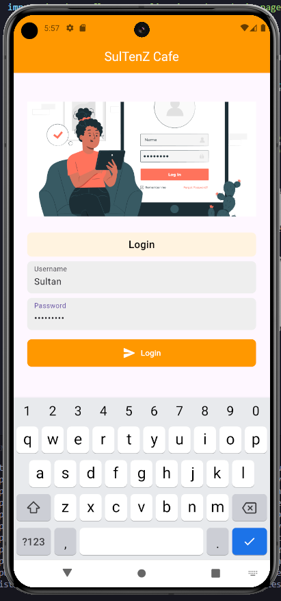
</p>

Karena ide yang saya usulkan di mata kuliah MWS teori ialah aplikasi resep makanan, maka pada praktikum ini saya akan desain menu login untuk aplikasi resep makanan.

Untuk desain aplikasinya saya akan mengambil dari figma community dan melakukan sedikit modifikasi.

<p align="center">
  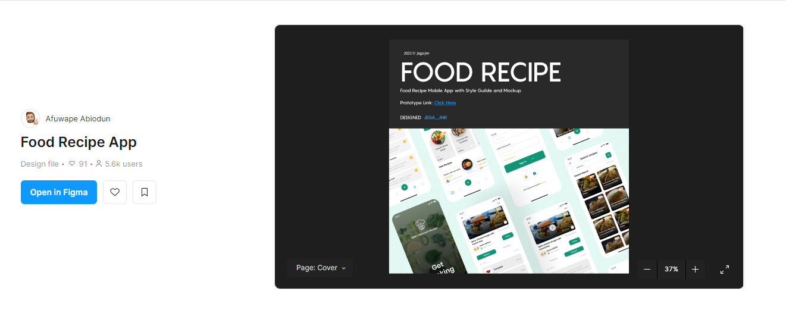
</p>

<p align="center">
  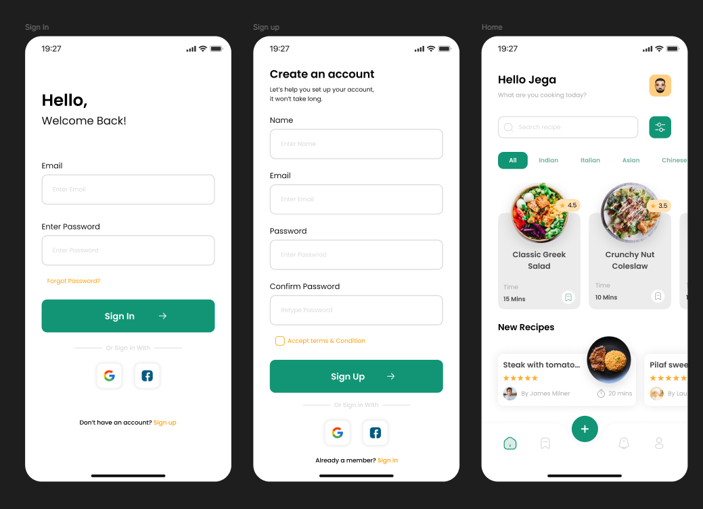
</p>

Saya modifikasi sedikit menjadi seperti ini :

<p align="center">
  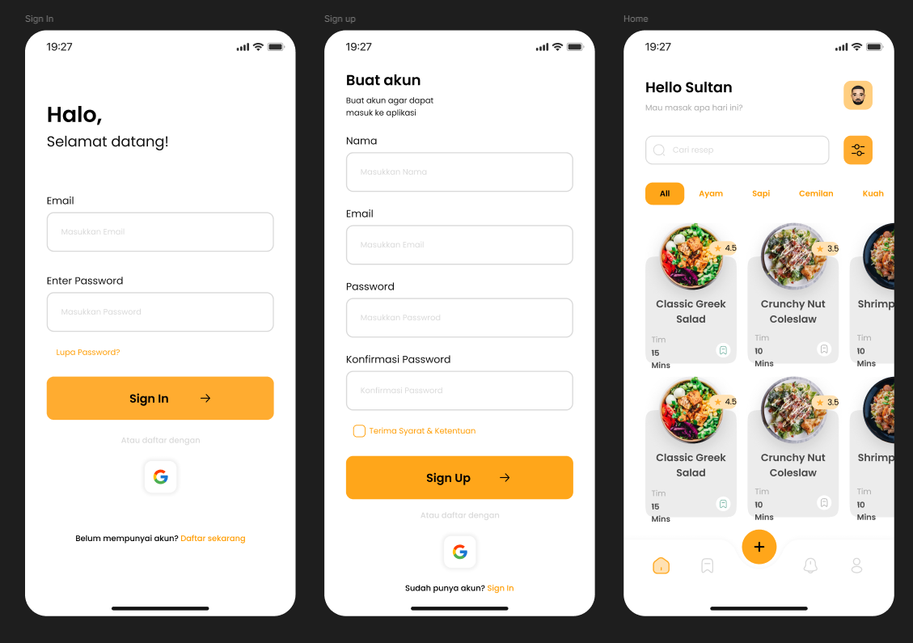
</p>

**Catatan :** Desain masih merupakan prototype, masih ada kemungkinan tampilan final pada aplikasinya akan berbeda dengan desainnya.

---

## 2. REST API

REST API merupakan interface yang memungkinkan sistem untuk saling berkomunikasi melalui protokol HTTP/HTTPS dalam format yang terstruktur dan dapat dipahami.

### 2.1 Komponen Utama REST API

#### a. Resource

Resource dalam REST API diidentifikasi menggunakan URI (Uniform Resource Identifier). Contohnya, resource dalam sistem dapat diakses melalui https://api.example.com/users.

#### b. HTTP Methods

REST API menggunakan metode HTTP standar untuk berinteraksi dngan resource :
- GET : Mengambil data dari server.
- POST : Mengirim data baru ke server.
- PUT : Memperbarui data yang ada di server.
- DELETE : Menghapus data dari server.

#### c. Stateless

Setiap permintaan dari client ke server harus berisi semua informasi yang diperlukan untuk memahami permintaan tersebut.

#### d. Representation

Data yang ditukar antara client dan server biasanya dalam forman JSON atau XML.

### 2.2 Karakteristik REST API

- Client-Server Architecture : Memisahkan user interface client dari penyimpanan data di server.
- Stateless : Setiap permintaan dari client berisi semua informasi yang diperlukan.
- Uniform Interface : Respon dari server dapat di-cache oleh client atau oleh perantara.
- Layered System : Memungkinkan komponen tambahan untuk meningkatkan skalabilitas dan keamanan.

### 2.3 Keuntungan REST API

#### Keuntungan :
- Memungkinkan aplikasi untuk skala dengan mudah karena pemisahan antara client dan server.
- Dapat digunakan oleh berbagai jenis client.
- Data yang dikirim dapat dengan mudah digunakan oleh berbagai platform dan bahasa pemrograman.
- Dukungan untuk caching respon dapat meningkatkan kinerja.

### 2.4 Postman

Postman merupakan tool yang digunakan untuk menguji dan mengembangkan API, terutama API yang menggunakan arsitektur RESTful. Postman menyediakan GUI yang memudahkan developer untuk membuat, mengirim, mengelola, dan mengotomatisasi permintaan HTTP ke server. Hal ini tentunya sangat berguna alam developing, testing, dan debugging API.

---

## 3. Implementasi API dan CRUD

Saya akan membuat API untuk login dan CRUD nya terlebih dahulu.

Pertama-tama saya membuat project baru dengan nama folder `food_recipe_app`.

<p align="center">
  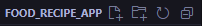
</p>

Kemudian saya membuat folder baru `resep_api` yang nantinya akan diisi oleh API untuk login dan CRUD membuat resep makanan.

Setelah itu, saya menginstall depensensi yang dibutuhkan.

<p align="center">
  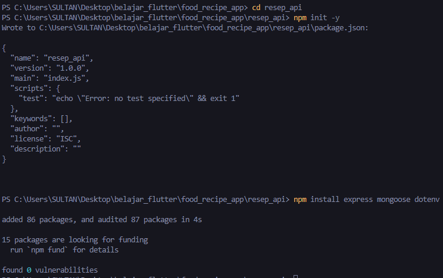
</p>

Kemudian pada folder `resep_api`, saya membuat beberapa folder dan file untuk API nya.

<p align="center">
  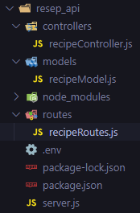
</p>

Setelah itu, saya melakukan setup MongoDB Atlas pada `.env`.

```
MONGODB_URI=url_penghubung_saya
PORT=5000
```

Ini adalah koed untuk API yang telah saya buat beserta sedikit penjelasan dalam bentuk caption :

### `recipeController.js`

```js
// recipeController.js
const Recipe = require("../models/recipeModel"); // Mengimpor model Recipe dari file recipeModel.js

// POST data
const createRecipe = async (req, res) => {
  // Mendefinisikan fungsi untuk membuat resep baru
  try {
    const { name, ingredients, instructions } = req.body; // Mengambil data nama, bahan, dan instruksi dari body permintaan

    // Validasi manual
    const errors = []; // Menyimpan kesalahan validasi
    if (!name) errors.push("Name is required"); // Memeriksa apakah nama ada
    if (
      !ingredients ||
      !Array.isArray(ingredients) ||
      ingredients.length === 0
    ) {
      errors.push("Ingredients must be a non-empty array"); // Memeriksa apakah bahan adalah array non-kosong
    }
    if (!instructions) errors.push("Instructions are required"); // Memeriksa apakah instruksi ada

    if (errors.length > 0) {
      // Jika ada kesalahan validasi
      return res.status(400).json({
        status: "error",
        message: "Validation failed",
        errors: errors, // Mengembalikan kesalahan sebagai respons
      });
    }

    const recipe = new Recipe({ name, ingredients, instructions }); // Membuat objek resep baru
    await recipe.save(); // Menyimpan resep ke database
    res.status(201).json({
      status: "success",
      message: "Recipe created successfully",
      data: recipe, // Mengembalikan resep yang dibuat
    });
  } catch (error) {
    // Menangani kesalahan
    res.status(400).json({
      status: "error",
      message: error.message,
      details: error.errors
        ? Object.values(error.errors).map((err) => err.message)
        : [], // Mengembalikan detail kesalahan
    });
  }
};

// GET data
const getRecipes = async (req, res) => {
  // Mendefinisikan fungsi untuk mendapatkan semua resep
  try {
    const recipes = await Recipe.find(); // Mengambil semua resep dari database
    res.status(200).json(recipes); // Mengembalikan daftar resep sebagai respons
  } catch (error) {
    // Menangani kesalahan
    res.status(500).json({ message: error.message }); // Mengembalikan pesan kesalahan
  }
};

// GET data by id
const getRecipeById = async (req, res) => {
  // Mendefinisikan fungsi untuk mendapatkan resep berdasarkan ID
  try {
    const recipe = await Recipe.findById(req.params.id); // Mencari resep dengan ID dari parameter
    if (!recipe) {
      // Jika resep tidak ditemukan
      return res.status(404).json({ message: "Recipe not found" }); // Mengembalikan pesan tidak ditemukan
    }
    res.status(200).json(recipe); // Mengembalikan resep yang ditemukan sebagai respons
  } catch (error) {
    // Menangani kesalahan
    res.status(500).json({ message: error.message }); // Mengembalikan pesan kesalahan
  }
};

// PUT data (update)
const updateRecipe = async (req, res) => {
  // Mendefinisikan fungsi untuk memperbarui resep
  try {
    const { name, ingredients, instructions } = req.body; // Mengambil data dari body permintaan
    const recipe = await Recipe.findByIdAndUpdate(
      req.params.id, // Mencari resep berdasarkan ID dari parameter
      { name, ingredients, instructions }, // Data baru untuk diperbarui
      { new: true } // Mengembalikan objek resep yang diperbarui
    );
    if (!recipe) {
      // Jika resep tidak ditemukan
      return res.status(404).json({ message: "Recipe not found" }); // Mengembalikan pesan tidak ditemukan
    }
    res.status(200).json(recipe); // Mengembalikan resep yang diperbarui sebagai respons
  } catch (error) {
    // Menangani kesalahan
    res.status(400).json({ message: error.message }); // Mengembalikan pesan kesalahan
  }
};

// DEL data (delete)
const deleteRecipe = async (req, res) => {
  // Mendefinisikan fungsi untuk menghapus resep
  try {
    const recipe = await Recipe.findByIdAndDelete(req.params.id); // Mencari dan menghapus resep berdasarkan ID dari parameter
    if (!recipe) {
      // Jika resep tidak ditemukan
      return res.status(404).json({ message: "Recipe not found" }); // Mengembalikan pesan tidak ditemukan
    }
    res.status(200).json({ message: "Recipe deleted successfully" }); // Mengembalikan pesan berhasil menghapus
  } catch (error) {
    // Menangani kesalahan
    res.status(500).json({ message: error.message }); // Mengembalikan pesan kesalahan
  }
};

// Export controller
module.exports = {
  createRecipe,
  getRecipes,
  getRecipeById,
  updateRecipe,
  deleteRecipe,
};
```

### `recipeModel.js`

```js
// recipeModel.js
const mongoose = require("mongoose"); // Mengimpor library mongoose untuk berinteraksi dengan MongoDB

// Mendefinisikan skema untuk model resep
const recipeSchema = new mongoose.Schema({
  name: {
    type: String, // Tipe data untuk nama resep
    required: [true, "Recipe name is required"], // Validasi untuk memastikan nama resep ada
    trim: true, // Menghapus spasi di awal dan akhir
    minlength: [3, "Name must be at least 3 characters long"], // Validasi panjang minimum nama
  },
  ingredients: {
    type: [String], // Tipe data untuk daftar bahan
    required: [true, "At least one ingredient is required"], // Validasi untuk memastikan ada setidaknya satu bahan
    validate: {
      validator: function (v) {
        // Fungsi validasi untuk memeriksa apakah array bahan tidak kosong
        return v && v.length > 0; // Mengembalikan true jika ada bahan
      },
      message: "Recipe must have at least one ingredient", // Pesan kesalahan jika validasi gagal
    },
  },
  instructions: {
    type: String, // Tipe data untuk instruksi memasak
    required: [true, "Cooking instructions are required"], // Validasi untuk memastikan instruksi ada
    minlength: [10, "Instructions must be at least 10 characters long"], // Validasi panjang minimum instruksi
  },
  createdAt: {
    type: Date, // Tipe data untuk tanggal pembuatan
    default: Date.now, // Mengatur nilai default ke waktu saat ini
  },
});

// Membuat model Recipe berdasarkan skema yang telah didefinisikan
const Recipe = mongoose.model("Recipe", recipeSchema);

// Mengekspor model Recipe agar bisa digunakan di file lain
module.exports = Recipe;
```

### `recipeRoutes.js`

```js
// recipeRoutes.js
const express = require("express"); // Mengimpor library express untuk membuat rute
const {
  createRecipe,
  getRecipes,
  getRecipeById,
  updateRecipe,
  deleteRecipe,
} = require("../controllers/recipeController"); // Mengimpor fungsi-fungsi controller resep

const router = express.Router(); // Membuat instance router dari express

// Rute-rute CRUD (Create, Read, Update, Delete)
router.post("/recipes", createRecipe); // Membuat resep baru
router.get("/recipes", getRecipes); // Membaca semua resep
router.get("/recipes/:id", getRecipeById); // Membaca satu resep berdasarkan ID
router.put("/recipes/:id", updateRecipe); // Memperbarui resep berdasarkan ID
router.delete("/recipes/:id", deleteRecipe); // Menghapus resep berdasarkan ID

module.exports = router; // Mengekspor router agar bisa digunakan di file lain
```

### `server.js`

```js
// server.js
const express = require("express"); // Mengimpor library express untuk membuat aplikasi web
const mongoose = require("mongoose"); // Mengimpor library mongoose untuk berinteraksi dengan MongoDB
const dotenv = require("dotenv"); // Mengimpor library dotenv untuk mengelola variabel lingkungan
const recipeRoutes = require("./routes/recipeRoutes"); // Mengimpor rute resep

dotenv.config(); // Memuat variabel lingkungan dari file .env

const app = express(); // Membuat instance aplikasi Express

// Middleware
app.use(express.json()); // Middleware untuk mengurai JSON dari body permintaan

// Routes
app.use("/api", recipeRoutes); // Menghubungkan rute resep dengan prefiks '/api'

// Connect to MongoDB
mongoose
  .connect(process.env.MONGODB_URI) // Menghubungkan ke MongoDB menggunakan URI dari variabel lingkungan
  .then(() => {
    console.log("Connected to MongoDB"); // Menampilkan pesan jika berhasil terhubung
    app.listen(process.env.PORT, () => {
      // Memulai server pada port yang ditentukan di variabel lingkungan
      console.log(`Server running on port ${process.env.PORT}`); // Menampilkan pesan bahwa server sedang berjalan
    });
  })
  .catch((error) => console.log(error)); // Menangani kesalahan jika koneksi gagal
```

### Melakukan Uji Coba API di Postman

- #### POST

Disini, saya mencoba untuk menambahkan dummy data sebanyak 2 data, yaitu resep untuk nasi goreng spesial dan ayam goreng kremes.

<p align="center">
  
</p>

<p align="center">
  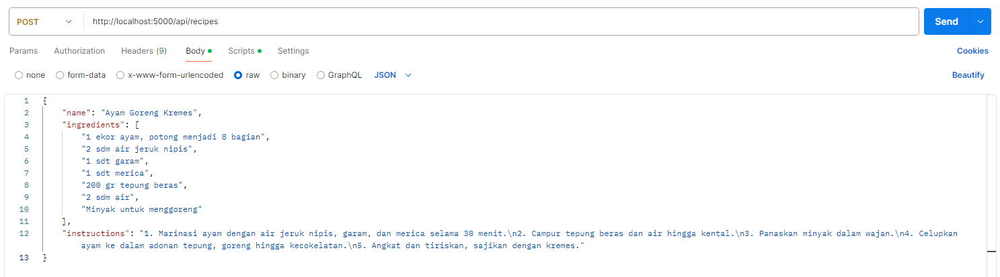
</p>

Terlihat pada gambar di bawah, data berhasil ditambahkan.

<p align="center">
  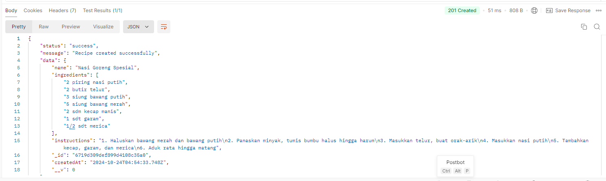
</p>

<p align="center">
  
</p>

- #### GET

Sekarang saya akan mencoba method GET untuk menampilkan dummy data yang telah saya tambahkan.

<p align="center">
  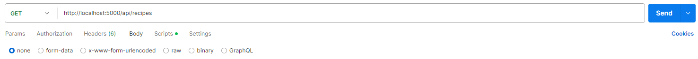
</p>

<p align="center">
  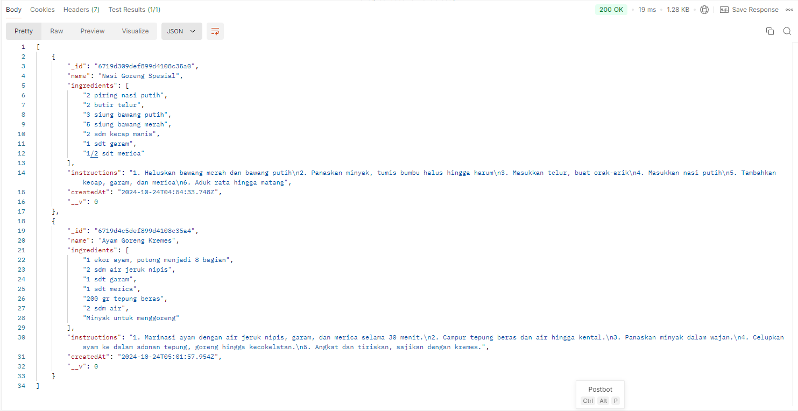
</p>

Dapat terlihat bahwa dummy data dapat ditampilkan.

- #### PUT

Sekarang, saya akan mencoba untuk mengubah value dari data pertama, dari :

```json
{
  "name": "Nasi Goreng Spesial",
  "ingredients": [
    "2 piring nasi putih",
    "2 butir telur",
    "3 siung bawang putih",
    "5 siung bawang merah",
    "2 sdm kecap manis",
    "1 sdt garam",
    "1/2 sdt merica"
  ],
  "instructions": "1. Haluskan bawang merah dan bawang putih\n2. Panaskan minyak, tumis bumbu halus hingga harum\n3. Masukkan telur, buat orak-arik\n4. Masukkan nasi putih\n5. Tambahkan kecap, garam, dan merica\n6. Aduk rata hingga matang"
}
```

menjadi :

```json
{
  "name": "Nasi Goreng Gymrat",
  "ingredients": [
    "2 piring nasi putih",
    "4 butir telur",
    "3 siung bawang putih",
    "3 siung bawang merah",
    "2 sdm kecap manis",
    "1 sdt garam",
    "1/2 sdt merica"
  ],
  "instructions": "1. Haluskan bawang merah dan bawang putih\n2. Panaskan minyak, tumis bumbu halus hingga harum\n3. Masukkan telur, buat orak-arik\n4. Masukkan nasi putih\n5. Tambahkan kecap, garam, dan merica\n6. Aduk rata hingga matang"
}
```

Yang perlu dilakukan ialah copy terlebih dahulu id data yang ingin diubah, lalu paste pada route endpoint id-nya.

<p align="center">
  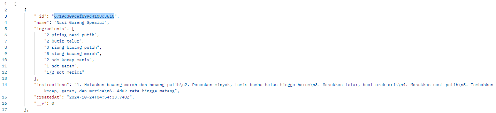
</p>

<p align="center">
  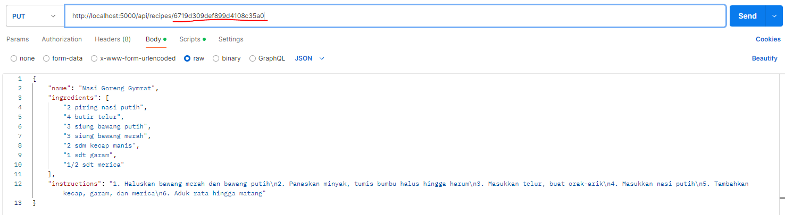
</p>

Data telah terupdate.

<p align="center">
  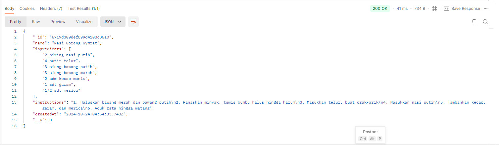
</p>

Coba gunakan method GET untuk mengecek, terlihat pada gambar, data terupdate.

<p align="center">
  
</p>

- #### DEL

Saya akan mencoba untuk menghapus 1 data, yaitu data yang tadi telah saya update.

Yang perlu dilakukan ialah copy terlebih dahulu id data yang ingin dihapus, lalu paste pada route endpoint id-nya.

<p align="center">
  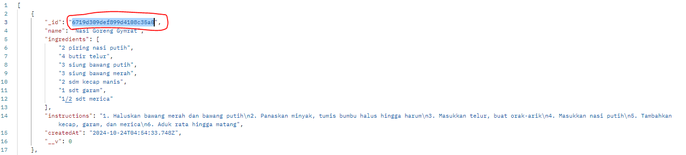
</p>

<p align="center">
  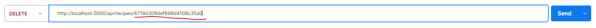
</p>

Terdapat pesan bahwa resep berhasil dihapus.

<p align="center">
  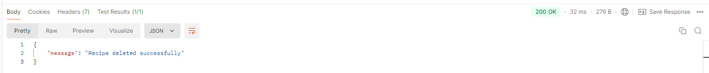
</p>

Gunakan method GET untuk menampilkan data, terlihat bahwa data telah terhapus.

<p align="center">
  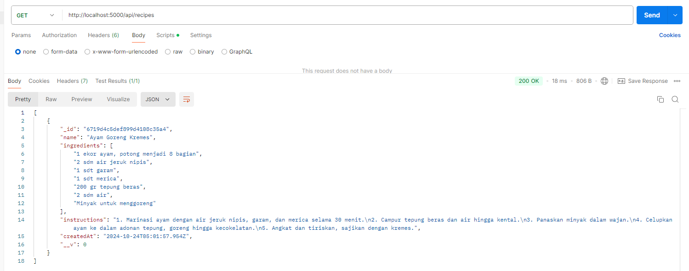
</p>
---

## Referensi

- Modul Praktikum
- https://api.flutter.dev/flutter/widgets/widgets-library.html
- https://docs.flutter.dev/ui/widgets
