# Week 6 (Minggu Keenam)

**Tanggal**: 24 Oktober 2024

**Nama**: Sultan Akmal Ghiffari

**NPM**: 5220411047

# Dokumentasi Progress Aplikasi

## 1. Konversi Desain Figma to Flutter

Ini adalah desain yang telah saya buat untuk aplikasi saya, beserta flow aplikasi yang telah saya atur sedemikian rupa :

<p align="center">
  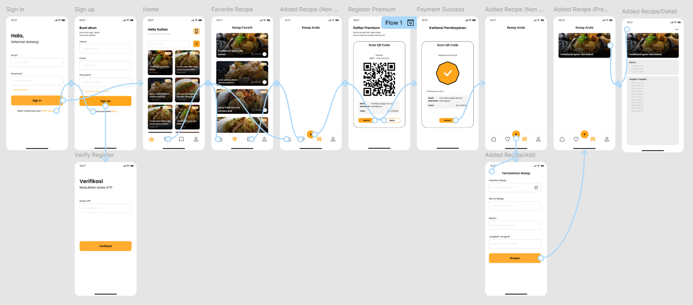
</p>

Untuk konversi desain figma ke flutter, saya menemukan sebuah cara yang saya dapat dari youtube, ini link videonya :

https://www.youtube.com/watch?v=t7lUSiddFd4

Tool yang akan digunakan ialah website https://www.dhiwise.com/.

- Pertama-tama buat akun terlebih dahulu.
- Kemudian pilih mobile app.
<p align="center">
  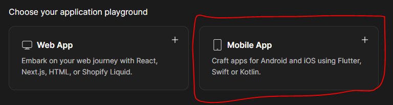
</p>

- Pilih bring your designs to life untuk menggunakan desain kita.
<p align="center">
  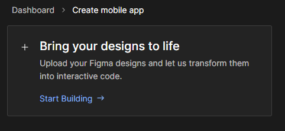
</p>

- Atur nama aplikasi, framework yang digunakan, akun figma, serta URL dari desain figma yang ingin dikonversi.
<p align="center">
  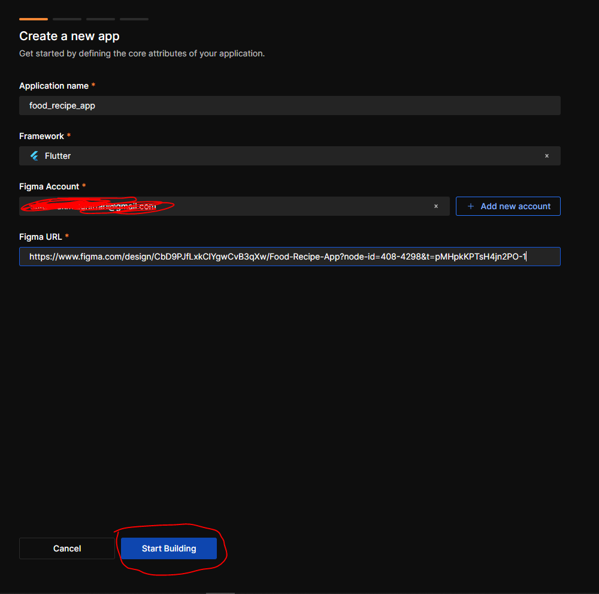
</p>

- Disini saya memilih semua screen untuk dikonversi.
<p align="center">
  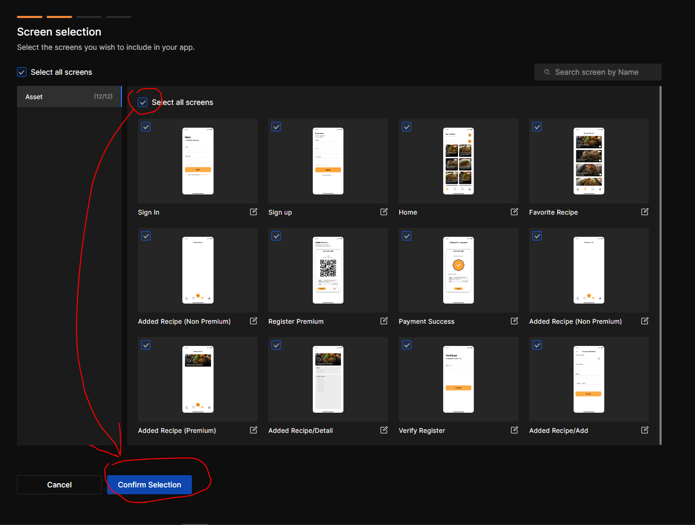
</p>

- Untuk setup aplkasi, disini saya tidak melakukan setup apapun, jadi saya langsung continue saja.
<p align="center">
  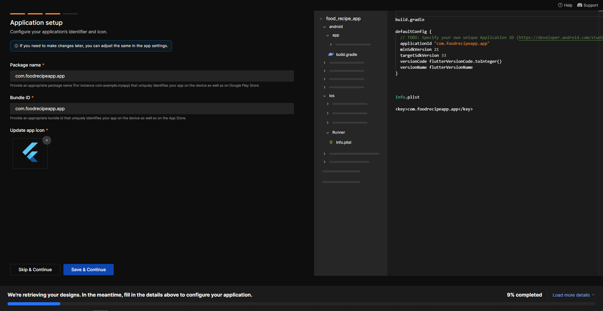
</p>

- Untuk state management saya memilih yang tanpa state management, dan versi flutternya saya menggunakan versi yang terbaru.
<p align="center">
  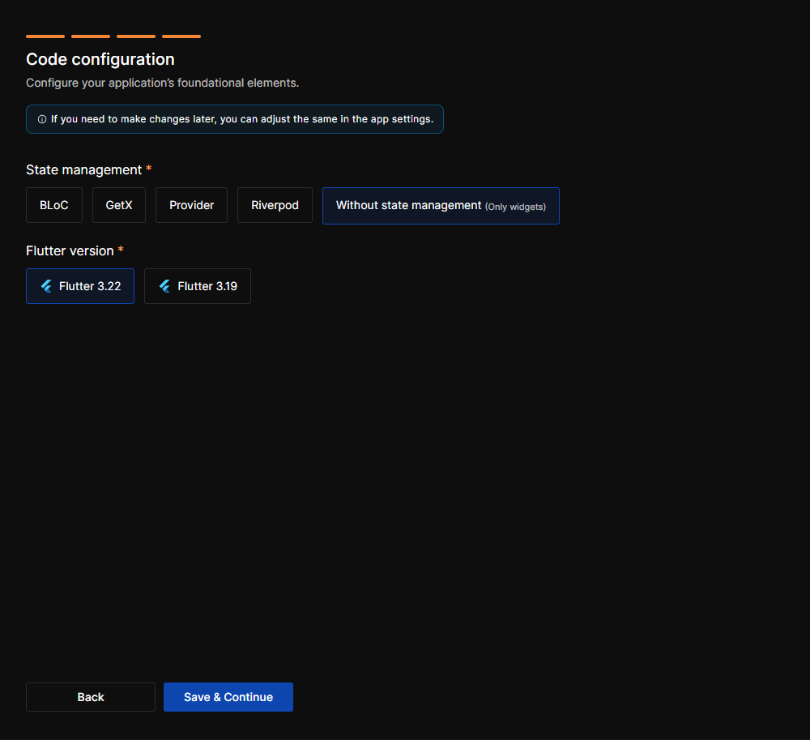
</p>

- Tunggu hingga selesai.
<p align="center">
  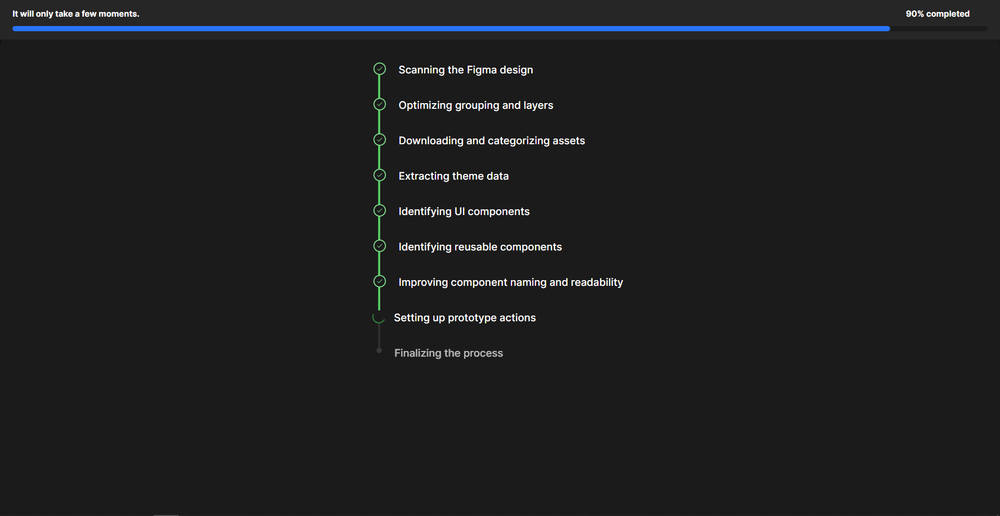
</p>

- Pilih splash screen dan next splash screen yang ingin digunakan.
<p align="center">
  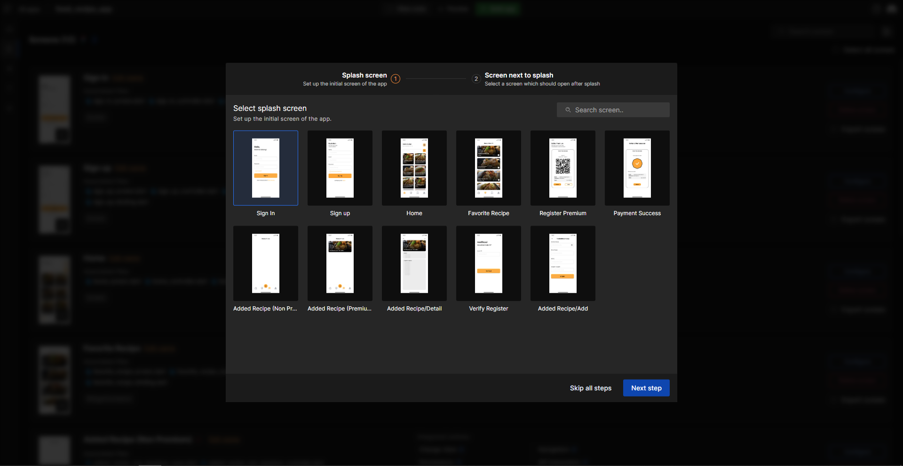
</p>
<p align="center">
  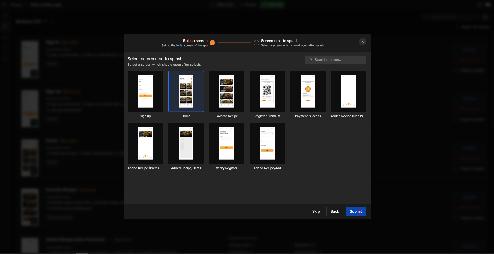
</p>

- Preview kode sudah dibuat. Selanjutnya pilih build app untuk dibuatkan aplikasinya, lalu tunggu.
<p align="center">
  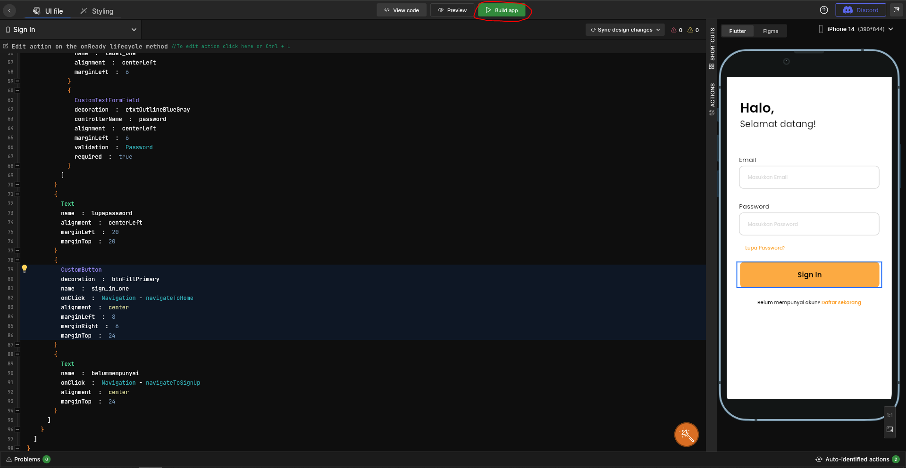
</p>
<p align="center">
  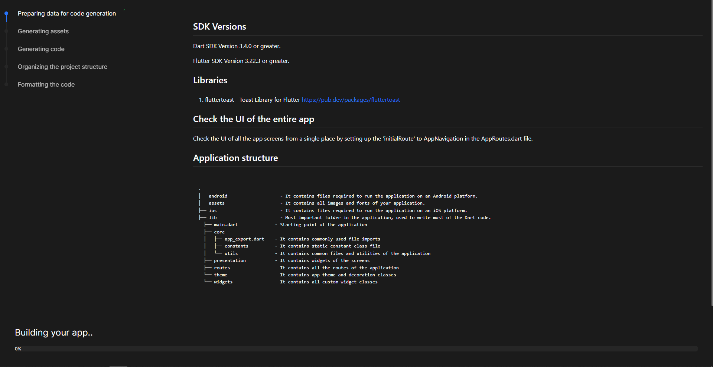
</p>

- Aplikasi sudah dibuat. Saatnya download kode dan melakukan modifikasi.
<p align="center">
  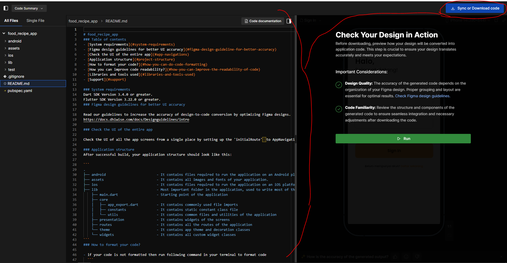
</p>

- Ternyata, harus berbayar jika ingin mendownload kode.
<p align="center">
  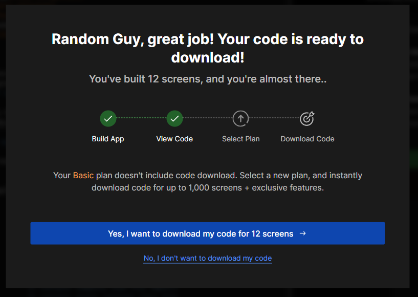
</p>

#### **Ya sudahlah, coding manual saja :)**

---

## 2. Membuat API untuk OTP dan Payment Gateaway

**Catatan :** Untuk API payment gateway mohon maaf saya belum bisa membuatnya pada laporan minggu ini. Saya akan membuat API payment gateaway untuk laporan minggu ke-7 :pray:.

Disini saya memutuskan untuk membuat OTP nya ke gmail, karena walaupun peringatan nomor WA akan dibanned jika menggunakan fonnte, resiko tetaplah resiko, dan saya ingin menghindari resiko tersebut.

Berikut ialah kode API untuk OTP dengan sedikit penjelasan dalam bentuk caption :

### ```controllers/authController.js```
```js
// resep_api/controllers/authController.js
const User = require('../models/userModel');  // Mengambil model `User` dari file userModel.js untuk mengakses data pengguna di database.
const bcrypt = require('bcrypt');  // Untuk mengenkripsi password dan mencocokkannya saat login.
const nodemailer = require('nodemailer');  // Mengirimkan email untuk mengirimkan OTP ke pengguna.
const crypto = require('crypto');  // Menghasilkan kode OTP acak.

const MAX_LOGIN_ATTEMPTS = 3;  // Batas maksimum percobaan login yang salah.
const BAN_TIME = 10 * 60 * 1000;  // Durasi ban sementara dalam milidetik (10 menit).

// Membuat transporter untuk mengirim email melalui Gmail
const transporter = nodemailer.createTransport({
  service: 'gmail',
  auth: {
    user: process.env.EMAIL_USER,  // Mengambil alamat email dari environment variables.
    pass: process.env.EMAIL_PASS   // Mengambil password email dari environment variables.
  }
});

// Fungsi untuk mengirim email OTP
const sendOTPEmail = async (email, otp) => {
  const mailOptions = {
    from: process.env.EMAIL_USER,  // Alamat pengirim (diambil dari environment variables).
    to: email,  // Alamat tujuan (alamat email pengguna).
    subject: 'Your OTP Code',  // Judul email.
    text: `Your OTP code is: ${otp}`  // Isi email dengan kode OTP.
  };

  return transporter.sendMail(mailOptions);  // Mengirim email dan mengembalikan hasil pengiriman.
};

// Register
const register = async (req, res) => {
  try {
    const { username, email, password } = req.body;  // Mendapatkan data dari permintaan pengguna.

    // Cek apakah email sudah terdaftar
    const userExists = await User.findOne({ email });
    if (userExists) {
      return res.status(400).json({ message: 'Email already registered' });
    }

    // Menghasilkan OTP secara acak
    const otp = crypto.randomBytes(3).toString('hex').toUpperCase();

    // Membuat pengguna baru dengan data yang diterima
    const user = new User({ username, email, password, otp });

    // Menyimpan pengguna baru di database
    await user.save();

    // Mengirim OTP ke email pengguna
    await sendOTPEmail(email, otp);

    res.status(201).json({
      status: 'success',
      message: 'User registered. OTP has been sent to your email.'
    });
  } catch (error) {
    res.status(500).json({ message: error.message });  // Menangani kesalahan dan mengembalikan pesan error.
  }
};

// Verifikasi OTP saat register
const verifyOTP = async (req, res) => {
  try {
    const { email, otp } = req.body;  // Mendapatkan email dan OTP dari permintaan pengguna.

    // Mencari pengguna berdasarkan email
    const user = await User.findOne({ email });
    if (!user) {
      return res.status(404).json({ message: 'User not found' });
    }

    // Memeriksa kecocokan OTP
    if (user.otp !== otp) {
      return res.status(400).json({ message: 'Invalid OTP' });
    }

    // Memperbarui status verifikasi pengguna
    user.isVerified = true;
    user.otp = undefined;  // Menghapus OTP setelah diverifikasi.
    await user.save();

    res.status(200).json({
      status: 'success',
      message: 'Account verified successfully.'
    });
  } catch (error) {
    res.status(500).json({ message: error.message });  // Menangani kesalahan dan mengembalikan pesan error.
  }
};

// Login
const login = async (req, res) => {
  try {
    const { email, password } = req.body;  // Mendapatkan email dan password dari permintaan pengguna.

    // Mencari pengguna berdasarkan email
    const user = await User.findOne({ email });
    if (!user) {
      return res.status(404).json({ message: 'User not found' });
    }

    // Memeriksa apakah pengguna dalam status banned
    if (user.banExpires && user.banExpires > Date.now()) {
      const remainingTime = Math.ceil((user.banExpires - Date.now()) / 60000);
      return res.status(403).json({
        message: `Account is temporarily banned. Try again in ${remainingTime} minute(s).`
      });
    }

    // Memeriksa apakah akun pengguna sudah diverifikasi
    if (!user.isVerified) {
      return res.status(403).json({ message: 'Account not verified. Please verify your account.' });
    }

    // Memeriksa kecocokan password
    const isMatch = await bcrypt.compare(password, user.password);
    if (!isMatch) {
      user.loginAttempts += 1;  // Menambah jumlah percobaan login yang gagal.

      // Jika login gagal mencapai batas maksimum, melakukan ban sementara
      if (user.loginAttempts >= MAX_LOGIN_ATTEMPTS) {
        user.banExpires = new Date(Date.now() + BAN_TIME);
        user.loginAttempts = 0;
      }

      await user.save();

      return res.status(400).json({ message: 'Invalid credentials' });
    }

    // Reset loginAttempts dan banExpires jika login berhasil
    user.loginAttempts = 0;
    user.banExpires = null;
    await user.save();

    res.status(200).json({
      status: 'success',
      message: 'Login successful.'
    });
  } catch (error) {
    res.status(500).json({ message: error.message });  // Menangani kesalahan dan mengembalikan pesan error.
  }
};

// Mengekspor fungsi untuk digunakan di tempat lain
module.exports = {
  register,
  verifyOTP,
  login
};
```

### ```models/userModel.js```
```js
// resep_api/models/userModel.js
const mongoose = require('mongoose');  // Mengimpor Mongoose untuk interaksi dengan MongoDB.
const bcrypt = require('bcrypt');  // Mengimpor bcrypt untuk melakukan hashing pada password.

// Skema untuk user
const userSchema = new mongoose.Schema({
  username: {
    type: String,
    required: [true, 'Username is required'],  // Field username wajib diisi.
    unique: true,  // Setiap username harus unik.
    trim: true  // Menghapus spasi di awal dan akhir username.
  },
  email: {
    type: String,
    required: [true, 'Email is required'],  // Field email wajib diisi.
    unique: true,  // Setiap email harus unik.
    trim: true  // Menghapus spasi di awal dan akhir email.
  },
  password: {
    type: String,
    required: [true, 'Password is required'],  // Field password wajib diisi.
    minlength: [6, 'Password must be at least 6 characters long']  // Minimal panjang password adalah 6 karakter.
  },
  otp: {
    type: String,
    required: false  // Field OTP tidak wajib diisi.
  },
  isVerified: {
    type: Boolean,
    default: false  // Secara default, akun tidak terverifikasi saat pertama kali dibuat.
  },
  loginAttempts: {
    type: Number,
    default: 0  // Jumlah percobaan login gagal awalnya di-set ke 0.
  },
  banExpires: {
    type: Date,
    default: null  // Waktu kedaluwarsa ban (blokir sementara), secara default null (tidak diblokir).
  },
  createdAt: {
    type: Date,
    default: Date.now  // Menyimpan waktu pembuatan user saat dokumen dibuat.
  }
});

// Middleware untuk hashing password sebelum disimpan ke database
userSchema.pre('save', async function (next) {
  if (!this.isModified('password')) return next();  // Jika password tidak diubah, lanjutkan ke proses berikutnya.
  this.password = await bcrypt.hash(this.password, 10);  // Hash password dengan bcrypt, dengan salt 10.
  next();  // Lanjutkan ke proses berikutnya.
});

// Membuat model User berdasarkan skema yang telah ditentukan
const User = mongoose.model('User', userSchema);

module.exports = User;  // Mengekspor model User agar bisa digunakan di tempat lain.
```

### ```routes/authRoutes.js```
```js
// resep_api/routes/authRoutes.js
const express = require('express');  // Mengimpor express untuk membuat router.
const { register, verifyOTP, login, verifyLoginOTP } = require('../controllers/authController');  // Mengimpor fungsi-fungsi dari authController.

const router = express.Router();  // Membuat instance router dari express.

// Rute untuk register
router.post('/register', register);  // Rute POST untuk pendaftaran pengguna baru.
router.post('/verify-register', verifyOTP);  // Rute POST untuk verifikasi OTP saat registrasi.

// Rute untuk login
router.post('/login', login);  // Rute POST untuk login pengguna.

module.exports = router;  // Mengekspor router agar dapat digunakan di file utama aplikasi.
```

### ```server.js```
```js
// resep_api/server.js
const express = require('express'); // Mengimpor library express untuk membuat aplikasi web
const mongoose = require('mongoose'); // Mengimpor library mongoose untuk berinteraksi dengan MongoDB
const dotenv = require('dotenv'); // Mengimpor library dotenv untuk mengelola variabel lingkungan
const recipeRoutes = require('./routes/recipeRoutes'); // Mengimpor rute resep

dotenv.config(); // Memuat variabel lingkungan dari file .env

const app = express(); // Membuat instance aplikasi Express

// Middleware
app.use(express.json()); // Middleware untuk mengurai JSON dari body permintaan

// Routes
app.use('/api', recipeRoutes); // Menghubungkan rute resep dengan prefiks '/api'

// Connect ke MongoDB
mongoose
  .connect(process.env.MONGODB_URI) // Menghubungkan ke MongoDB menggunakan URI dari variabel lingkungan
  .then(() => {
    console.log('Connected to MongoDB'); // Menampilkan pesan jika berhasil terhubung
    app.listen(process.env.PORT, () => { // Memulai server pada port yang ditentukan di variabel lingkungan
      console.log(`Server running on port ${process.env.PORT}`); // Menampilkan pesan bahwa server sedang berjalan
    });
  })
  .catch((error) => console.log(error)); // Menangani kesalahan jika koneksi gagal

// Login

const authRoutes = require('./routes/authRoutes');

// Routes
app.use('/api', recipeRoutes);
app.use('/api/auth', authRoutes); // Menambahkan rute auth
```

---

## 3. Mengintegrasikan Desain Figma dengan API yang Sudah Dibuat

Berikut ialah kode flutter yang telah mengintegrasikan API yang sudah dibuat beserta sedkit penjelasan dalam bentuk caption :

### ```main.dart```
```dart
// lib/main.dart
import 'package:flutter/material.dart';  // Mengimpor paket Material untuk desain UI di Flutter.
import 'package:flutter_application/screens/added_recipe.dart';  // Mengimpor layar untuk resep yang ditambahkan.
import 'package:flutter_application/screens/create_recipe.dart';  // Mengimpor layar untuk membuat resep.
import 'screens/login.dart';  // Mengimpor layar login.
import 'screens/register.dart';  // Mengimpor layar registrasi.
import 'screens/verify_register.dart';  // Mengimpor layar verifikasi registrasi.
import 'screens/home.dart';  // Mengimpor layar utama.

void main() {
  runApp(const MyApp());  // Memanggil aplikasi utama.
}

class MyApp extends StatelessWidget {
  const MyApp({super.key});

  @override
  Widget build(BuildContext context) {
    return MaterialApp(
      title: 'Recipe App',  // Menetapkan judul aplikasi.
      theme: ThemeData(
        primarySwatch: Colors.orange,  // Mengatur warna utama aplikasi menjadi oranye.
        scaffoldBackgroundColor: Colors.white,  // Mengatur warna latar belakang menjadi putih.
      ),
      initialRoute: '/login',  // Menetapkan rute awal aplikasi ke layar login.
      routes: {
        '/login': (context) => const LoginScreen(),  // Rute untuk layar login.
        '/register': (context) => const RegisterScreen(),  // Rute untuk layar registrasi.
        '/verify-register': (context) => const VerifyRegisterScreen(),  // Rute untuk layar verifikasi registrasi.
        '/home': (context) => const HomeScreen(),  // Rute untuk layar utama setelah login.
        '/added-recipes': (context) => const AddedRecipeScreen(),  // Rute untuk layar daftar resep yang telah ditambahkan.
        '/create-recipe': (context) => const CreateRecipeScreen(),  // Rute untuk layar membuat resep baru.
      },
    );
  }
}
```

### ```screens/login.dart```
```dart
// lib/screens/login.dart
import 'package:flutter/material.dart'; // Import library material untuk UI Flutter
import 'package:http/http.dart' as http; // Import library HTTP untuk request ke backend
import 'dart:convert'; // Import library untuk encode dan decode data JSON

// Membuat StatefulWidget untuk login screen
class LoginScreen extends StatefulWidget {
  const LoginScreen({super.key});

  @override
  _LoginScreenState createState() => _LoginScreenState();
}

class _LoginScreenState extends State<LoginScreen> {
  final _formKey = GlobalKey<FormState>(); // Key untuk form validation
  final _emailController = TextEditingController(); // Controller untuk input email
  final _passwordController = TextEditingController(); // Controller untuk input password
  bool _isLoading = false; // Status loading untuk button login

  // Fungsi login async yang kirim request ke API login
  Future<void> _login() async {
    if (!_formKey.currentState!.validate()) return; // Validasi form

    setState(() => _isLoading = true); // Set status loading ke true

    try {
      // Mengirim POST request ke endpoint login
      final response = await http.post(
        Uri.parse('http://10.0.2.2:5000/api/auth/login'), // URL endpoint
        headers: {'Content-Type': 'application/json'}, // Headers request
        body: json.encode({
          'email': _emailController.text, // Isi data email dari input
          'password': _passwordController.text, // Isi data password dari input
        }),
      );

      if (response.statusCode == 200) {
        // Jika login berhasil
        Navigator.pushReplacementNamed(context, '/home'); // Pindah ke halaman home
      } else {
        final error = json.decode(response.body); // Ambil error message dari response
        ScaffoldMessenger.of(context).showSnackBar(
          SnackBar(content: Text(error['message'])), // Show error message
        );
      }
    } catch (e) {
      // Jika ada error koneksi
      ScaffoldMessenger.of(context).showSnackBar(
        const SnackBar(content: Text('Terjadi kesalahan koneksi')),
      );
    } finally {
      setState(() => _isLoading = false); // Set loading status ke false
    }
  }

  @override
  Widget build(BuildContext context) {
    return Scaffold(
      body: SafeArea(
        child: Padding(
          padding: const EdgeInsets.all(20.0), // Padding di sekitar elemen UI
          child: Form(
            key: _formKey, // Set form key untuk validasi
            child: Column(
              crossAxisAlignment: CrossAxisAlignment.stretch, // Membuat kolom menempati full lebar
              children: [
                const SizedBox(height: 40), // Space vertikal kosong
                const Text(
                  'Halo,',
                  style: TextStyle(
                    fontSize: 24,
                    fontWeight: FontWeight.bold,
                  ),
                ),
                const Text(
                  'Selamat datang!',
                  style: TextStyle(fontSize: 16),
                ),
                const SizedBox(height: 40), // Space vertikal kosong
                TextFormField(
                  controller: _emailController, // Set controller untuk email
                  decoration: InputDecoration(
                    labelText: 'Email', // Label input
                    labelStyle: const TextStyle(color: Colors.black), // Style label
                    border: const OutlineInputBorder(), // Border default
                    focusedBorder: OutlineInputBorder(
                      borderSide: const BorderSide(color: Colors.orange, width: 2), // Border saat fokus
                      borderRadius: BorderRadius.circular(12), // Radius border
                    ),
                    enabledBorder: OutlineInputBorder(
                      borderSide: const BorderSide(color: Colors.orange, width: 2), // Border saat tidak fokus
                      borderRadius: BorderRadius.circular(12), // Radius border
                    ),
                  ),
                  validator: (value) {
                    if (value == null || value.isEmpty) {
                      return 'Masukkan email Anda'; // Pesan validasi jika kosong
                    }
                    return null;
                  },
                ),
                const SizedBox(height: 20), // Space vertikal kosong
                TextFormField(
                  controller: _passwordController, // Set controller untuk password
                  decoration: InputDecoration(
                    labelText: 'Password', // Label input
                    labelStyle: const TextStyle(color: Colors.black), // Style label
                    border: const OutlineInputBorder(), // Border default
                    focusedBorder: OutlineInputBorder(
                      borderSide: const BorderSide(color: Colors.orange, width: 2), // Border saat fokus
                      borderRadius: BorderRadius.circular(12), // Radius border
                    ),
                    enabledBorder: OutlineInputBorder(
                      borderSide: const BorderSide(color: Colors.orange, width: 2), // Border saat tidak fokus
                      borderRadius: BorderRadius.circular(12), // Radius border
                    ),
                  ),
                  obscureText: true, // Mengatur input jadi karakter bintang untuk password
                  validator: (value) {
                    if (value == null || value.isEmpty) {
                      return 'Masukkan password Anda'; // Pesan validasi jika kosong
                    }
                    return null;
                  },
                ),
                const SizedBox(height: 10), // Space vertikal kosong
                TextButton(
                  onPressed: () {
                    // Implementasi fitur lupa password
                  },
                  style: TextButton.styleFrom(
                    foregroundColor: Colors.orange, // Warna teks
                  ),
                  child: const Text('Lupa Password?'), // Teks button
                ),
                const SizedBox(height: 20), // Space vertikal kosong
                ElevatedButton(
                  onPressed: _isLoading ? null : _login, // Jika loading, onPressed null
                  style: ElevatedButton.styleFrom(
                    backgroundColor: Colors.orange, // Warna background button
                    padding: const EdgeInsets.symmetric(vertical: 15), // Padding dalam button
                  ),
                  child: _isLoading
                      ? const CircularProgressIndicator() // Indicator loading
                      : const Text(
                          'Sign In',
                          style: TextStyle(color: Colors.black), // Teks button saat tidak loading
                        ),
                ),
                const SizedBox(height: 20), // Space vertikal kosong
                Row(
                  mainAxisAlignment: MainAxisAlignment.center, // Posisikan di tengah secara horizontal
                  children: [
                    const Text('Belum punya akun?'), // Teks ajakan daftar
                    TextButton(
                      onPressed: () {
                        Navigator.pushNamed(context, '/register'); // Pindah ke halaman register
                      },
                      style: TextButton.styleFrom(
                        foregroundColor: Colors.orange, // Warna teks button
                      ),
                      child: const Text('Daftar sekarang'), // Teks button
                    ),
                  ],
                ),
              ],
            ),
          ),
        ),
      ),
    );
  }
}
```

### ```screens/register.dart```
```dart
// lib/screens/register.dart
import 'package:flutter/material.dart'; // Import library material untuk UI
import 'package:http/http.dart' as http; // Import library HTTP untuk request ke backend
import 'dart:convert'; // Import library untuk encode dan decode data JSON

// Membuat StatefulWidget untuk register screen
class RegisterScreen extends StatefulWidget {
  const RegisterScreen({super.key});

  @override
  _RegisterScreenState createState() => _RegisterScreenState();
}

class _RegisterScreenState extends State<RegisterScreen> {
  final _formKey = GlobalKey<FormState>(); // Key untuk form validation
  final _nameController = TextEditingController(); // Controller untuk input nama
  final _emailController = TextEditingController(); // Controller untuk input email
  final _passwordController = TextEditingController(); // Controller untuk input password
  bool _acceptTerms = false; // Status checkbox Terms & Conditions
  bool _isLoading = false; // Status loading untuk button sign-up

  // Fungsi register async yang kirim request ke API register
  Future<void> _register() async {
    if (!_formKey.currentState!.validate() || !_acceptTerms) { // Validasi form dan checkbox
      if (!_acceptTerms) {
        ScaffoldMessenger.of(context).showSnackBar(
          const SnackBar(content: Text('Please accept terms and conditions')), // Show pesan error jika checkbox tidak dicentang
        );
      }
      return;
    }

    setState(() => _isLoading = true); // Set status loading ke true

    try {
      // Kirim POST request ke endpoint register
      final response = await http.post(
        Uri.parse('http://10.0.2.2:5000/api/auth/register'), // URL endpoint
        headers: {'Content-Type': 'application/json'}, // Headers request
        body: json.encode({
          'username': _nameController.text, // Isi data username dari input
          'email': _emailController.text, // Isi data email dari input
          'password': _passwordController.text, // Isi data password dari input
        }),
      );

      if (response.statusCode == 201) { // Jika register berhasil
        Navigator.pushReplacementNamed(
          context,
          '/verify-register', // Pindah ke halaman verifikasi registrasi
          arguments: _emailController.text, // Kirim email sebagai argument
        );
      } else {
        final error = json.decode(response.body); // Ambil error message dari response
        ScaffoldMessenger.of(context).showSnackBar(
          SnackBar(content: Text(error['message'])), // Show error message
        );
      }
    } catch (e) {
      ScaffoldMessenger.of(context).showSnackBar(
        const SnackBar(content: Text('Connection error')), // Show pesan error koneksi
      );
    } finally {
      setState(() => _isLoading = false); // Set loading status ke false
    }
  }

  @override
  Widget build(BuildContext context) {
    return Scaffold(
      appBar: AppBar(
        title: const Text('Buat akun'), // Set judul app bar
        backgroundColor: Colors.transparent, // Background app bar transparan
        elevation: 0, // Hilangkan bayangan pada app bar
        foregroundColor: Colors.black, // Warna teks app bar
      ),
      body: SafeArea(
        child: Padding(
          padding: const EdgeInsets.all(20.0), // Padding di sekitar elemen UI
          child: Form(
            key: _formKey, // Set form key untuk validasi
            child: Column(
              crossAxisAlignment: CrossAxisAlignment.stretch, // Membuat kolom full lebar
              children: [
                const Text(
                  'Buat akun agar dapat\nmasuk ke aplikasi', // Teks deskripsi
                  style: TextStyle(fontSize: 16),
                ),
                const SizedBox(height: 30), // Space vertikal kosong
                TextFormField(
                  controller: _nameController, // Set controller untuk nama
                  decoration: InputDecoration(
                    labelText: 'Nama', // Label input
                    labelStyle: const TextStyle(color: Colors.black), // Style label
                    border: const OutlineInputBorder(), // Border default
                    focusedBorder: OutlineInputBorder(
                      borderSide: const BorderSide(color: Colors.orange, width: 2), // Border saat fokus
                      borderRadius: BorderRadius.circular(12), // Radius border
                    ),
                    enabledBorder: OutlineInputBorder(
                      borderSide: const BorderSide(color: Colors.orange, width: 2), // Border saat tidak fokus
                      borderRadius: BorderRadius.circular(12), // Radius border
                    ),
                  ),
                  validator: (value) { // Validator untuk nama
                    if (value == null || value.isEmpty) {
                      return 'Please enter your name'; // Pesan jika nama kosong
                    }
                    return null;
                  },
                ),
                const SizedBox(height: 20), // Space vertikal kosong
                TextFormField(
                  controller: _emailController, // Set controller untuk email
                  decoration: InputDecoration(
                    labelText: 'Email', // Label input
                    labelStyle: const TextStyle(color: Colors.black), // Style label
                    border: const OutlineInputBorder(), // Border default
                    focusedBorder: OutlineInputBorder(
                      borderSide: const BorderSide(color: Colors.orange, width: 2), // Border saat fokus
                      borderRadius: BorderRadius.circular(12), // Radius border
                    ),
                    enabledBorder: OutlineInputBorder(
                      borderSide: const BorderSide(color: Colors.orange, width: 2), // Border saat tidak fokus
                      borderRadius: BorderRadius.circular(12), // Radius border
                    ),
                  ),
                  validator: (value) { // Validator untuk email
                    if (value == null || value.isEmpty) {
                      return 'Please enter your email'; // Pesan jika email kosong
                    }
                    return null;
                  },
                ),
                const SizedBox(height: 20), // Space vertikal kosong
                TextFormField(
                  controller: _passwordController, // Set controller untuk password
                  decoration: InputDecoration(
                    labelText: 'Password', // Label input
                    labelStyle: const TextStyle(color: Colors.black), // Style label
                    border: const OutlineInputBorder(), // Border default
                    focusedBorder: OutlineInputBorder(
                      borderSide: const BorderSide(color: Colors.orange, width: 2), // Border saat fokus
                      borderRadius: BorderRadius.circular(12), // Radius border
                    ),
                    enabledBorder: OutlineInputBorder(
                      borderSide: const BorderSide(color: Colors.orange, width: 2), // Border saat tidak fokus
                      borderRadius: BorderRadius.circular(12), // Radius border
                    ),
                  ),
                  obscureText: true, // Buat input jadi bintang untuk password
                  validator: (value) { // Validator untuk password
                    if (value == null || value.isEmpty) {
                      return 'Please enter your password'; // Pesan jika password kosong
                    }
                    return null;
                  },
                ),
                const SizedBox(height: 20), // Space vertikal kosong
                Row(
                  children: [
                    Checkbox(
                      value: _acceptTerms, // Status checkbox
                      onChanged: (value) {
                        setState(() => _acceptTerms = value!); // Update status checkbox
                      },
                      activeColor: Colors.orange, // Warna aktif checkbox
                    ),
                    const Text('Terima Syarat & Ketentuan'), // Label checkbox
                  ],
                ),
                const SizedBox(height: 20), // Space vertikal kosong
                ElevatedButton(
                  onPressed: _isLoading ? null : _register, // Jika loading, onPressed null
                  style: ElevatedButton.styleFrom(
                    padding: const EdgeInsets.symmetric(vertical: 15), // Padding dalam button
                    backgroundColor: Colors.orange, // Warna background button
                  ),
                  child: _isLoading
                      ? const CircularProgressIndicator() // Indicator loading
                      : const Text('Sign Up', style: TextStyle(color: Colors.black)), // Teks button
                ),
                const SizedBox(height: 20), // Space vertikal kosong
                Row(
                  mainAxisAlignment: MainAxisAlignment.center, // Center alignment
                  children: [
                    const Text('Sudah punya akun?'), // Teks prompt sign-in
                    TextButton(
                      onPressed: () {
                        Navigator.pop(context); // Kembali ke halaman sebelumnya (login)
                      },
                      child: Text('Sign in', style: TextStyle(color: Colors.orange)), // Teks button
                    ),
                  ],
                ),
              ],
            ),
          ),
        ),
      ),
    );
  }
}
```

### ```screens/verify_register.dart```
```dart
// lib/screens/verify_register.dart
import 'package:flutter/material.dart'; // Library material untuk widget UI
import 'package:http/http.dart' as http; // Library HTTP untuk request ke backend
import 'dart:convert'; // Library JSON untuk encode/decode data

// Membuat StatefulWidget untuk screen verifikasi registrasi
class VerifyRegisterScreen extends StatefulWidget {
  const VerifyRegisterScreen({super.key});

  @override
  _VerifyRegisterScreenState createState() => _VerifyRegisterScreenState();
}

class _VerifyRegisterScreenState extends State<VerifyRegisterScreen> {
  final _otpController = TextEditingController(); // Controller untuk input OTP
  bool _isLoading = false; // Status loading untuk button
  late String _email; // Variabel email yang didapat dari argument

  @override
  void didChangeDependencies() { // Mendapatkan email dari argument route
    super.didChangeDependencies();
    _email = ModalRoute.of(context)!.settings.arguments as String; // Ambil argument email
  }

  // Fungsi verifikasi OTP
  Future<void> _verifyOTP() async {
    if (_otpController.text.isEmpty) { // Validasi jika OTP kosong
      ScaffoldMessenger.of(context).showSnackBar(
        const SnackBar(content: Text('Please enter OTP code')), // Show pesan error
      );
      return;
    }

    setState(() => _isLoading = true); // Set status loading

    try {
      // Kirim POST request ke endpoint verifikasi OTP
      final response = await http.post(
        Uri.parse('http://10.0.2.2:5000/api/auth/verify-register'), // URL endpoint verifikasi
        headers: {'Content-Type': 'application/json'}, // Headers request
        body: json.encode({
          'email': _email, // Kirim email ke backend
          'otp': _otpController.text, // Kirim OTP ke backend
        }),
      );

      if (response.statusCode == 200) { // Jika verifikasi berhasil
        Navigator.pushReplacementNamed(context, '/home'); // Pindah ke halaman home
      } else {
        final error = json.decode(response.body); // Ambil error dari response
        ScaffoldMessenger.of(context).showSnackBar(
          SnackBar(content: Text(error['message'])), // Show error message
        );
      }
    } catch (e) {
      ScaffoldMessenger.of(context).showSnackBar(
        const SnackBar(content: Text('Connection error')), // Show pesan error koneksi
      );
    } finally {
      setState(() => _isLoading = false); // Set loading status ke false
    }
  }

  @override
  Widget build(BuildContext context) {
    return Scaffold(
      appBar: AppBar(
        title: const Text('Verifikasi'), // Set judul AppBar
        backgroundColor: Colors.transparent, // Set background AppBar transparan
        elevation: 0, // Hilangkan shadow pada AppBar
        foregroundColor: Colors.black, // Warna teks AppBar
      ),
      body: SafeArea(
        child: Padding(
          padding: const EdgeInsets.all(20.0), // Padding konten
          child: Column(
            crossAxisAlignment: CrossAxisAlignment.stretch, // Membuat kolom full lebar
            children: [
              const Text(
                'Masukkan kode OTP', // Teks instruksi
                style: TextStyle(
                  fontSize: 24,
                  fontWeight: FontWeight.bold,
                ),
              ),
              const SizedBox(height: 30), // Space vertikal
              TextFormField(
                controller: _otpController, // Set controller OTP
                decoration: InputDecoration(
                  labelText: 'Kode OTP', // Label input OTP
                  labelStyle: const TextStyle(color: Colors.black), // Style label
                  border: const OutlineInputBorder(
                    borderSide: BorderSide(color: Colors.orange), // Border default
                  ),
                  focusedBorder: const OutlineInputBorder(
                    borderSide: BorderSide(color: Colors.orange), // Border saat fokus
                  ),
                  enabledBorder: const OutlineInputBorder(
                    borderSide: BorderSide(color: Colors.orange), // Border saat tidak fokus
                  ),
                ),
                keyboardType: TextInputType.number, // Input khusus angka
                textAlign: TextAlign.center, // Text input center
                style: const TextStyle(letterSpacing: 8.0, fontSize: 20), // Style input
              ),
              const SizedBox(height: 30), // Space vertikal
              ElevatedButton(
                onPressed: _isLoading ? null : _verifyOTP, // Jika loading, onPressed null
                style: ElevatedButton.styleFrom(
                  padding: const EdgeInsets.symmetric(vertical: 15), // Padding button
                  backgroundColor: Colors.orange, // Warna background button
                ),
                child: _isLoading
                    ? const CircularProgressIndicator() // Indicator loading
                    : const Text('Verifikasi', style: TextStyle(color: Colors.black)), // Teks button
              ),
            ],
          ),
        ),
      ),
    );
  }
}
```

### ```screens/home.dart```
```dart
// lib/screens/home.dart
import 'package:flutter/material.dart';  // Mengimpor paket material design Flutter.
import 'added_recipe.dart';  // Mengimpor layar 'AddedRecipeScreen' untuk menampilkan resep yang ditambahkan.

class Recipe {  // Kelas model untuk menyimpan data resep.
  final String name;
  final String chef;
  final double rating;
  final String imageUrl;

  const Recipe({
    required this.name,
    required this.chef,
    required this.rating,
    required this.imageUrl,
  });
}

class HomeScreen extends StatefulWidget {  // Stateful widget untuk layar beranda aplikasi.
  static const List<Recipe> _recipes = [  
    // Daftar resep yang ditampilkan pada halaman utama (Sementara saya membuat list untuk sekedar tampilan saja,
    // untuk selanjutnya saya ingin fetch API unofficial dari orang yang saya temukan di github untuk menampilkan
    // resep-resep masakan yang sudah ada)
    Recipe(
      name: 'Nasi Goreng Spesial',
      chef: 'Chef John',
      rating: 4.5,
      imageUrl: 'https://via.placeholder.com/150',
    ),
    Recipe(
      name: 'Soto Ayam',
      chef: 'Chef Sarah',
      rating: 4.8,
      imageUrl: 'https://via.placeholder.com/150',
    ),
    Recipe(
      name: 'Rendang Daging',
      chef: 'Chef Michael',
      rating: 4.7,
      imageUrl: 'https://via.placeholder.com/150',
    ),
    Recipe(
      name: 'Mie Goreng',
      chef: 'Chef Lisa',
      rating: 4.3,
      imageUrl: 'https://via.placeholder.com/150',
    ),
  ];

  const HomeScreen({super.key});

  @override
  State<HomeScreen> createState() => _HomeScreenState();
}

class _HomeScreenState extends State<HomeScreen> {
  int _selectedIndex = 0;  // Menyimpan indeks navigasi bawah yang dipilih.

  void _onItemTapped(int index) {  // Fungsi untuk menangani navigasi antar halaman.
    setState(() {
      _selectedIndex = index;
    });

    if (index == 2) {  // Navigasi ke layar 'AddedRecipeScreen' saat ikon bookmark ditekan.
      Navigator.push(
        context,
        MaterialPageRoute(builder: (context) => const AddedRecipeScreen()),
      ).then((_) {
        setState(() {
          _selectedIndex = 0;
        });
      });
    }
  }

  @override
  Widget build(BuildContext context) {
    return Scaffold(
      body: SafeArea(  // Memastikan konten tidak berada di bawah area notifikasi perangkat.
        child: Column(
          crossAxisAlignment: CrossAxisAlignment.start,
          children: [
            Padding(  // Menampilkan sapaan dan ikon profil.
              padding: const EdgeInsets.all(16.0),
              child: Row(
                children: [
                  Column(
                    crossAxisAlignment: CrossAxisAlignment.start,
                    children: [
                      const Text(
                        'Halo,',
                        style: TextStyle(
                          fontSize: 24,
                          fontWeight: FontWeight.bold,
                        ),
                      ),
                      Text(
                        'Mau masak apa hari ini?',
                        style: TextStyle(
                          fontSize: 16,
                          color: Colors.grey[600],
                        ),
                      ),
                    ],
                  ),
                  const Spacer(),
                  CircleAvatar(
                    backgroundColor: Colors.orange[100],
                    child: const Icon(
                      Icons.person,
                      color: Colors.orange,
                    ),
                  ),
                ],
              ),
            ),

            // Search bar
            Padding(
              padding: const EdgeInsets.symmetric(horizontal: 16.0),
              child: TextField(
                decoration: InputDecoration(
                  hintText: 'Cari resep',  // Placeholder untuk kolom pencarian.
                  prefixIcon: const Icon(Icons.search),
                  suffixIcon: Container(
                    margin: const EdgeInsets.all(8),
                    padding: const EdgeInsets.all(8),
                    decoration: BoxDecoration(
                      color: Colors.orange,
                      borderRadius: BorderRadius.circular(8),
                    ),
                    child: const Icon(
                      Icons.tune,
                      color: Colors.white,
                      size: 20,
                    ),
                  ),
                  border: OutlineInputBorder(
                    borderRadius: BorderRadius.circular(12),
                    borderSide: const BorderSide(color: Colors.orange),
                  ),
                  enabledBorder: OutlineInputBorder(
                    borderRadius: BorderRadius.circular(12),
                    borderSide: const BorderSide(color: Colors.orange, width: 2),
                  ),
                  focusedBorder: OutlineInputBorder(
                    borderRadius: BorderRadius.circular(12),
                    borderSide: const BorderSide(color: Colors.orange, width: 2),
                  ),
                ),
              ),
            ),

            const SizedBox(height: 20),

            // Recipe grid
            Expanded(
              child: GridView.builder(
                padding: const EdgeInsets.all(16),
                gridDelegate: const SliverGridDelegateWithFixedCrossAxisCount(
                  crossAxisCount: 2,
                  childAspectRatio: 0.8,
                  crossAxisSpacing: 16,
                  mainAxisSpacing: 16,
                ),
                itemCount: HomeScreen._recipes.length,
                itemBuilder: (context, index) {
                  final recipe = HomeScreen._recipes[index];
                  return RecipeCard(recipe: recipe);
                },
              ),
            ),
          ],
        ),
      ),
      bottomNavigationBar: BottomNavigationBar(  // Bar navigasi bawah dengan ikon untuk halaman berbeda.
        type: BottomNavigationBarType.fixed,
        currentIndex: _selectedIndex,
        selectedItemColor: Colors.orange,
        unselectedItemColor: Colors.grey,
        onTap: _onItemTapped,
        items: const [
          BottomNavigationBarItem(
            icon: Icon(Icons.home),
            label: 'Home',
          ),
          BottomNavigationBarItem(
            icon: Icon(Icons.favorite),
            label: 'Favorite',
          ),
          BottomNavigationBarItem(
            icon: Icon(Icons.bookmark),
            label: 'Saved',
          ),
          BottomNavigationBarItem(
            icon: Icon(Icons.person),
            label: 'Profile',
          ),
        ],
      ),
    );
  }
}


class RecipeCard extends StatelessWidget {  // Kartu untuk menampilkan informasi tiap resep.
  final Recipe recipe;

  const RecipeCard({
    super.key,
    required this.recipe,
  });

  @override
  Widget build(BuildContext context) {
    return Card(
      elevation: 2,
      shape: RoundedRectangleBorder(
        borderRadius: BorderRadius.circular(12),
      ),
      child: Column(
        crossAxisAlignment: CrossAxisAlignment.start,
        children: [
          ClipRRect(  // Menampilkan gambar resep di bagian atas kartu.
            borderRadius: const BorderRadius.vertical(top: Radius.circular(12)),
            child: Stack(
              children: [
                Image.network(
                  recipe.imageUrl,
                  height: 150,
                  width: double.infinity,
                  fit: BoxFit.cover,
                ),
                Positioned(  // Posisi rating di kanan atas gambar.
                  top: 8,
                  right: 8,
                  child: Container(
                    padding: const EdgeInsets.symmetric(
                      horizontal: 8,
                      vertical: 4,
                    ),
                    decoration: BoxDecoration(
                      color: Colors.black.withOpacity(0.6),
                      borderRadius: BorderRadius.circular(12),
                    ),
                    child: Row(
                      mainAxisSize: MainAxisSize.min,
                      children: [
                        const Icon(
                          Icons.star,
                          color: Colors.amber,
                          size: 16,
                        ),
                        const SizedBox(width: 4),
                        Text(
                          recipe.rating.toString(),
                          style: const TextStyle(
                            color: Colors.white,
                            fontSize: 12,
                          ),
                        ),
                      ],
                    ),
                  ),
                ),
              ],
            ),
          ),
          Padding(
            padding: const EdgeInsets.all(12.0),
            child: Column(
              crossAxisAlignment: CrossAxisAlignment.start,
              children: [
                Text(
                  recipe.name,  // Menampilkan nama resep.
                  style: const TextStyle(
                    fontWeight: FontWeight.bold,
                    fontSize: 16,
                  ),
                  maxLines: 2,
                  overflow: TextOverflow.ellipsis,
                ),
                const SizedBox(height: 4),
                Row(  // Menampilkan nama koki di bawah nama resep.
                  children: [
                    const Icon(
                      Icons.person,
                      size: 16,
                      color: Colors.grey,
                    ),
                    const SizedBox(width: 4),
                    Text(
                      'By ${recipe.chef}',
                      style: TextStyle(
                        color: Colors.grey[600],
                        fontSize: 12,
                      ),
                    ),
                  ],
                ),
              ],
            ),
          ),
        ],
      ),
    );
  }
}

```

### ```screens/added_recipe.dart```
```dart
// lib/screens/added_recipe.dart
import 'package:flutter/material.dart';
import 'package:http/http.dart' as http;
import 'dart:convert';
import 'create_recipe.dart';
import 'home.dart';
import 'added_recipe_detail.dart'; // Import halaman detail resep
import 'edit_recipe.dart'; // Import halaman edit resep

// Widget utama untuk layar resep yang telah ditambahkan
class AddedRecipeScreen extends StatefulWidget {
  const AddedRecipeScreen({super.key});

  @override
  State<AddedRecipeScreen> createState() => _AddedRecipeScreenState();
}

class _AddedRecipeScreenState extends State<AddedRecipeScreen> {
  List<dynamic> _recipes = []; // Daftar resep yang diambil dari server
  bool _isLoading = true; // Indikator loading untuk menunggu data
  int _selectedIndex = 2; // Indeks item yang dipilih di bottom navigation

  @override
  void initState() {
    super.initState();
    _fetchRecipes(); // Memanggil fungsi untuk mengambil resep saat inisialisasi
  }

  // Fungsi untuk mengambil resep dari API
  Future<void> _fetchRecipes() async {
    try {
      // Melakukan permintaan GET untuk mengambil resep
      final response = await http.get(
        Uri.parse('http://10.0.2.2:5000/api/recipes'),
        headers: {
          'Authorization': 'Bearer your-token-here',
          'Content-Type': 'application/json',
        },
      );

      if (response.statusCode == 200) {
        // Jika permintaan berhasil, perbarui state dengan resep yang diambil
        setState(() {
          _recipes = json.decode(response.body); // Mengubah JSON ke List
          _isLoading = false; // Mengubah status loading
        });
      } else {
        throw Exception('Failed to load recipes'); // Menangani kesalahan jika permintaan gagal
      }
    } catch (e) {
      // Menangani kesalahan dan menampilkan pesan
      setState(() => _isLoading = false);
      ScaffoldMessenger.of(context).showSnackBar(
        SnackBar(content: Text('Error: ${e.toString()}')),
      );
    }
  }

  // Fungsi untuk menghapus resep
  Future<void> _deleteRecipe(String recipeId) async {
    try {
      final response = await http.delete(
        Uri.parse('http://10.0.2.2:5000/api/recipes/$recipeId'),
        headers: {
          'Authorization': 'Bearer your-token-here', // Login belum disempurnakan, belum ada JWT
          'Content-Type': 'application/json',
        },
      );

      if (response.statusCode == 200) {
        // Jika penghapusan berhasil, ambil ulang daftar resep
        _fetchRecipes();
      } else {
        throw Exception('Failed to delete recipe');
      }
    } catch (e) {
      ScaffoldMessenger.of(context).showSnackBar(
        SnackBar(content: Text('Error: ${e.toString()}')),
      );
    }
  }

  // Fungsi untuk menangani navigasi saat item dipilih di bottom navigation
  void _onItemTapped(int index) {
    switch (index) {
      case 0:
        // Navigasi ke halaman Home
        Navigator.pushReplacement(
          context,
          MaterialPageRoute(builder: (context) => const HomeScreen()),
        );
        break;
      case 1:
        // Implement navigasi ke halaman favorit (Work in Proggress)
        break;
      case 2:
        // Halaman yang sama
        break;
      case 3:
        // Implement navigasi ke halaman profil (Work in Proggress)
        break;
    }
  }

  @override
  Widget build(BuildContext context) {
    return Scaffold(
      appBar: AppBar(
        title: const Text(
          'Resep Anda', // Judul layar
          style: TextStyle(color: Colors.black),
        ),
        backgroundColor: Colors.white,
        elevation: 0, // Menghilangkan bayangan
        centerTitle: true,
      ),
      body: _isLoading
          ? const Center(child: CircularProgressIndicator()) // Tampilkan indikator loading
          : _recipes.isEmpty
              ? Center(
                  child: Column(
                    mainAxisAlignment: MainAxisAlignment.center ,
                    children: [
                      const Text(
                        'Belum ada resep yang ditambahkan', // Pesan jika tidak ada resep
                        style: TextStyle(fontSize: 16, color: Colors.grey),
                      ),
                      const SizedBox(height: 16),
                      ElevatedButton(
                        onPressed: () => Navigator.push(
                          context,
                          MaterialPageRoute(
                            builder: (context) => const CreateRecipeScreen(),
                          ),
                        ),
                        child: const Text('Tambah Resep Sekarang'), // Tombol untuk menambah resep
                      ),
                    ],
                  ),
                )
              : ListView.builder(
                  padding: const EdgeInsets.all(16), // Padding untuk ListView
                  itemCount: _recipes.length, // Jumlah item dalam ListView
                  itemBuilder: (context, index) {
                    final recipe = _recipes[index]; // Mengambil resep berdasarkan index
                    return Card(
                      margin: const EdgeInsets.only(bottom: 16), // Margin di bawah kartu
                      shape: RoundedRectangleBorder(
                        borderRadius: BorderRadius.circular(12), // Membulatkan sudut
                      ),
                      child: ListTile(
                        contentPadding: const EdgeInsets.all(16), // Padding di dalam ListTile
                        title: Text(
                          recipe['name'], // Menampilkan nama resep
                          style: const TextStyle(
                            fontWeight: FontWeight.bold,
                            fontSize: 16,
                          ),
                        ),
                        subtitle: Column(
                          crossAxisAlignment: CrossAxisAlignment.start,
                          children: [
                            const SizedBox(height: 8),
                            Text(
                              'Bahan: ${recipe['ingredients'].join(", ")}', // Menampilkan bahan
                              maxLines: 2,
                              overflow: TextOverflow.ellipsis, // Mengatur overflow teks
                            ),
                          ],
                        ),
                        onTap: () {
                          // Navigasi ke halaman detail resep
                          Navigator.push(
                            context,
                            MaterialPageRoute(
                              builder: (context) => AddedRecipeDetailScreen(
                                recipeName: recipe['name'], // Nama resep
                                ingredients: List<String>.from(recipe['ingredients']), // Bahan resep
                                instructions: recipe['instructions'] ?? 'Tidak ada instruksi', // Instruksi resep
                              ),
                            ),
                          );
                        },
                        trailing: Row(
                          mainAxisSize: MainAxisSize.min, // Ukuran minimum baris
                          children: [
                            IconButton(
                              icon: const Icon(Icons.edit), // Tombol edit
                              onPressed: () {
                                // Navigasi ke halaman edit resep
                                Navigator.push(
                                  context,
                                  MaterialPageRoute(
                                    builder: (context) => EditRecipeScreen(
                                      recipeId: recipe['_id'], // ID resep
                                      currentName: recipe['name'], // Nama resep
                                      currentIngredients: List<String>.from(recipe['ingredients']), // Bahan resep
                                      currentInstructions: recipe['instructions'] ?? 'Tidak ada instruksi', // Instruksi resep
                                    ),
                                  ),
                                );
                              },
                            ),
                            IconButton(
                              icon: const Icon(Icons.delete_outline), // Tombol hapus
                              onPressed: () async {
                                // Panggil fungsi penghapusan resep
                                await _deleteRecipe(recipe['_id']);
                              },
                            ),
                          ],
                        ),
                      ),
                    );
                  },
                ),
      // Tombol untuk menambah resep baru
      floatingActionButton: FloatingActionButton(
        onPressed: () => Navigator.push(
          context,
          MaterialPageRoute(builder: (context) => const CreateRecipeScreen()),
        ),
        child: const Icon(Icons.add, color: Colors.white), // Ikon untuk tombol tambah
        backgroundColor: Colors.orange,
      ),
      bottomNavigationBar: BottomNavigationBar( // Bar navigasi bawah dengan ikon untuk halaman berbeda
        type: BottomNavigationBarType.fixed,
        currentIndex: _selectedIndex, // Indeks item yang dipilih
        selectedItemColor: Colors.orange, // Warna item terpilih
        unselectedItemColor: Colors.grey, // Warna item tidak terpilih
        onTap: _onItemTapped, // Fungsi untuk menangani item yang dipilih
        items: const [
          BottomNavigationBarItem(
            icon: Icon(Icons.home),
            label: 'Home',
          ),
          BottomNavigationBarItem(
            icon: Icon(Icons.favorite),
            label: 'Favorite',
          ),
          BottomNavigationBarItem(
            icon: Icon(Icons.bookmark),
            label: 'Saved',
          ),
          BottomNavigationBarItem(
            icon: Icon(Icons.person),
            label: 'Profile',
          ),
        ],
      ),
    );
  }
}
```

### ```screens/added_recipe_detail.dart```
```dart
// lib/screens/added_recipe_detail.dart
import 'package:flutter/material.dart';

class AddedRecipeDetailScreen extends StatelessWidget {
  // Parameter yang diperlukan untuk menampilkan detail resep
  final String recipeName; // Nama resep
  final List<String> ingredients; // Daftar bahan resep
  final String instructions; // Instruksi pembuatan

  const AddedRecipeDetailScreen({
    Key? key,
    required this.recipeName,
    required this.ingredients,
    required this.instructions,
  }) : super(key: key);

  @override
  Widget build(BuildContext context) {
    return Scaffold(
      appBar: AppBar(
        title: Text(recipeName), // Menampilkan nama resep sebagai judul
        backgroundColor: Colors.orange, // Warna latar belakang AppBar
      ),
      body: Padding(
        padding: const EdgeInsets.all(16.0),
        child: Column(
          crossAxisAlignment: CrossAxisAlignment.start,
          children: [
            // Judul bagian bahan
            Text(
              'Bahan',
              style: TextStyle(fontSize: 20, fontWeight: FontWeight.bold),
            ),
            SizedBox(height: 8), // Spasi antar elemen
            // Menampilkan daftar bahan sebagai satu teks
            Text(ingredients.join(", "), style: TextStyle(fontSize: 16)),
            SizedBox(height: 16), // Spasi antara bagian bahan dan instruksi
            // Judul bagian instruksi
            Text(
              'Instruksi',
              style: TextStyle(fontSize: 20, fontWeight: FontWeight.bold),
            ),
            SizedBox(height: 8),
            // Menampilkan instruksi sebagai teks
            Text(instructions, style: TextStyle(fontSize: 16)),
          ],
        ),
      ),
    );
  }
}
```

### ```screens/create_recipe.dart```
```dart
// lib/screens/create_recipe.dart
import 'package:flutter/material.dart';
import 'package:http/http.dart' as http;
import 'dart:convert';

class CreateRecipeScreen extends StatefulWidget {
  const CreateRecipeScreen({super.key});

  @override
  State<CreateRecipeScreen> createState() => _CreateRecipeScreenState();
}

class _CreateRecipeScreenState extends State<CreateRecipeScreen> {
  // Key untuk validasi form
  final _formKey = GlobalKey<FormState>();
  
  // Controllers untuk menangani input pengguna
  final _nameController = TextEditingController();
  final _ingredientsController = TextEditingController();
  final _instructionsController = TextEditingController();
  
  // Menyimpan status loading saat proses pengiriman data
  bool _isLoading = false;

  // Fungsi untuk submit resep ke backend
  Future<void> _submitRecipe() async {
    // Memvalidasi form, jika tidak valid, return
    if (!_formKey.currentState!.validate()) return;

    setState(() => _isLoading = true); // Mengaktifkan indikator loading

    try {
      // Membuat permintaan POST ke server untuk menambahkan resep baru
      final response = await http.post(
        Uri.parse('http://10.0.2.2:5000/api/recipes'),
        headers: {
          'Authorization': 'Bearer your-token-here', // Token otorisasi
          'Content-Type': 'application/json',
        },
        body: json.encode({
          // Mengambil nilai dari controller dan menyiapkan JSON body
          'name': _nameController.text,
          'ingredients': _ingredientsController.text.split(',').map((e) => e.trim()).toList(),
          'instructions': _instructionsController.text,
        }),
      );

      if (response.statusCode == 201) {
        if (!mounted) return; // Cek jika widget masih dalam tree
        Navigator.pop(context); // Kembali ke layar sebelumnya
        ScaffoldMessenger.of(context).showSnackBar(
          const SnackBar(content: Text('Resep berhasil ditambahkan')),
        );
      } else {
        throw Exception('Failed to create recipe');
      }
    } catch (e) {
      // Menampilkan error jika koneksi gagal
      ScaffoldMessenger.of(context).showSnackBar(
        SnackBar(content: Text('Error: ${e.toString()}')),
      );
    } finally {
      setState(() => _isLoading = false); // Nonaktifkan indikator loading
    }
  }

  @override
  Widget build(BuildContext context) {
    return Scaffold(
      appBar: AppBar(
        title: const Text(
          'Tambahkan Resep',
          style: TextStyle(color: Colors.black), // Warna teks judul
        ),
        backgroundColor: Colors.white, // Warna latar belakang AppBar
        elevation: 0, // Menghilangkan shadow
        centerTitle: true, // Memusatkan judul
        leading: IconButton(
          icon: const Icon(Icons.arrow_back, color: Colors.black),
          onPressed: () => Navigator.pop(context),
        ),
      ),
      body: Form(
        key: _formKey, // Key untuk validasi form
        child: ListView(
          padding: const EdgeInsets.all(16),
          children: [
            TextFormField(
              controller: _nameController,
              decoration: InputDecoration(
                labelText: 'Nama Resep',
                labelStyle: TextStyle(color: Colors.black),
                hintText: 'Masukkan nama resep',
                border: OutlineInputBorder(
                  borderRadius: BorderRadius.circular(12),
                ),
                focusedBorder: const OutlineInputBorder(
                  borderSide: BorderSide(color: Colors.orange),
                ),
                enabledBorder: const OutlineInputBorder(
                  borderSide: BorderSide(color: Colors.orange),
                ),
              ),
              validator: (value) {
                if (value == null || value.isEmpty) {
                  return 'Nama resep tidak boleh kosong';
                }
                return null;
              },
            ),
            const SizedBox(height: 16),
            TextFormField(
              controller: _ingredientsController,
              decoration: InputDecoration(
                labelText: 'Bahan',
                labelStyle: TextStyle(color: Colors.black),
                hintText: 'Masukkan bahan-bahan',
                border: OutlineInputBorder(
                  borderRadius: BorderRadius.circular(12),
                ),
                focusedBorder: const OutlineInputBorder(
                  borderSide: BorderSide(color: Colors.orange),
                ),
                enabledBorder: const OutlineInputBorder(
                  borderSide: BorderSide(color: Colors.orange),
                ),
              ),
              validator: (value) {
                if (value == null || value.isEmpty) {
                  return 'Bahan tidak boleh kosong';
                }
                return null;
              },
              maxLines: 3, // Dapat memasukkan beberapa baris teks
            ),
            const SizedBox(height: 16),
            TextFormField(
              controller: _instructionsController,
              decoration: InputDecoration(
                labelText: 'Langkah-Langkah',
                labelStyle: TextStyle(color: Colors.black),
                hintText: 'Masukkan langkah-langkah',
                border: OutlineInputBorder(
                  borderRadius: BorderRadius.circular(12),
                ),
                focusedBorder: const OutlineInputBorder(
                  borderSide: BorderSide(color: Colors.orange),
                ),
                enabledBorder: const OutlineInputBorder(
                  borderSide: BorderSide(color: Colors.orange),
                ),
              ),
              validator: (value) {
                if (value == null || value.isEmpty) {
                  return 'Langkah-langkah tidak boleh kosong';
                }
                return null;
              },
              maxLines: 5, // Beberapa baris untuk instruksi
            ),
            const SizedBox(height: 24),
            ElevatedButton(
              onPressed: _isLoading ? null : _submitRecipe,
              style: ElevatedButton.styleFrom(
                padding: const EdgeInsets.symmetric(vertical: 16),
                shape: RoundedRectangleBorder(
                  borderRadius: BorderRadius.circular(12),
                ),
                backgroundColor: Colors.orange,
              ),
              child: _isLoading
                  ? const CircularProgressIndicator()
                  : Text(
                      'Simpan',
                      style: TextStyle(color: Colors.black),
                    ),
            ),
          ],
        ),
      ),
    );
  }

  @override
  void dispose() {
    _nameController.dispose();
    _ingredientsController.dispose();
    _instructionsController.dispose();
    super.dispose(); // Membersihkan controller saat widget dibuang
  }
}
```

### ```screens/edit_recipe.dart```
```dart
// lib/screens/edit_recipe.dart
import 'package:flutter/material.dart';
import 'package:http/http.dart' as http;
import 'dart:convert';

// Widget untuk layar edit resep
class EditRecipeScreen extends StatefulWidget {
  final String recipeId; // ID resep yang akan diedit
  final String currentName; // Nama resep saat ini
  final List<String> currentIngredients; // Bahan-bahan saat ini
  final String currentInstructions; // Langkah-langkah saat ini

  const EditRecipeScreen({
    Key? key,
    required this.recipeId,
    required this.currentName,
    required this.currentIngredients,
    required this.currentInstructions,
  }) : super(key: key);

  @override
  State<EditRecipeScreen> createState() => _EditRecipeScreenState();
}

class _EditRecipeScreenState extends State<EditRecipeScreen> {
  final _formKey = GlobalKey<FormState>(); // Kunci untuk form
  late TextEditingController _nameController; // Controller untuk nama resep
  late TextEditingController _ingredientsController; // Controller untuk bahan
  late TextEditingController _instructionsController; // Controller untuk langkah-langkah
  bool _isLoading = false; // Indikator loading saat mengirim data

  @override
  void initState() {
    super.initState();
    // Inisialisasi controllers dengan nilai awal dari widget
    _nameController = TextEditingController(text: widget.currentName);
    _ingredientsController = TextEditingController(text: widget.currentIngredients.join(', '));
    _instructionsController = TextEditingController(text: widget.currentInstructions);
  }

  // Fungsi untuk mengirim data resep yang telah diedit ke server
  Future<void> _submitRecipe() async {
    // Validasi form sebelum pengiriman
    if (!_formKey.currentState!.validate()) return;

    setState(() => _isLoading = true); // Tampilkan loading

    try {
      // Mengirim permintaan PUT untuk memperbarui resep di server
      final response = await http.put(
        Uri.parse('http://10.0.2.2:5000/api/recipes/${widget.recipeId}'),
        headers: {
          'Authorization': 'Bearer your-token-here', // Token otorisasi
          'Content-Type': 'application/json',
        },
        body: json.encode({
          'name': _nameController.text, // Nama resep baru
          'ingredients': _ingredientsController.text.split(',').map((e) => e.trim()).toList(), // Mengonversi bahan ke list
          'instructions': _instructionsController.text, // Langkah-langkah baru
        }),
      );

      // Jika berhasil, kembali ke layar sebelumnya dan tampilkan pesan
      if (response.statusCode == 200) {
        if (!mounted) return;
        Navigator.pop(context);
        ScaffoldMessenger.of(context).showSnackBar(
          const SnackBar(content: Text('Resep berhasil diperbarui')),
        );
      } else {
        throw Exception('Failed to update recipe'); // Menangani kesalahan jika permintaan gagal
      }
    } catch (e) {
      // Menampilkan pesan kesalahan jika ada
      ScaffoldMessenger.of(context).showSnackBar(
        SnackBar(content: Text('Error: ${e.toString()}')),
      );
    } finally {
      setState(() => _isLoading = false); // Menyembunyikan loading
    }
  }

  @override
  Widget build(BuildContext context) {
    return Scaffold(
      appBar: AppBar(
        title: const Text(
          'Edit Resep', // Judul aplikasi
          style: TextStyle(color: Colors.black),
        ),
        backgroundColor: Colors.white,
        elevation: 0, // Menghilangkan bayangan
        centerTitle: true,
        leading: IconButton(
          icon: const Icon(Icons.arrow_back, color: Colors.black), // Tombol kembali
          onPressed: () => Navigator.pop(context),
        ),
      ),
      body: Form(
        key: _formKey, // Menghubungkan form dengan kunci
        child: ListView(
          padding: const EdgeInsets.all(16), // Padding di sekitar form
          children: [
            // Field untuk nama resep
            TextFormField(
              controller: _nameController,
              decoration: InputDecoration(
                labelText: 'Nama Resep',
                labelStyle: const TextStyle(color: Colors.black),
                hintText: 'Masukkan nama resep',
                border: OutlineInputBorder(
                  borderRadius: BorderRadius.circular(12),
                ),
                focusedBorder: const OutlineInputBorder(
                  borderSide: BorderSide(color: Colors.orange),
                ),
                enabledBorder: const OutlineInputBorder(
                  borderSide: BorderSide(color: Colors.orange),
                ),
              ),
              validator: (value) {
                // Validasi nama resep
                if (value == null || value.isEmpty) {
                  return 'Nama resep tidak boleh kosong';
                }
                return null;
              },
            ),
            const SizedBox(height: 16),
            // Field untuk bahan
            TextFormField(
              controller: _ingredientsController,
              decoration: InputDecoration(
                labelText: 'Bahan',
                labelStyle: const TextStyle(color: Colors.black),
                hintText: 'Masukkan bahan-bahan',
                border: OutlineInputBorder(
                  borderRadius: BorderRadius.circular(12),
                ),
                focusedBorder: const OutlineInputBorder(
                  borderSide: BorderSide(color: Colors.orange),
                ),
                enabledBorder: const OutlineInputBorder(
                  borderSide: BorderSide(color: Colors.orange),
                ),
              ),
              validator: (value) {
                // Validasi bahan
                if (value == null || value.isEmpty) {
                  return 'Bahan tidak boleh kosong';
                }
                return null;
              },
              maxLines: 3, // Batasan baris untuk bahan
            ),
            const SizedBox(height: 16),
            // Field untuk langkah-langkah
            TextFormField(
              controller: _instructionsController,
              decoration: InputDecoration(
                labelText: 'Langkah-Langkah',
                labelStyle: const TextStyle(color: Colors.black),
                hintText: 'Masukkan langkah-langkah',
                border: OutlineInputBorder(
                  borderRadius: BorderRadius.circular(12),
                ),
                focusedBorder: const OutlineInputBorder(
                  borderSide: BorderSide(color: Colors.orange),
                ),
                enabledBorder: const OutlineInputBorder(
                  borderSide: BorderSide(color: Colors.orange),
                ),
              ),
              validator: (value) {
                // Validasi langkah-langkah
                if (value == null || value.isEmpty) {
                  return 'Langkah-langkah tidak boleh kosong';
                }
                return null;
              },
              maxLines: 5, // Batasan baris untuk langkah-langkah
            ),
            const SizedBox(height: 24),
            // Tombol untuk menyimpan perubahan
            ElevatedButton(
              onPressed: _isLoading ? null : _submitRecipe, // Nonaktifkan jika loading
              style: ElevatedButton.styleFrom(
                padding: const EdgeInsets.symmetric(vertical: 16),
                shape: RoundedRectangleBorder(
                  borderRadius: BorderRadius.circular(12),
                ),
                backgroundColor: Colors.orange,
              ),
              child: _isLoading
                  ? const CircularProgressIndicator() // Tampilkan indikator loading
                  : const Text(
                      'Simpan', // Teks tombol
                      style: TextStyle(color: Colors.black),
                    ),
            ),
          ],
        ),
      ),
    );
  }

  @override
  void dispose() {
    // Membersihkan controllers saat widget dibuang
    _nameController.dispose();
    _ingredientsController.dispose();
    _instructionsController.dispose();
    super.dispose();
  }
}
```

---

## 4. Simulasi OTP & CRUD pada Aplikasi Flutter

- Daftar akun.
<p align="center">
  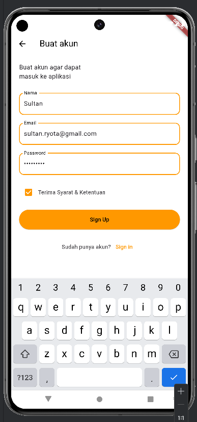
</p>

- Diminta untuk memasukkan kode OTP.
<p align="center">
  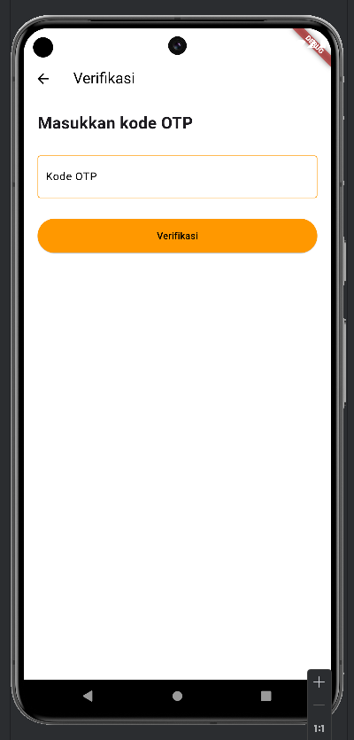
</p>

- Kode masuk ke Gmail.
<p align="center">
  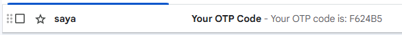
</p>
<p align="center">
  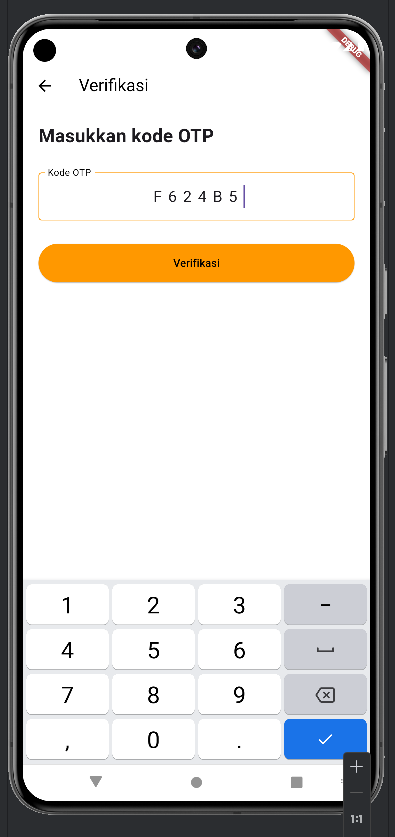
</p>

- Berhasil masuk ke halaman Home. Untuk sementara halaman yang berfungsi hanya halaman home dan saved (Added Recipe).
<p align="center">
  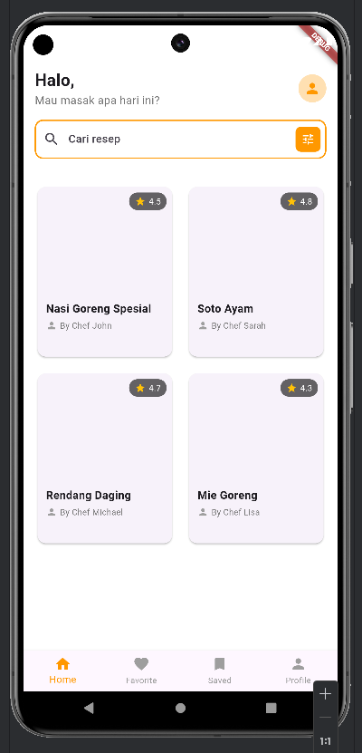
</p>

- Tampilan halaman Added Recipe. Terdapat list resep yang telah saya coba untuk masukkan ke database pada pertemuan sebelumnya. Artinya, API ter-fetch dengan benar.
<p align="center">
  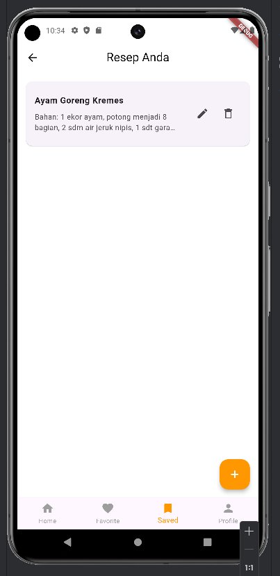
</p>

- Percobaan menambahkan resep baru.
<p align="center">
  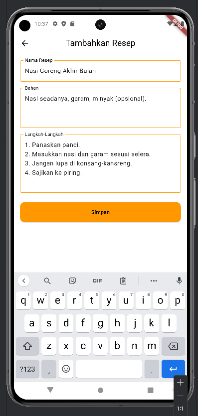
</p>

- Resep berhasil ditambahkan.
<p align="center">
  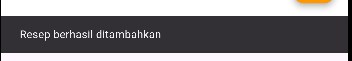
</p>
<p align="center">
  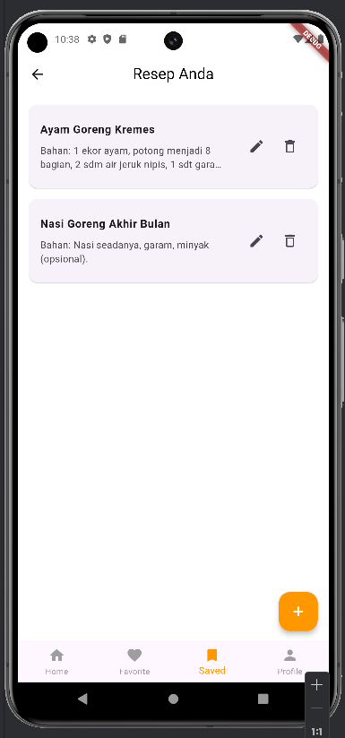
</p>

- Percobaan mengedit resep.
<p align="center">
  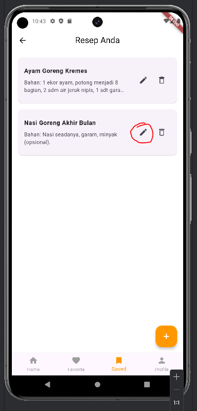
</p>
<p align="center">
  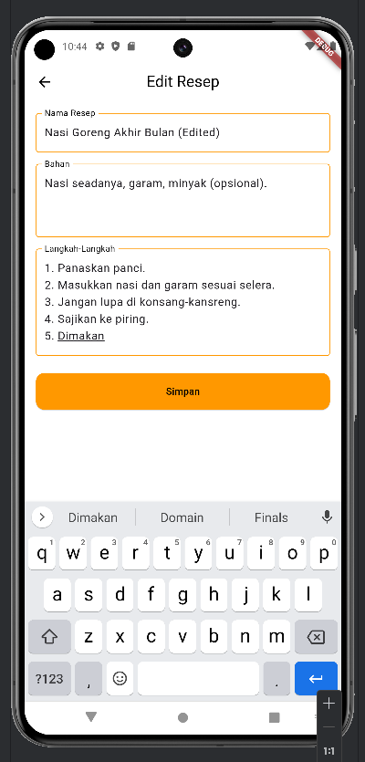
</p>

- Resep berhasil diedit.
<p align="center">
  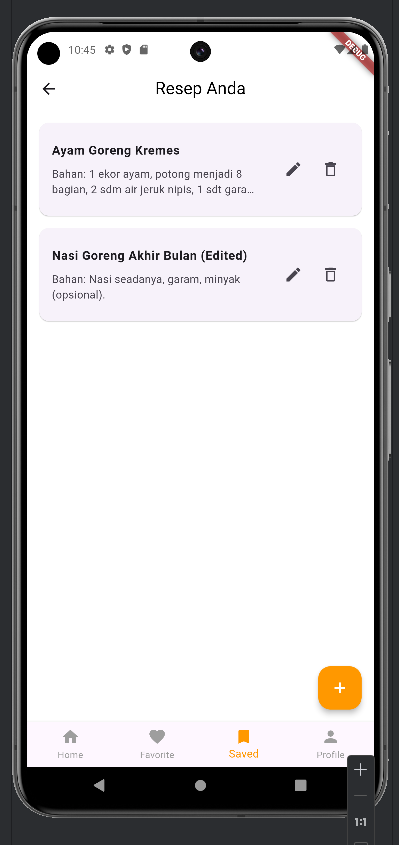
</p>

- Melihat resep.
<p align="center">
  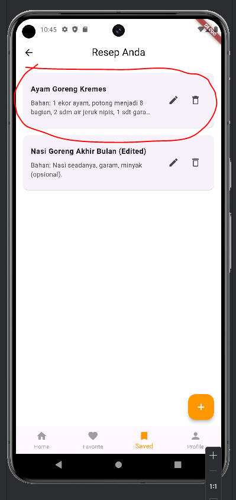
</p>
<p align="center">
  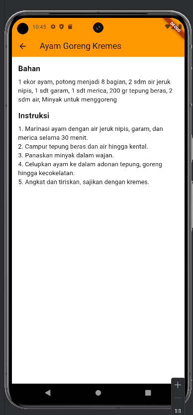
</p>

- Percobaan menghapus resep.
<p align="center">
  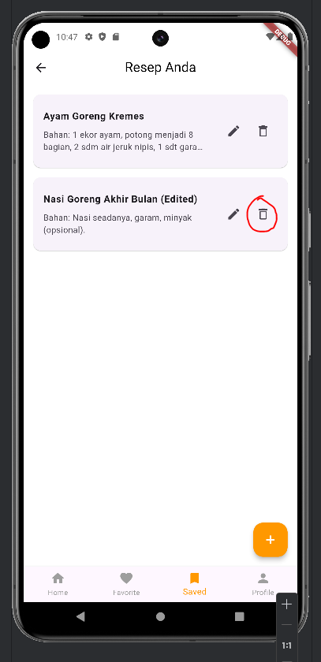
</p>

- Berhasil menghapus resep.
<p align="center">
  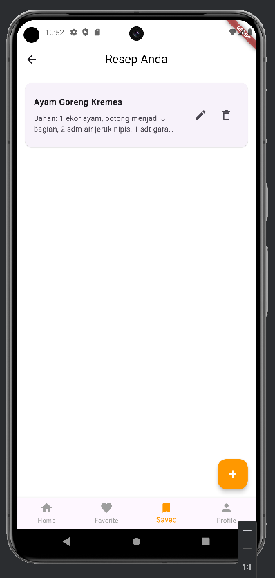
</p>

### Rekapan

Pada laporan diatas, saya telah berhasil mengintegrasikan API dengan desain figma yang telah saya ubah menjadi kode flutter.
- Konversi Figma to Flutter -> **Done**
- API Login, Register, OTP Register -> **Done**
- API Payment Gateaway -> **Not Yet**

### List Improve untuk Minggu Selanjutnya

- Menyempurnakan login (JWT)
- Menambahkan API Payment Gateaway (User perlu membayar jika ingin menambahkan resep sendiri), mungkin akan saya buat langsung setelah pulang dari pertemuan 7 besok **(mungkin)**
- Fetch API online yang saya dapat dari github (untuk halaman Home)

## Referensi

- Modul Praktikum
- https://api.flutter.dev/flutter/widgets/widgets-library.html
- https://docs.flutter.dev/ui/widgets
